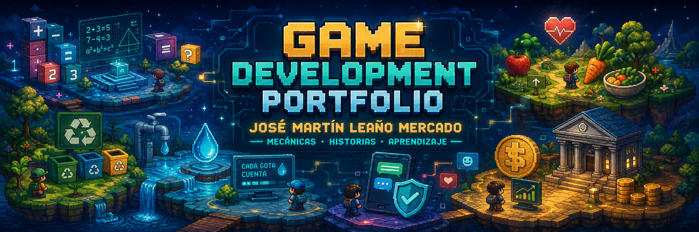
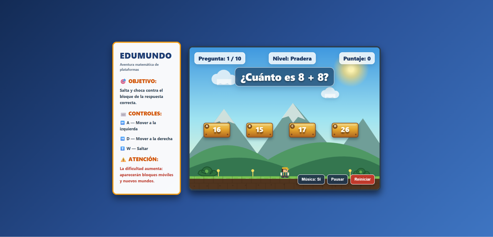
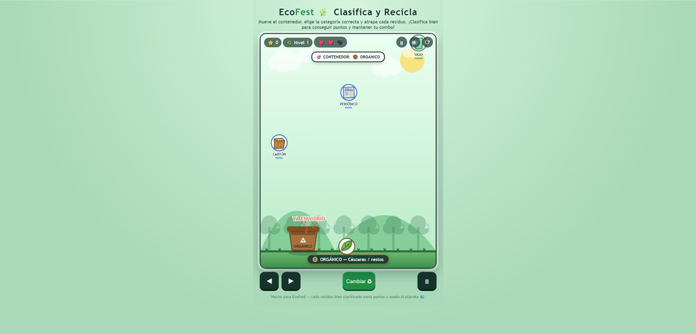
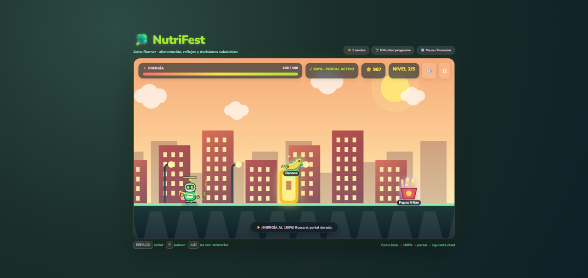
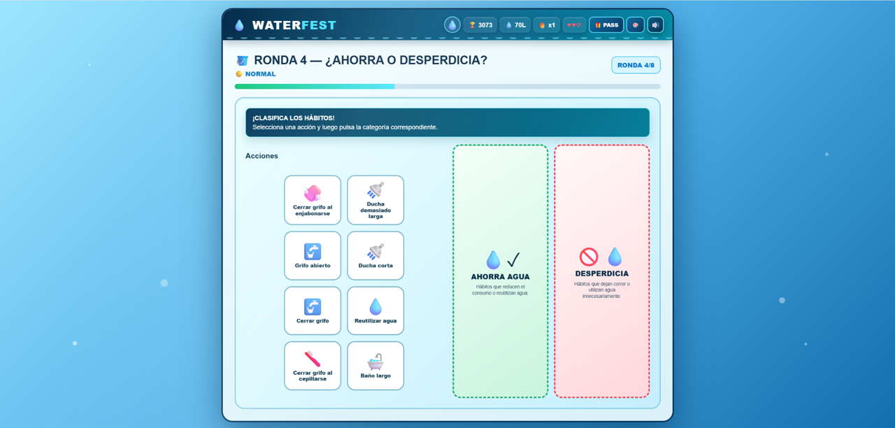
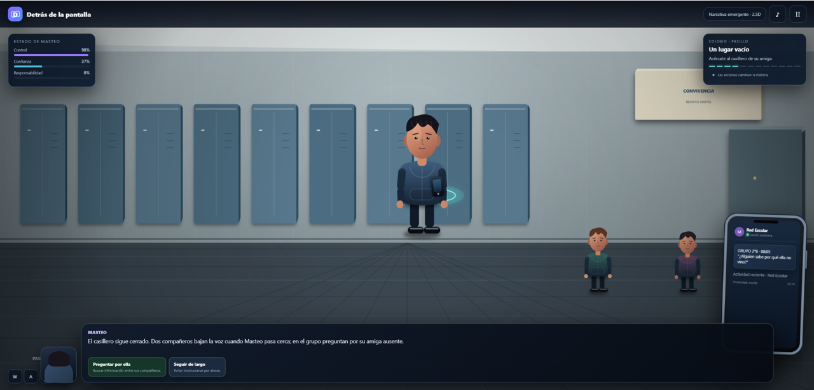
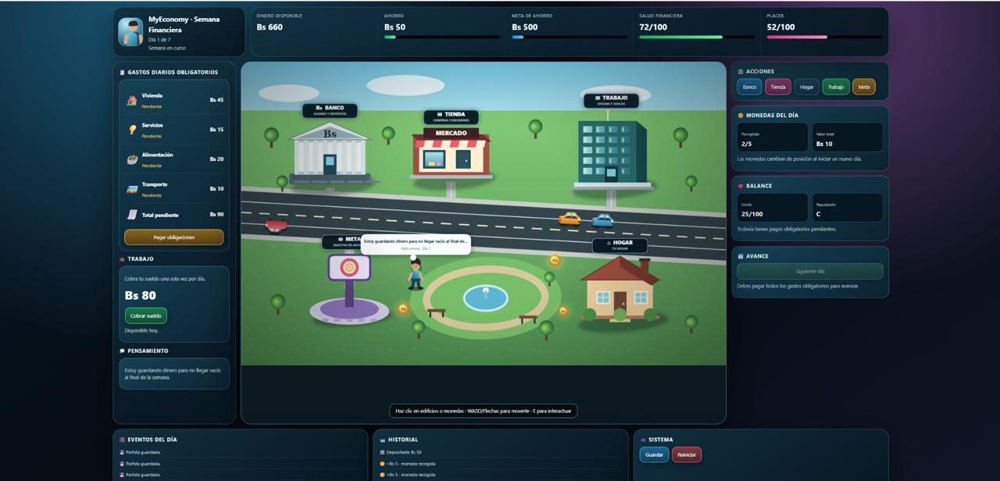

  

<h1 align="center">Game Development Portfolio</h1>

  <em>Diseñando experiencias que combinan creatividad, aprendizaje y programación.</em>

  
  
  
  

  <a href="#mi-enfoque-como-desarrollador">Mi enfoque</a>
  &nbsp;•&nbsp;
  <a href="#galería-de-videojuegos">Videojuegos</a>
  &nbsp;•&nbsp;
  <a href="#tecnologías-y-herramientas">Tecnologías</a>
  &nbsp;•&nbsp;
  <a href="#proceso-de-desarrollo">Proceso</a>
  &nbsp;•&nbsp;
  <a href="#uso-de-inteligencia-artificial">IA</a>
  &nbsp;•&nbsp;
  <a href="#aprendizajes">Aprendizajes</a>

  Portafolio académico con seis videojuegos educativos desarrollados en
  HTML5, CSS3 y JavaScript, acompañados de documentación, capturas y
  versiones jugables.

---

## Mi enfoque como desarrollador

Soy **José Martín Leaño Mercado**, estudiante de Ingeniería en Sistemas Informáticos. Me interesa crear proyectos donde la programación no sea solamente una parte técnica, sino una herramienta para construir experiencias que puedan comunicar, enseñar y generar una respuesta en el usuario.

Durante el desarrollo de estos videojuegos aprendí que una buena idea necesita más que código para funcionar. También requiere objetivos claros, mecánicas comprensibles, una presentación visual coherente y un proceso constante de pruebas y correcciones.

Cada proyecto de este portafolio parte de una temática diferente, pero todos comparten una misma intención: convertir un concepto en una experiencia interactiva con identidad propia.

### Principios que aplico en mis proyectos

| Principio | Aplicación |
|---|---|
| Creatividad con propósito | Cada juego utiliza una temática, una ambientación y una forma de interacción propia. |
| Experiencia del jugador | Los controles, objetivos y respuestas visuales deben comprenderse durante la partida. |
| Programación funcional | Las mecánicas deben ejecutarse correctamente y responder a las acciones del jugador. |
| Mejora continua | Cada prototipo pasa por pruebas, correcciones y nuevas versiones. |
| Comunicación visual | Los escenarios, personajes, objetos e interfaces deben apoyar la idea principal del juego. |
| Documentación | Las decisiones, herramientas, dificultades y aprendizajes deben quedar explicados claramente. |

### Perfil dentro del portafolio

| Área | Información |
|---|---|
| Formación | Ingeniería en Sistemas Informáticos |
| Intereses | Desarrollo de software, videojuegos, diseño UI/UX y resolución de problemas |
| Participación | Diseño, programación, pruebas, corrección y documentación |
| Tecnologías principales | HTML5, CSS3 y JavaScript |
| Enfoque | Videojuegos educativos y experiencias interactivas |
| Objetivo | Combinar lógica y creatividad para construir proyectos funcionales y comprensibles |

> Este portafolio representa una evolución: comienza con mecánicas sencillas y avanza hacia sistemas con narrativa, progresión, personalización, toma de decisiones y administración de recursos.

Los seis proyectos también reflejan diferentes formas de utilizar un videojuego como medio de aprendizaje. Las matemáticas se convierten en un reto de plataformas; el reciclaje, en una clasificación arcade; la alimentación, en un runner; el cuidado del agua, en una colección de desafíos; el ciberbullying, en una historia interactiva; y la educación financiera, en una simulación de decisiones.

---

---

---

## Videojuegos

  Selecciona un proyecto para conocerlo o iniciar su versión jugable directamente desde el navegador.

<table>
<tr>
<td align="center" width="33%">
<a href="#edumundo"><strong>01</strong> EduMundo</a>
</td>
<td align="center" width="33%">
<a href="#ecofest"><strong>02</strong> EcoFest</a>
</td>
<td align="center" width="33%">
<a href="#nutrifest"><strong>03</strong> NutriFest</a>
</td>
</tr>
<tr>
<td align="center">
<a href="#waterfest"><strong>04</strong> WaterFest</a>
</td>
<td align="center">
<a href="#detras-de-la-pantalla"><strong>05</strong> Detrás de la Pantalla</a>
</td>
<td align="center">
<a href="#myeconomy"><strong>06</strong> MyEconomy</a>
</td>
</tr>
</table>

 

<table>
<tr>
<td width="50%" valign="top">

<h3 align="center">01 | EduMundo</h3>

<strong>Aventura matemática de plataformas</strong>

Resuelve operaciones y alcanza el bloque correcto para avanzar por diferentes niveles.

</td>
<td width="50%" valign="top">

<h3 align="center">02 | EcoFest</h3>

<strong>Clasificación y reciclaje</strong>

Identifica los residuos y utiliza el contenedor adecuado para mantener tu puntuación.

</td>
</tr>

<tr>
<td width="50%" valign="top">

<h3 align="center">03 | NutriFest</h3>

<strong>Aventura de alimentación saludable</strong>

Recolecta alimentos saludables, evita obstáculos y completa los cinco niveles.

</td>
<td width="50%" valign="top">

<h3 align="center">04 | WaterFest</h3>

<strong>Desafíos para cuidar el agua</strong>

Completa actividades sobre ahorro, consumo responsable e identificación de desperdicios.

</td>
</tr>

<tr>
<td width="50%" valign="top">

<h3 align="center">05 | Detrás de la Pantalla</h3>

<strong>Historia interactiva sobre el ciberbullying</strong>

Toma decisiones que modifican las relaciones, las consecuencias y el final de la historia.

</td>
<td width="50%" valign="top">

<h3 align="center">06 | MyEconomy</h3>

<strong>Simulación de una semana financiera</strong>

Administra ingresos, gastos obligatorios, ahorro y decisiones durante siete días.

</td>
</tr>
</table>

  Haz clic sobre una captura o utiliza el botón JUGAR para abrir el videojuego.

  <a href="#videojuegos">Volver a la lista de videojuegos</a>

