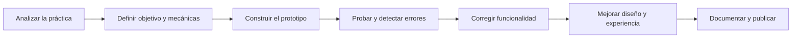

<p align="center">
  
</p>

<h1 align="center">Game Development Portfolio</h1>

<p align="center">
  <em>Diseño, programación y aprendizaje convertidos en seis experiencias interactivas.</em>
</p>

<p align="center">
  
  
  
  
  
</p>

<p align="center">
  <a href="https://katfipol.github.io/game-development-portfolio/">
    
  </a>
  <a href="https://github.com/katfipol/game-development-portfolio">
    
  </a>
</p>

<p align="center">
  <a href="#presentacion">Presentación</a>
  &nbsp;|&nbsp;
  <a href="#catalogo">Videojuegos</a>
  &nbsp;|&nbsp;
  <a href="#recorrido">Recorrido académico</a>
  &nbsp;|&nbsp;
  <a href="#tecnologias">Tecnologías</a>
  &nbsp;|&nbsp;
  <a href="#proceso">Proceso</a>
  &nbsp;|&nbsp;
  <a href="#inteligencia-artificial">Inteligencia artificial</a>
  &nbsp;|&nbsp;
  <a href="#documentacion">Documentación</a>
</p>

---

<a id="presentacion"></a>

## Presentación

Soy **José Martín Leaño Mercado**, estudiante de Ingeniería en Sistemas Informáticos. Este repositorio reúne los videojuegos educativos desarrollados durante la asignatura de **Game Development** y documenta su evolución desde las primeras ideas hasta los prototipos funcionales publicados en la web.

El portafolio no muestra solamente productos terminados. También presenta las decisiones de diseño, las prácticas académicas, las tecnologías utilizadas, las correcciones realizadas y los aprendizajes obtenidos durante el proceso.

### Identidad del portafolio

| Área | Enfoque |
|---|---|
| Desarrollo | Prototipos web funcionales y ejecutables desde el navegador |
| Diseño | Interfaces claras, ambientaciones propias y retroalimentación visual |
| Aprendizaje | Matemáticas, reciclaje, nutrición, agua, convivencia digital y finanzas |
| Experiencia | Mecánicas comprensibles, progresión y respuesta inmediata |
| Documentación | README general, README individual |
| Mejora continua | Pruebas, corrección de errores y evolución visual de cada versión |

> La intención común de los seis proyectos es convertir un contenido educativo en una acción jugable, evitando que el aprendizaje dependa únicamente de explicaciones teóricas.

---

<a id="catalogo"></a>

## Catálogo de videojuegos

<p align="center">
  <strong>SEIS TEMÁTICAS · SEIS MECÁNICAS · UN MISMO PROCESO DE APRENDIZAJE</strong>
</p>

<p align="center">
  Cada proyecto dispone de tres accesos: la versión jugable, su documentación individual y el archivo que contiene el código.
</p>

<p align="center">
  <a href="#edumundo"></a>
  <a href="#ecofest"></a>
  <a href="#nutrifest"></a>
</p>

<p align="center">
  <a href="#waterfest"></a>
  <a href="#detras-de-la-pantalla"></a>
  <a href="#myeconomy"></a>
</p>

### Vista comparativa

| Proyecto | Género | Aprendizaje principal | Progresión |
|---|---|---|---|
| EduMundo | Plataformas y preguntas | Resolución de operaciones matemáticas | Preguntas más complejas y biomas variables |
| EcoFest | Arcade de clasificación | Separación correcta de residuos | Mayor velocidad y variedad de objetos |
| NutriFest | Auto-runner | Selección de alimentos saludables | Cinco niveles y dificultad progresiva |
| WaterFest | Colección de minijuegos | Hábitos de consumo responsable del agua | Ocho rondas, experiencia y recompensas |
| Detrás de la Pantalla | Aventura narrativa 2.5D | Consecuencias del ciberbullying | Decisiones, variables y dos desenlaces |
| MyEconomy | Simulación financiera | Administración responsable del dinero | Semana de siete días y evaluación final |

---

<table>
<tr>
<td width="50%" valign="top">

<a id="edumundo"></a>

<h3 align="center">01 | EduMundo</h3>

<a href="https://katfipol.github.io/game-development-portfolio/juegos/edumundo/">
  
</a>

<p align="center"><strong>Aventura matemática de plataformas</strong></p>

<p>Resuelve operaciones y alcanza el bloque correcto mientras avanzas por escenarios de dificultad creciente.</p>

<p align="center">
  <a href="https://katfipol.github.io/game-development-portfolio/juegos/edumundo/"></a>
  <a href="https://github.com/katfipol/game-development-portfolio/blob/main/juegos/edumundo/README.md"></a>
  <a href="https://github.com/katfipol/game-development-portfolio/blob/main/juegos/edumundo/index.html"></a>
</p>

</td>
<td width="50%" valign="top">

<a id="ecofest"></a>

<h3 align="center">02 | EcoFest</h3>

<a href="https://katfipol.github.io/game-development-portfolio/juegos/ecofest/">
  
</a>

<p align="center"><strong>Clasificación arcade de residuos</strong></p>

<p>Identifica cada residuo y atrápalo con el contenedor correcto para conservar vidas, puntos y combo.</p>

<p align="center">
  <a href="https://katfipol.github.io/game-development-portfolio/juegos/ecofest/"></a>
  <a href="https://github.com/katfipol/game-development-portfolio/blob/main/juegos/ecofest/README.md"></a>
  <a href="https://github.com/katfipol/game-development-portfolio/blob/main/juegos/ecofest/index.html"></a>
</p>

</td>
</tr>

<tr>
<td width="50%" valign="top">

<a id="nutrifest"></a>

<h3 align="center">03 | NutriFest</h3>

<a href="https://katfipol.github.io/game-development-portfolio/juegos/nutrifest/">
  
</a>

<p align="center"><strong>Auto-runner de alimentación saludable</strong></p>

<p>Recolecta alimentos saludables, evita comida poco nutritiva y supera obstáculos hasta activar el portal.</p>

<p align="center">
  <a href="https://katfipol.github.io/game-development-portfolio/juegos/nutrifest/"></a>
  <a href="https://github.com/katfipol/game-development-portfolio/blob/main/juegos/nutrifest/README.md"></a>
  <a href="https://github.com/katfipol/game-development-portfolio/blob/main/juegos/nutrifest/index.html"></a>
</p>

</td>
<td width="50%" valign="top">

<a id="waterfest"></a>

<h3 align="center">04 | WaterFest</h3>

<a href="https://katfipol.github.io/game-development-portfolio/juegos/waterfest/">
  
</a>

<p align="center"><strong>Minijuegos sobre el cuidado del agua</strong></p>

<p>Completa desafíos de observación, clasificación y reacción mientras avanzas por un sistema de recompensas.</p>

<p align="center">
  <a href="https://katfipol.github.io/game-development-portfolio/juegos/waterfest/"></a>
  <a href="https://github.com/katfipol/game-development-portfolio/blob/main/juegos/waterfest/README.md"></a>
  <a href="https://github.com/katfipol/game-development-portfolio/blob/main/juegos/waterfest/index.html"></a>
</p>

</td>
</tr>

<tr>
<td width="50%" valign="top">

<a id="detras-de-la-pantalla"></a>

<h3 align="center">05 | Detrás de la Pantalla</h3>

<a href="https://katfipol.github.io/game-development-portfolio/juegos/detras-de-la-pantalla/">
  
</a>

<p align="center"><strong>Narrativa interactiva sobre el ciberbullying</strong></p>

<p>Explora los escenarios como Masteo y toma decisiones que modifican la confianza, la responsabilidad y el desenlace.</p>

<p align="center">
  <a href="https://katfipol.github.io/game-development-portfolio/juegos/detras-de-la-pantalla/"></a>
  <a href="https://github.com/katfipol/game-development-portfolio/blob/main/juegos/detras-de-la-pantalla/README.md"></a>
  <a href="https://github.com/katfipol/game-development-portfolio/blob/main/juegos/detras-de-la-pantalla/index.html"></a>
</p>

</td>
<td width="50%" valign="top">

<a id="myeconomy"></a>

<h3 align="center">06 | MyEconomy</h3>

<a href="https://katfipol.github.io/game-development-portfolio/juegos/myeconomy/">
  
</a>

<p align="center"><strong>Simulación de una semana financiera</strong></p>

<p>Administra ingresos, obligaciones, ahorro y compras durante siete días para construir una economía equilibrada.</p>

<p align="center">
  <a href="https://katfipol.github.io/game-development-portfolio/juegos/myeconomy/"></a>
  <a href="https://github.com/katfipol/game-development-portfolio/blob/main/juegos/myeconomy/README.md"></a>
  <a href="https://github.com/katfipol/game-development-portfolio/blob/main/juegos/myeconomy/index.html"></a>
</p>

</td>
</tr>
</table>

<p align="center">
  <sub>Selecciona una captura para jugar o utiliza los botones para elegir exactamente qué deseas consultar.</sub>
</p>

<p align="right"><a href="#catalogo">Volver al catálogo</a></p>

---

<a id="recorrido"></a>

## Recorrido académico

Cada juego corresponde a una práctica y evidencia una parte diferente del proceso de creación de videojuegos.

| Práctica | Proyecto | Aplicación principal |
|---:|---|---|
| 01 | EduMundo | Conceptos iniciales de videojuegos y construcción de una mecánica jugable |
| 02 | EcoFest | Proceso de desarrollo, prototipado, pruebas y corrección |
| 03 | NutriFest | Diseño de mecánicas, reglas, retroalimentación y dificultad |
| 04 | WaterFest | Player Persona, motivaciones, recompensas y experiencia del jugador |
| 05 | Detrás de la Pantalla | Storytelling, arco de personaje, decisiones y *show, don't tell* |
| 06 | MyEconomy | Elaboración de un GDD y producción alineada con sus componentes |

Este orden permite observar una evolución desde una interacción sencilla hasta sistemas con narrativa ramificada, personalización, persistencia y administración de recursos.

---

<a id="tecnologias"></a>

## Tecnologías y herramientas

| Tecnología | Uso dentro del portafolio |
|---|---|
| HTML5 | Estructura de cada videojuego, pantallas, controles y contenido |
| CSS3 | Interfaces, adaptación, animaciones, profundidad y ambientación |
| JavaScript | Mecánicas, estados, colisiones, progresión, decisiones y resultados |
| Canvas 2D | Escenarios, personajes, objetos y renderizado dinámico |
| Web Audio API | Música y efectos generados directamente en el navegador |
| LocalStorage | Conservación de progreso y preferencias en proyectos compatibles |
| Git y GitHub | Control de versiones, organización y publicación del código |
| GitHub Pages | Acceso web a las versiones jugables |
| Visual Studio Code | Edición, revisión y depuración de los archivos |

### Características compartidas

- Ejecución directa desde un navegador moderno.
- Proyectos autocontenidos y fáciles de revisar.
- Interfaces adaptables a diferentes tamaños de pantalla.
- Retroalimentación visual y sonora para las acciones del jugador.
- Código disponible para fines académicos y de aprendizaje.

---

<a id="proceso"></a>

## Proceso de desarrollo



### Criterios aplicados

1. **Comprender el problema:** identificar qué debe aprender o experimentar el jugador.
2. **Definir la interacción:** traducir el tema a una mecánica concreta.
3. **Prototipar:** construir una primera versión funcional en HTML, CSS y JavaScript.
4. **Probar:** revisar inicio, controles, puntuación, progresión y condiciones finales.
5. **Corregir:** solucionar errores encontrados durante la ejecución.
6. **Mejorar:** trabajar en personajes, objetos, fondos, sonido, claridad y accesibilidad.
7. **Documentar:** explicar decisiones, tecnologías, resultados y aprendizajes.
8. **Publicar:** organizar el repositorio y habilitar cada juego mediante GitHub Pages.

---

<a id="inteligencia-artificial"></a>

## Uso de inteligencia artificial

La inteligencia artificial se utilizó de forma permitida por las guías de práctica y como una herramienta de apoyo durante el desarrollo. **ChatGPT fue el asistente principal** para transformar requisitos en prototipos, proponer estructuras de código, localizar errores y explorar alternativas visuales.

### ¿Por qué se utilizó?

- Para acelerar la creación de prototipos que pudieran probarse desde las primeras etapas.
- Para convertir conceptos académicos —mecánicas, Player Persona, storytelling y GDD— en sistemas interactivos.
- Para analizar errores de JavaScript y plantear correcciones comprensibles.
- Para comparar alternativas de interfaz, progresión, sonido y presentación visual.
- Para apoyar la organización de la documentación sin perder la relación con cada práctica.

### Participación del equipo

El uso de IA no sustituyó las decisiones del proyecto. El equipo proporcionó los objetivos, revisó las propuestas, ejecutó los juegos, identificó problemas y solicitó cambios concretos. Entre las correcciones dirigidas por los estudiantes se encuentran:

- Ajuste de dificultad, velocidad y accesibilidad de los obstáculos.
- Sustitución de objetos poco reconocibles por representaciones más claras.
- Mejora de personajes, escenarios, edificios, carreteras e interfaces.
- Corrección de errores que impedían iniciar o continuar algunos juegos.
- Revisión de clasificaciones, preguntas, reglas y condiciones de avance.
- Elección de nombres, temáticas, recompensas, sonidos y estilo de presentación.

### Flujo de trabajo con IA

| Etapa | Acción del equipo | Apoyo de la IA | Verificación humana |
|---|---|---|---|
| Definición | Interpretar la guía y decidir la propuesta | Organizar requisitos y alternativas | Comparar con el documento original |
| Desarrollo | Establecer mecánicas y comportamiento | Generar o modificar fragmentos de código | Ejecutar el prototipo en el navegador |
| Depuración | Reportar errores y resultados inesperados | Analizar causas y proponer correcciones | Repetir las acciones que provocaban el error |
| Diseño | Indicar referencias, claridad y estilo deseado | Plantear mejoras visuales y sonoras | Evaluar legibilidad y coherencia temática |
| Documentación | Seleccionar información y evidencias | Estructurar README y prompts reconstruidos | Corregir datos y justificar decisiones |

### Transparencia y límites

- Los README individuales identifican dónde se utilizó ChatGPT.
- Los prompts incluidos son reconstrucciones del proceso cuando no se conservó el texto original.
- El código generado fue revisado mediante pruebas manuales y correcciones iterativas.
- Las decisiones finales y la responsabilidad sobre los resultados corresponden al equipo.
- No se presenta la IA como autora única ni se atribuyen automáticamente como correctas todas sus respuestas.

Este enfoque permitió aprender no solo a solicitar código, sino también a **evaluarlo, depurarlo, adaptarlo y defender técnicamente las decisiones implementadas**.

---

<a id="documentacion"></a>

## Documentación del repositorio

La información se distribuye en tres niveles para facilitar la navegación:

| Nivel | Contenido | Acceso |
|---|---|---|
| Portafolio | Presentación general, catálogo, tecnologías y proceso | Este README |
| Proyecto | Objetivo, mecánicas, controles, IA, pruebas y aprendizajes | Botón **Información** de cada tarjeta |
| Práctica | Consignas, investigación, decisiones y validaciones académicas | Se incorporará en `documentacion/practicas/` |

Los documentos de práctica se revisarán antes de publicarse para corregir redacción, completar evidencias y mantener la información original proporcionada por el docente claramente diferenciada del trabajo realizado por el equipo.

### Estructura prevista

```text
game-development-portfolio/
├── README.md
├── LICENSE
├── assets/
│   ├── banner-imagen.png
│   └── capturas/
│       ├── edumundo.png
│       ├── ecofest.png
│       ├── nutrifest.png
│       ├── waterfest.png
│       ├── detras-de-la-pantalla.png
│       └── myeconomy.png
├── juegos/
│   ├── edumundo/
│   ├── ecofest/
│   ├── nutrifest/
│   ├── waterfest/
│   ├── detras-de-la-pantalla/
│   └── myeconomy/
└── documentacion/
    └── practicas/
```

---

<a id="aprendizajes"></a>

## Aprendizajes principales

- Diseñar una mecánica a partir de un objetivo educativo.
- Mantener coherencia entre documento, prototipo y experiencia final.
- Programar movimiento, colisiones, estados, progresión y decisiones.
- Mejorar una interfaz a partir de pruebas y observaciones.
- Diseñar para diferentes perfiles de jugador.
- Utilizar narrativa y sistemas de recompensa con un propósito definido.
- Depurar código generado o modificado con apoyo de inteligencia artificial.
- Documentar de forma transparente el proceso y las herramientas utilizadas.
- Organizar y publicar proyectos mediante GitHub Pages.

## Estado del portafolio

| Componente | Estado |
|---|---|
| Seis videojuegos corregidos | Completado |
| Publicación mediante GitHub Pages | Completado |
| README principal | En revisión y mejora |
| README individuales | Base completada; falta galería ampliada |
| Documentos de práctica | Pendientes de revisión y publicación |
| Validaciones y evidencias | Pendientes de integración final |

---

## Autor

**José Martín Leaño Mercado**  
Estudiante de Ingeniería en Sistemas Informáticos  
GitHub: [katfipol](https://github.com/katfipol)

## Licencia

Este repositorio se publica bajo la licencia [MIT](LICENSE). Los documentos académicos, imágenes y recursos externos deberán conservar su atribución correspondiente antes de la entrega definitiva.

---

<p align="center">
  <a href="#presentacion">Inicio</a>
  &nbsp;|&nbsp;
  <a href="#catalogo">Videojuegos</a>
  &nbsp;|&nbsp;
  <a href="#inteligencia-artificial">Uso de IA</a>
  &nbsp;|&nbsp;
  <a href="https://katfipol.github.io/game-development-portfolio/">Abrir versiones jugables</a>
</p>
