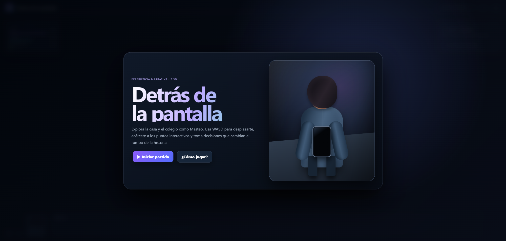
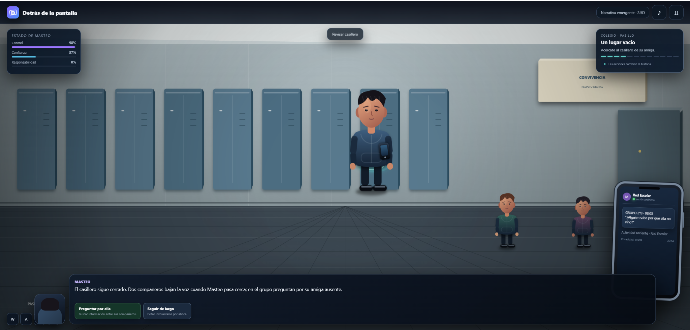
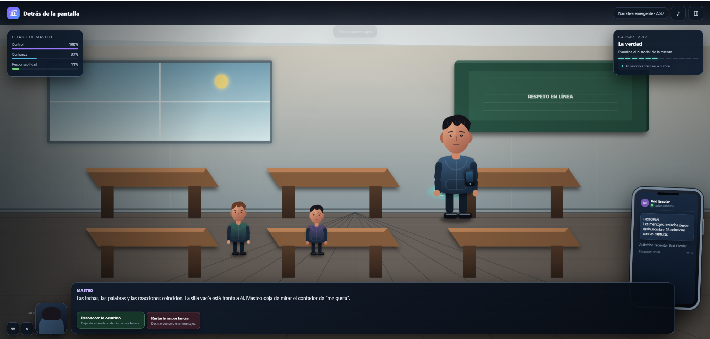
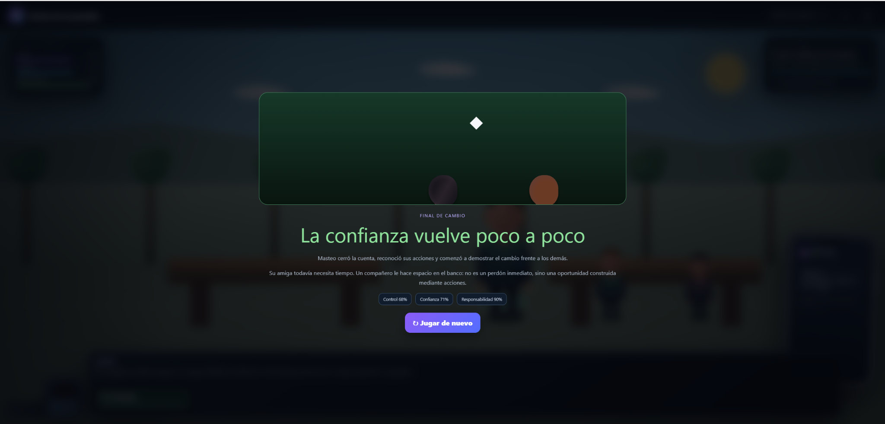
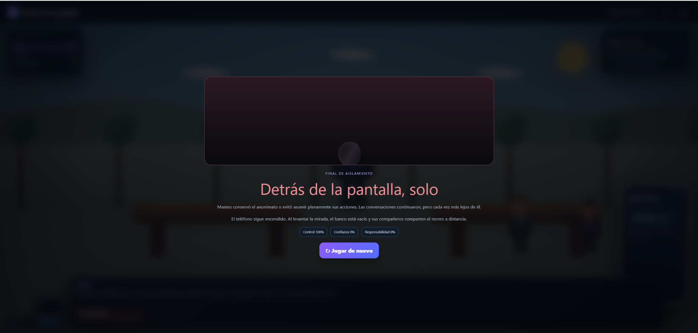
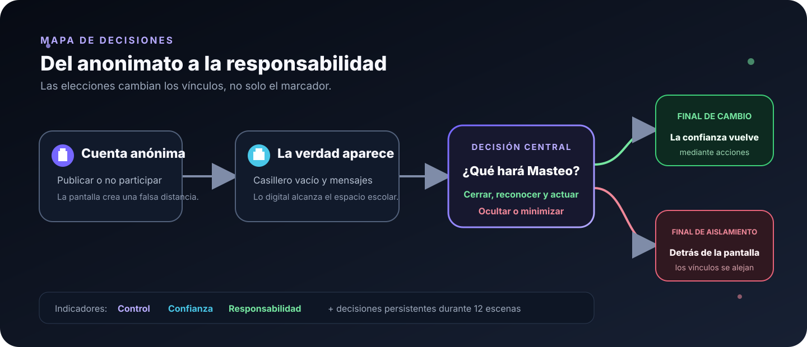

<p align="center">
  <a href="https://katfipol.github.io/game-development-portfolio/juegos/detras-de-la-pantalla/">
    
  </a>
</p>

<h1 align="center">Detrás de la pantalla</h1>

<p align="center"><em>Una experiencia narrativa donde cada decisión digital transforma lo que ocurre fuera de la pantalla.</em></p>

<p align="center">
  
  
  
  
  
</p>

<p align="center">
  <a href="https://katfipol.github.io/game-development-portfolio/juegos/detras-de-la-pantalla/"><strong>JUGAR AHORA</strong></a>
  &nbsp;·&nbsp;
  <a href="index.html"><strong>VER CÓDIGO</strong></a>
  &nbsp;·&nbsp;
  <a href="../../README.md#videojuegos"><strong>GALERÍA DEL PORTAFOLIO</strong></a>
</p>

<p align="center">
  <a href="#experiencia">Experiencia</a> · <a href="#galería">Galería</a> ·
  <a href="#storytelling">Storytelling</a> · <a href="#mecánicas">Mecánicas</a> ·
  <a href="#práctica-05">Práctica 05</a> · <a href="#uso-de-inteligencia-artificial">IA</a>
</p>

---

## Experiencia

**Detrás de la pantalla** es una aventura narrativa 2.5D sobre ciberbullying, empatía y responsabilidad digital. El jugador acompaña a **Masteo** por su dormitorio y distintos espacios del colegio, consulta una red social ficticia y toma decisiones que modifican sus relaciones, tres indicadores narrativos y el desenlace.

El proyecto evita convertir el tema en una charla. Aplica **show, don't tell**: un casillero cerrado, una silla vacía, mensajes que coinciden con lo ocurrido y compañeros que se distancian comunican las consecuencias mediante el escenario y las acciones.

> **Nota de contenido:** la historia presenta de forma ficticia situaciones de acoso digital y sus consecuencias sociales. Su enfoque es educativo y no incluye contenido gráfico.

| Ficha | Información |
|---|---|
| Asignatura | Game Development |
| Tema académico | Storytelling en videojuegos |
| Género | Aventura narrativa e historia interactiva |
| Público del caso | Adolescentes de 13 a 17 años |
| Perspectiva | Escenario lateral 2.5D |
| Plataforma | Navegador web, escritorio y móvil |
| Modalidad | Un jugador |
| Integrantes | Melani Quintela Aguilar y José Martín Leaño Mercado |

### Problema y propósito

La práctica parte del caso de **Red Escolar Segura**, que busca generar identificación y reflexión frente al acoso digital. El juego convierte este problema en una experiencia de causa y consecuencia: el jugador descubre que la sensación de anonimato no elimina el impacto de lo que se publica y decide si Masteo conserva esa distancia o comienza a reparar el daño mediante acciones.

---

## Galería

### La historia se descubre al explorar

| Un lugar vacío | La verdad |
|---|---|
|  |  |
| El casillero cerrado y la ausencia de su amiga introducen el conflicto sin explicarlo directamente. | El historial de la cuenta conecta las publicaciones con sus consecuencias y plantea una decisión de responsabilidad. |

### Dos desenlaces, dos lecturas de las decisiones

| Final de cambio | Final de aislamiento |
|---|---|
|  |  |
| La confianza no regresa de inmediato: Masteo obtiene una oportunidad al reconocer lo ocurrido y demostrar el cambio. | Mantener el anonimato o evitar asumir responsabilidad provoca que los vínculos continúen alejándose. |

---

## Storytelling

### Arco de Masteo

| Momento | Transformación narrativa |
|---|---|
| Estado inicial | Utiliza una cuenta anónima para obtener reacciones y sentir control. |
| Situación de cambio | La ausencia de su amiga y las pruebas de la cuenta conectan sus publicaciones con una consecuencia real. |
| Conflicto interno | Debe elegir entre proteger su anonimato o reconocer el daño que ayudó a producir. |
| Cambio posible | Cierra la cuenta, habla con honestidad y actúa cuando aparece una nueva agresión. |
| Resultado | Sus decisiones conducen a una oportunidad de reconstruir confianza o a un aislamiento progresivo. |

### Mapa narrativo

<p align="center"></p>

### Recursos narrativos

- **Narrativa emergente:** el sentido de la historia depende de las decisiones acumuladas.
- **Narrativa ambiental:** casillero, pupitre, banco y teléfono comunican información sin detener el juego.
- **Retroalimentación visible:** Control, Confianza y Responsabilidad muestran el efecto inmediato de cada elección.
- **Consecuencias persistentes:** el resultado no depende de una sola respuesta, sino del recorrido completo.
- **Reparación gradual:** el final positivo presenta una oportunidad construida con acciones, no un perdón automático.

---

## Mecánicas

### Bucle principal

1. Explorar el escenario.
2. Acercarse al punto de interés.
3. Leer la situación y consultar el teléfono cuando corresponda.
4. Elegir una respuesta.
5. Observar el cambio en los indicadores y continuar la historia.

| Sistema | Función dentro del juego |
|---|---|
| Movimiento 2.5D | Permite recorrer dormitorio, pasillo, aula y patio. |
| Interacción por proximidad | Activa objetos y conversaciones cuando Masteo está cerca. |
| Decisiones ramificadas | Modifican estadísticas, banderas narrativas y escenas posteriores. |
| Teléfono ficticio | Presenta publicaciones, mensajes e indicios de la historia. |
| Indicadores | Representan Control, Confianza y Responsabilidad. |
| Audio reactivo | Añade ambiente y señales sonoras mediante Web Audio API. |
| Pausa y controles táctiles | Mantienen la experiencia accesible en escritorio y móvil. |

### Controles

| Acción | Teclado | Móvil |
|---|---|---|
| Moverse | `W` `A` `S` `D` | Control direccional táctil |
| Interactuar | `E` o `Espacio` | Botón de interacción |
| Pausar | `Esc` o botón de pausa | Botón de pausa |

<details>
<summary><strong>Ver cómo se determinan los finales — contiene spoilers</strong></summary>

El final de cambio exige que Masteo haya cerrado la cuenta y que el recorrido termine con al menos **55% de Responsabilidad** y **45% de Confianza**. Las elecciones previas —preguntar por su amiga, hablar con honestidad y defender a otra persona— ayudan a alcanzar esas condiciones.

Si no se cumplen, la historia conduce al final de aislamiento. Esto evita que una única respuesta correcta borre las decisiones anteriores.

</details>

---

## Diseño visual y sonoro

La dirección artística utiliza azules oscuros, violetas y luz ambiental para transmitir distancia, tensión y reflexión. Los personajes están apoyados sobre el escenario, tienen sombras y proporciones humanas estilizadas; los espacios escolares incorporan profundidad, mobiliario y objetos narrativos reconocibles.

La música ambiental y las señales de elección se generan en tiempo real con **Web Audio API**, por lo que el juego mantiene una identidad sonora propia sin depender de archivos externos.

## Tecnologías

| Tecnología | Aplicación |
|---|---|
| HTML5 | Estructura, interfaz y lienzo del juego |
| CSS3 | Diseño adaptable, iluminación, paneles y controles táctiles |
| JavaScript | Estados, escenas, decisiones, colisiones e interacción |
| Canvas 2D | Escenarios, personajes y objetos narrativos |
| Web Audio API | Ambiente y retroalimentación sonora |

El videojuego se distribuye como un único archivo `index.html` y no necesita instalación, servidor ni dependencias externas.

---

## Práctica 05

El proyecto responde a la práctica **Storytelling en videojuegos** y conserva la esencia de su propuesta académica.

| Etapa solicitada | Evidencia en el proyecto | Estado |
|---|---|---|
| Investigación conceptual | Storytelling, narrativa lineal y emergente, arco de personaje y *show, don't tell*. | Cumplida |
| Construcción del personaje | Estado inicial, situación de cambio y transformación posible de Masteo. | Cumplida |
| Diseño de la historia | Decisiones ramificadas, indicadores y dos finales coherentes. | Cumplida |
| Producción del prototipo | Experiencia funcional con exploración, interacción y cierre narrativo. | Cumplida |
| Validación con otros equipos | El documento incluye tablas, pero no registra respuestas ni observaciones. | Pendiente de documentar |

> El README no presenta una validación como realizada porque las tablas del documento entregado están vacías. Cuando se incorporen comentarios reales, esta sección podrá actualizarse con evidencias y correcciones derivadas de las pruebas.

### Evolución del prototipo

| Antes | Mejora aplicada |
|---|---|
| Escenas con poca profundidad visual | Sombras, iluminación, perspectiva y escenarios escolares más detallados |
| Personajes simples o con sensación de flotar | Figuras humanas estilizadas, pies apoyados y sombras de contacto |
| Recorrido poco claro | Objetivos por escena, puntos interactivos y progreso de 12 escenas |
| Consecuencias concentradas en una elección | Estadísticas y decisiones persistentes que determinan el final |
| Cambio entendido como solución inmediata | Reparación gradual y confianza que vuelve mediante acciones |

---

## Uso de inteligencia artificial

**ChatGPT fue la herramienta de IA principal** durante el desarrollo. Se utilizó como apoyo para estructurar el prototipo, revisar errores, proponer alternativas visuales y refinar el sistema narrativo. Las decisiones temáticas, la selección de mejoras, las pruebas y la integración final fueron responsabilidad del equipo.

| Uso | Aporte de la IA | Decisión del equipo |
|---|---|---|
| Ideación | Propuso estructuras de escenas y posibles bifurcaciones. | Se eligió una narrativa emergente con dos desenlaces. |
| Programación | Sugirió HTML, CSS y JavaScript para movimiento, estados e interacción. | Se probó, corrigió e integró el código funcional. |
| Diseño visual | Generó alternativas para personajes, escenarios y profundidad. | Se mantuvo una identidad oscura y escolar coherente con el tema. |
| Revisión | Ayudó a detectar inconsistencias entre decisiones y consecuencias. | Se ajustaron condiciones, estadísticas y mensajes finales. |
| Documentación | Apoyó la organización del README y la reconstrucción del prompt. | Se verificó la información contra el documento y el juego final. |

<details>
<summary><strong>Ver prompt reconstruido utilizado como referencia</strong></summary>

> **Nota:** el prompt original no fue conservado. El siguiente texto es una reconstrucción fiel al objetivo y a las funciones implementadas; no se presenta como una transcripción literal.

```text
Actúa como diseñador y desarrollador de videojuegos educativos. Crea en un solo
archivo HTML una experiencia narrativa 2.5D llamada "Detrás de la pantalla",
dirigida a adolescentes y centrada en ciberbullying y responsabilidad digital.

El protagonista, Masteo, utiliza una cuenta anónima y descubre que sus acciones
afectaron a una amiga. Aplica storytelling, arco de personaje, show don't tell y
narrativa emergente. Incluye exploración con WASD, interacción por proximidad,
un teléfono ficticio, decisiones que modifiquen Control, Confianza y
Responsabilidad, 12 escenas y dos finales coherentes: cambio o aislamiento.

Construye escenarios de casa y colegio con personajes humanos estilizados,
sombras, profundidad y objetos narrativos. Agrega música ambiental diferente a
los otros juegos, pausa, controles táctiles y diseño adaptable. El final positivo
debe exigir acciones sostenidas y no representar un perdón inmediato. Usa HTML5,
CSS3, JavaScript, Canvas 2D y Web Audio API sin dependencias externas.
```

</details>

### Criterio de uso responsable

La IA se empleó como herramienta de apoyo, no como sustituto del criterio académico. Cada propuesta fue revisada según tres preguntas: **¿funciona?, ¿es coherente con la historia?, ¿conserva el objetivo educativo de la práctica?**

---

## Aprendizajes

- Una consecuencia narrativa puede comunicarse mejor con el entorno que con una explicación extensa.
- Los indicadores ayudan a comprender el efecto de las elecciones sin revelar toda la lógica interna.
- Un final coherente debe considerar el historial de acciones y no solamente la última decisión.
- La mejora visual también mejora la lectura narrativa cuando cada objeto cumple una función.
- Documentar con transparencia la participación humana y el apoyo de IA fortalece la credibilidad del proyecto.

## Próximas mejoras

- Registrar sesiones reales de validación y resumir sus observaciones.
- Añadir opciones de accesibilidad para tamaño de texto y contraste.
- Incorporar subtítulos para todas las señales sonoras.
- Ampliar las variaciones intermedias sin alterar los dos finales centrales.

## Ejecución local

1. Descarga o clona el repositorio.
2. Abre `juegos/detras-de-la-pantalla/index.html` en un navegador moderno.
3. Presiona **Iniciar partida** y utiliza los controles indicados.

No se requiere instalación.

---

<p align="center">
  <a href="../waterfest/README.md">← Anterior: WaterFest</a>
  &nbsp;&nbsp;·&nbsp;&nbsp;
  <a href="../../README.md#videojuegos">Galería de videojuegos</a>
  &nbsp;&nbsp;·&nbsp;&nbsp;
  <a href="../myeconomy/README.md">Siguiente: MyEconomy →</a>
</p>

<p align="center"><sub>Proyecto académico de Game Development · José Martín Leaño Mercado</sub></p>
