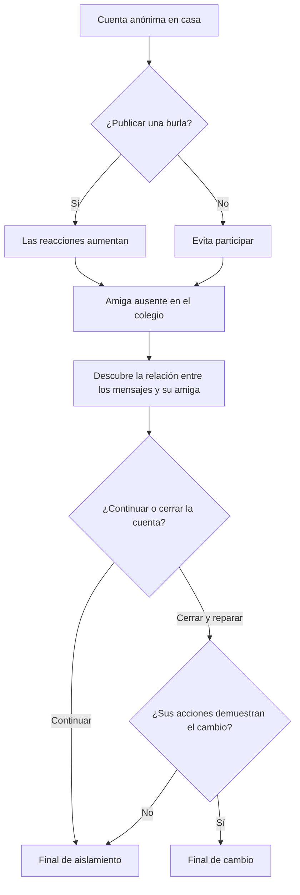

<p align="center">
  <a href="https://katfipol.github.io/game-development-portfolio/juegos/detras-de-la-pantalla/">
    
  </a>
</p>

<h1 align="center">Detrás de la Pantalla</h1>

<p align="center">
  <em>Las decisiones digitales también dejan consecuencias fuera de la pantalla.</em>
</p>

<p align="center">
  
  
  
  
  
</p>

<p align="center">
  <a href="https://katfipol.github.io/game-development-portfolio/juegos/detras-de-la-pantalla/"><strong>JUGAR EN EL NAVEGADOR</strong></a>
  &nbsp;&nbsp;|&nbsp;&nbsp;
  <a href="index.html"><strong>VER CÓDIGO</strong></a>
  &nbsp;&nbsp;|&nbsp;&nbsp;
  <a href="../../README.md"><strong>VOLVER AL PORTAFOLIO</strong></a>
</p>

---

## Descripción

**Detrás de la Pantalla** es una aventura narrativa 2.5D sobre el ciberbullying y la responsabilidad digital. El jugador controla a **Masteo**, explora su dormitorio y distintos espacios del colegio, consulta mensajes dentro de un teléfono ficticio y toma decisiones que modifican sus relaciones y el desenlace.

La experiencia no presenta el tema como una charla. Aplica el principio **show, don't tell**: el casillero cerrado, la silla vacía, las conversaciones que desaparecen y la distancia de los compañeros muestran las consecuencias de las acciones de Masteo.

## Ficha del proyecto

| Elemento | Información |
|---|---|
| Asignatura | Game Development |
| Tema de la práctica | Storytelling en videojuegos |
| Género | Aventura narrativa e historia interactiva |
| Estructura | Narrativa emergente con decisiones ramificadas |
| Perspectiva | Escenario lateral 2.5D |
| Tema central | Ciberbullying, empatía y responsabilidad digital |
| Público del caso | Adolescentes de 13 a 17 años |
| Plataforma | Navegador web de escritorio y dispositivos móviles |
| Modalidad | Un jugador |
| Integrantes | Melani Quintela Aguilar y José Martín Leaño Mercado |

## Problema y propósito

La práctica parte del caso de **Red Escolar Segura**, una institución que busca que los adolescentes comprendan el impacto del acoso digital mediante una experiencia narrativa y no mediante explicaciones moralizantes.

El juego convierte ese problema en una situación interactiva: el jugador observa cómo una conducta anónima afecta la vida escolar de otras personas y decide si Masteo conserva el control que siente detrás de la pantalla o asume responsabilidad y comienza a cambiar mediante acciones.

## Arco de Masteo

### Inicio

Masteo utiliza una cuenta anónima para obtener reacciones y sentirse en control. Al principio interpreta las burlas como algo distante, protegido por una pantalla.

### Situación de cambio

La ausencia de su mejor amiga, un casillero cerrado y la coincidencia entre sus publicaciones y los mensajes recibidos revelan que sus acciones digitales tienen consecuencias reales.

### Transformación posible

El jugador decide si Masteo minimiza lo ocurrido o reconoce su responsabilidad. El cambio positivo no se presenta como un perdón inmediato: requiere cerrar la cuenta, hablar con honestidad e intervenir cuando aparece una nueva burla.

## Sistema narrativo

La historia combina exploración, puntos de interacción, mensajes y elecciones. Cada decisión modifica tres indicadores:

| Variable | Lo que representa |
|---|---|
| Control | La necesidad de Masteo de dominar la situación mediante el anonimato |
| Confianza | La calidad de sus vínculos con su amiga y sus compañeros |
| Responsabilidad | Su capacidad de reconocer el daño y actuar de manera diferente |

Además de los porcentajes visibles, el juego registra acciones importantes como publicar una burla, preguntar por su amiga, cerrar la cuenta, hablar con honestidad y defender a otro compañero.

## Recorrido de la historia



## Escenarios

- **Casa — dormitorio:** presenta la cuenta anónima, las publicaciones y la sensación inicial de impunidad.
- **Colegio — pasillo:** muestra la ausencia de su amiga y el distanciamiento de los compañeros.
- **Colegio — aula:** relaciona las publicaciones con sus consecuencias y plantea nuevas oportunidades de actuar.
- **Colegio — patio:** concentra la decisión principal y presenta los desenlaces.

Los objetos del entorno —teléfono, computadora, casillero, pupitre y banco— funcionan como recursos narrativos y no solo como decoración.

## Decisiones y consecuencias

- Publicar una burla o no participar.
- Preguntar por su amiga o seguir de largo.
- Reconocer lo ocurrido o restarle importancia.
- Mantener la cuenta anónima o cerrarla.
- Hablar con honestidad o buscar una solución rápida.
- Detener y reportar una nueva burla o permanecer en silencio.

Las decisiones modifican las estadísticas y ciertas acciones quedan registradas para evaluar el resultado final.

## Desenlaces

### Final de cambio — *La confianza vuelve poco a poco*

Se obtiene cuando Masteo cierra la cuenta y alcanza al menos **55 % de responsabilidad** y **45 % de confianza**. Su amiga todavía necesita tiempo, pero sus acciones abren una oportunidad para reconstruir vínculos.

### Final de aislamiento — *Detrás de la pantalla, solo*

Ocurre cuando Masteo conserva el anonimato o no asume plenamente sus acciones. El teléfono continúa encendido, mientras sus relaciones reales se debilitan.

## Mecánicas principales

- Exploración libre dentro de cada escenario.
- Acercamiento a puntos iluminados para desbloquear la escena.
- Interacción contextual con objetos y personajes.
- Selección de decisiones desde el panel narrativo.
- Estadísticas dinámicas entre 0 % y 100 %.
- Ramificación de escenas mediante decisiones y banderas internas.
- Dos desenlaces evaluados a partir de acciones y estadísticas.
- Pausa, reinicio, sonido ambiental y retroalimentación sonora.

## Controles

| Entrada | Acción |
|---|---|
| `W` `A` `S` `D` | Mover a Masteo |
| `E` o `Espacio` | Interactuar con un punto cercano |
| Clic o toque | Elegir una decisión narrativa |
| `Esc` o botón `II` | Pausar o reanudar |
| Botón musical | Activar o desactivar el sonido |

En dispositivos móviles se muestran controles táctiles para movimiento e interacción.

## Dirección visual y sonora

El prototipo utiliza una estética 2.5D sobria para conservar el tono de la historia. Los escenarios incluyen perspectiva, iluminación, materiales, sombras, mobiliario y personajes con contacto visible con el suelo. La luz y el color cambian entre el dormitorio nocturno y los espacios escolares.

El audio se genera con **Web Audio API**: un ambiente grave acompaña la exploración y tonos diferentes distinguen decisiones favorables y desfavorables. No se utilizan archivos musicales externos.

## Tecnologías utilizadas

| Tecnología | Aplicación en el proyecto |
|---|---|
| HTML5 | Estructura de pantallas, interfaz, diálogos y botones |
| CSS3 | Diseño adaptable, paneles, transiciones, profundidad y estados visuales |
| JavaScript | Movimiento, decisiones, variables, escenas, finales y control del juego |
| Canvas 2D | Renderizado de escenarios, personajes, iluminación y elementos interactivos |
| Web Audio API | Ambiente y efectos sonoros generados en tiempo real |

El proyecto se distribuye en un único archivo `index.html`, por lo que puede ejecutarse sin dependencias ni instalación.

## Organización técnica

```text
detras-de-la-pantalla/
├── index.html   # Juego completo: estructura, estilos y lógica
└── README.md    # Documentación individual del proyecto
```

La lógica se organiza alrededor de un arreglo de escenas. Cada escena define ubicación, objetivo, punto interactivo, contenido del teléfono, texto narrativo, elecciones, modificaciones de estadísticas y siguiente destino.

## Relación con la práctica

| Requerimiento | Evidencia en el proyecto | Estado |
|---|---|---|
| Investigar storytelling, narrativa lineal/emergente y *show, don't tell* | Definiciones y ejemplo incluidos en el informe | Cumplido |
| Construir el arco de personaje | Inicio, situación de cambio y transformación de Masteo | Cumplido |
| Elegir y justificar la estructura narrativa | Narrativa emergente basada en decisiones | Cumplido |
| Crear una representación del storytelling | Estructura ramificada desarrollada en la práctica | Cumplido |
| Producir un prototipo funcional | Escenas, movimiento, interacción, decisiones y desenlaces | Cumplido |
| Integrar la escena clave | Descubrimiento de la relación entre la cuenta y su amiga | Cumplido |
| Validar con otros dos equipos | Las tablas del documento todavía no contienen resultados | Pendiente |

## Evolución del prototipo

| Área | Mejora incorporada |
|---|---|
| Navegación | Exploración con WASD, interacción contextual y controles táctiles |
| Narrativa | Más decisiones, consecuencias acumulativas y rutas diferenciadas |
| Personajes | Proporciones humanas, expresiones, sombras y posición coherente sobre el suelo |
| Escenarios | Dormitorio, pasillo, aula y patio con mayor profundidad visual |
| Interfaz | HUD de variables, objetivo actual, progreso, pausa y ayuda inicial |
| Finales | Evaluación mediante acciones, confianza y responsabilidad |
| Sonido | Ambiente original generado en el navegador y señales por decisión |
| Accesibilidad | Etiquetas en botones, soporte táctil y textos de apoyo |

## Uso de inteligencia artificial

La práctica permite utilizar herramientas de IA siempre que el equipo comprenda y pueda defender técnicamente el resultado. **ChatGPT** se utilizó como apoyo principal para estructurar el prototipo, convertir el storytelling en escenas programables, implementar decisiones y mejorar el apartado visual y sonoro.

Las decisiones narrativas, la revisión del mensaje, las pruebas y las correcciones fueron realizadas de forma iterativa por el equipo. La IA se documenta como herramienta de apoyo, no como autora única del proyecto.

<details>
<summary><strong>Prompt reconstruido del proceso</strong></summary>

> Desarrolla en un único archivo HTML un prototipo narrativo 2.5D sobre ciberbullying para adolescentes. El protagonista se llama Masteo y utiliza una cuenta anónima para molestar a otros. La historia debe aplicar “show, don't tell”, permitir explorar la casa y el colegio, interactuar con objetos y tomar decisiones con consecuencias. Incluye las variables control, confianza y responsabilidad, rutas de cambio o aislamiento, dos finales, controles WASD, interacción con E, pausa, sonido generado en el navegador y diseño adaptable. Representa visualmente el dormitorio, el pasillo, el aula y el patio con personajes humanos, sombras, profundidad y objetos reconocibles. Evita mensajes moralizantes y muestra el cambio mediante acciones.

Este texto es una **reconstrucción fiel de las instrucciones y correcciones aplicadas**; no corresponde a una copia literal del prompt original.

</details>

## Pruebas recomendadas

- [ ] Recorrer la ruta de cambio y comprobar sus requisitos finales.
- [ ] Recorrer la ruta de aislamiento.
- [ ] Verificar que cada elección modifique correctamente las estadísticas.
- [ ] Confirmar que los valores nunca salgan del rango de 0 % a 100 %.
- [ ] Probar movimiento, interacción, pausa, reinicio y sonido.
- [ ] Revisar controles táctiles y adaptación a pantallas pequeñas.
- [ ] Completar la validación narrativa con otros dos equipos.

## Aprendizajes

- Diferenciar una narrativa lineal de una narrativa emergente.
- Construir un arco de personaje a partir de decisiones jugables.
- Aplicar *show, don't tell* mediante escenarios, silencios y reacciones.
- Relacionar variables narrativas con consecuencias visibles.
- Diseñar rutas y finales sin separar la historia de la interacción.
- Tratar un tema social con claridad, empatía y responsabilidad.

## Ejecución local

1. Descarga o clona el repositorio.
2. Abre la carpeta `juegos/detras-de-la-pantalla/`.
3. Ejecuta `index.html` en un navegador moderno.

No requiere instalación, servidor ni paquetes externos.

---

<p align="center">
  <a href="https://katfipol.github.io/game-development-portfolio/juegos/detras-de-la-pantalla/"><strong>Jugar ahora</strong></a>
  &nbsp;&nbsp;|&nbsp;&nbsp;
  <a href="../../README.md"><strong>Explorar los seis videojuegos</strong></a>
</p>
