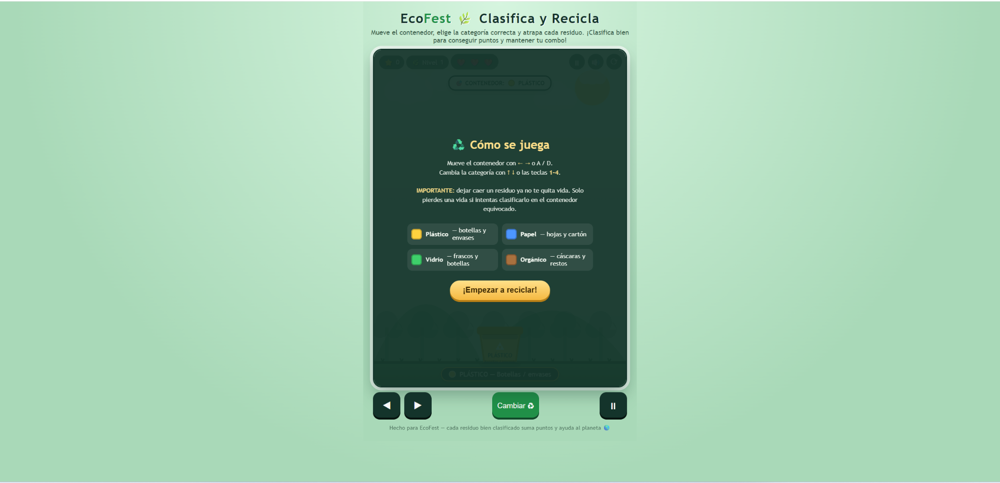
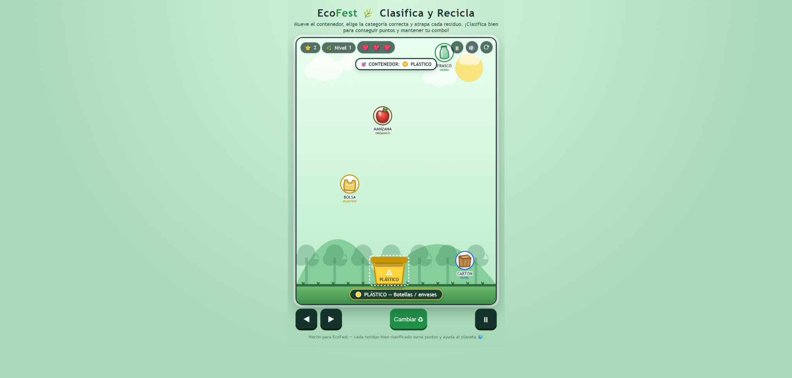
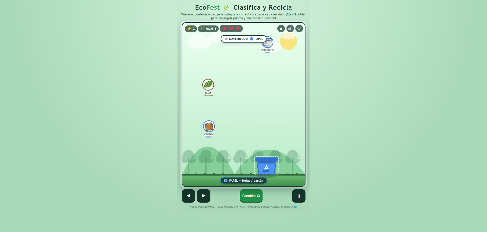
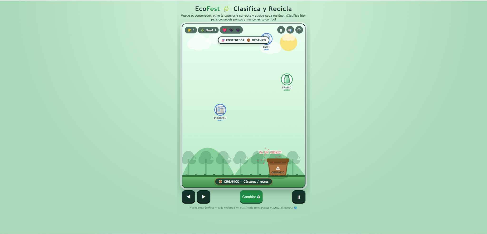
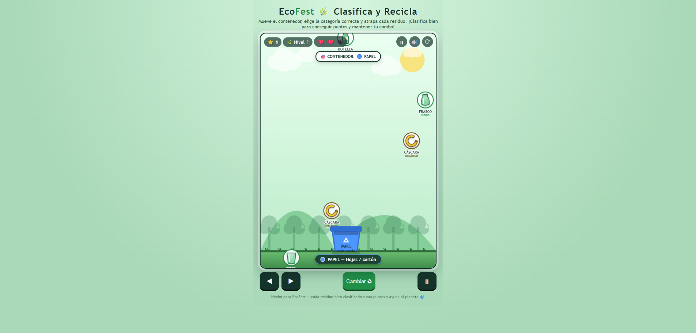
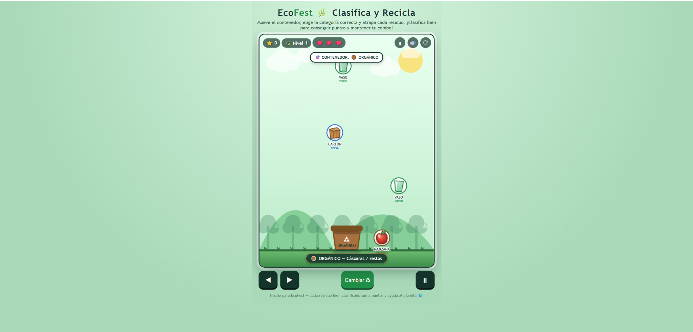
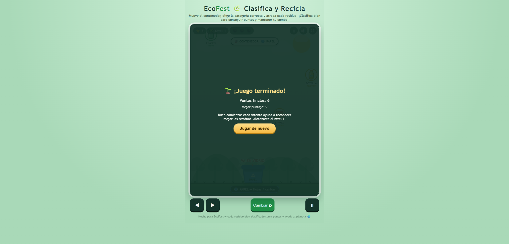
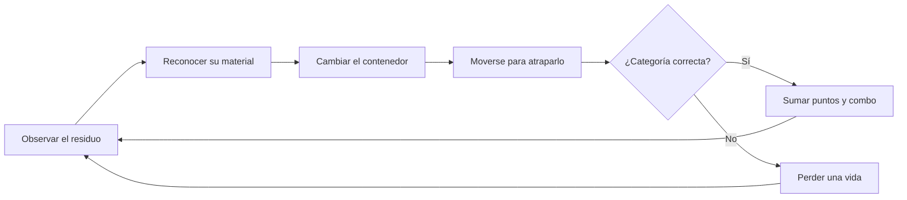
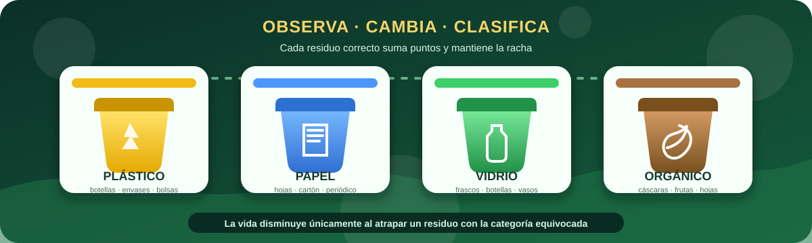

  

<h1 align="center">EcoFest</h1>

  <strong>Clasifica y recicla</strong> 
  Reconoce cada residuo, cambia el contenedor y protege tu racha ecológica.

  
  
  
  

  
  
  

  <a href="#vista-general">Vista general</a>
  &nbsp;|&nbsp;
  <a href="#galeria">Galería</a>
  &nbsp;|&nbsp;
  <a href="#mecanicas">Mecánicas</a>
  &nbsp;|&nbsp;
  <a href="#progresion">Progresión</a>
  &nbsp;|&nbsp;
  <a href="#practica">Práctica</a>
  &nbsp;|&nbsp;
  <a href="#ia">Uso de IA</a>

---

## Vista general

**EcoFest** es un videojuego casual y educativo de clasificación de residuos. El jugador desplaza un contenedor por la parte inferior de la pantalla, selecciona una de cuatro categorías y decide qué objetos debe atrapar. La partida combina observación, reacción y memoria visual para reforzar hábitos de reciclaje.

> [!TIP]
> El reto no consiste únicamente en alcanzar un objeto: antes de atraparlo hay que reconocer su material y comprobar que el contenedor activo sea el correcto.

<table>
<tr>
<td width="25%" align="center"><strong>4</strong> categorías</td>
<td width="25%" align="center"><strong>12</strong> tipos de residuo</td>
<td width="25%" align="center"><strong>3</strong> vidas iniciales</td>
<td width="25%" align="center"><strong>8</strong> niveles de dificultad</td>
</tr>
</table>

### Propósito

Separar residuos puede parecer una tarea cotidiana, pero exige reconocer materiales y relacionarlos con su destino correcto. EcoFest transforma ese aprendizaje en una experiencia arcade de decisiones rápidas, retroalimentación inmediata y dificultad progresiva.

### Ficha del proyecto

| Elemento | Información |
|---|---|
| Asignatura | Game Development |
| Tema | Proceso formal de desarrollo de videojuegos |
| Género | Casual, arcade educativo |
| Público objetivo | Personas de 6 años en adelante |
| Objetivo | Conseguir la mayor puntuación clasificando residuos correctamente |
| Mecánica principal | Mover el contenedor, cambiar su categoría y atrapar objetos |
| Plataforma | Navegador web |
| Modalidad | Un jugador |
| Condición de cierre | La partida termina al perder las tres vidas |
| Sistema de logro | Récord de puntuación guardado localmente |

---

## Galería del proyecto

Las capturas muestran el ciclo completo del juego: instrucciones, clasificación, retroalimentación, aumento de dificultad y resultado final.

### Gameplay y clasificación correcta

<table>
<tr>
<td width="50%" valign="top">
  
  
<strong>Decisión en movimiento</strong> El contenedor activo y la categoría de cada residuo permanecen visibles.

</td>
<td width="50%" valign="top">
  
  
<strong>Clasificación correcta</strong> El acierto suma puntos y genera una confirmación visual sobre el contenedor.

</td>
</tr>
</table>

### Error y dificultad progresiva

<table>
<tr>
<td width="50%" valign="top">
  
  
<strong>Corrección inmediata</strong> El mensaje indica la categoría correcta y una vida se descuenta.

</td>
<td width="50%" valign="top">
  
  
<strong>Mayor presión</strong> Más objetos en pantalla exigen priorizar y cambiar de categoría con rapidez.

</td>
</tr>
</table>

### Categorías y resultado

<table>
<tr>
<td width="50%" valign="top">
  
  
<strong>Cuatro materiales</strong> El color, el nombre y el dibujo ayudan a reconocer cada clasificación.

</td>
<td width="50%" valign="top">
  
  
<strong>Cierre de partida</strong> Puntaje, récord local, nivel alcanzado y opción de volver a jugar.

</td>
</tr>
</table>

> [!NOTE]
> Dejar que un residuo llegue al suelo no quita una vida; únicamente rompe el combo. La vida disminuye cuando el jugador atrapa un residuo con la categoría equivocada.

---

## Mecánicas y reglas

### Ciclo jugable

### Sistema de clasificación

  

| Categoría | Color del contenedor | Residuos representados |
|---|---|---|
| Plástico | Amarillo | Botella, envase y bolsa |
| Papel | Azul | Papel, cartón y periódico |
| Vidrio | Verde | Frasco, botella y vaso |
| Orgánico | Marrón | Cáscara, manzana y hoja |

### Reglas principales

1. Los residuos aparecen desde la parte superior y avanzan hacia el suelo.
2. El jugador puede mover el contenedor horizontalmente en cualquier momento.
3. Antes de atrapar un objeto debe seleccionar una de las cuatro categorías.
4. Una clasificación correcta suma puntos y aumenta el combo.
5. Cada cinco aciertos consecutivos aumenta el valor del siguiente tramo de la racha.
6. Una clasificación incorrecta reinicia el combo y resta una vida.
7. Un residuo no atrapado desaparece y reinicia el combo, pero no resta vidas.
8. La partida termina cuando las tres vidas llegan a cero.

### Controles

| Entrada | Acción |
|---|---|
| `A` o `←` | Mover el contenedor hacia la izquierda |
| `D` o `→` | Mover el contenedor hacia la derecha |
| `↑` o `↓` | Recorrer las categorías |
| `1`, `2`, `3` o `4` | Seleccionar una categoría directamente |
| `Espacio` | Pausar o reanudar |
| `R` | Reiniciar la partida |
| Botón de sonido | Activar o silenciar música y efectos |
| Controles inferiores | Mover, cambiar categoría y pausar en pantalla táctil |

---

## Progresión y puntuación

La puntuación controla la dificultad. El nivel aumenta cada **12 puntos**, hasta llegar al nivel 8. Con cada nivel se reduce el intervalo entre apariciones y aumenta la velocidad de caída.

| Elemento | Funcionamiento |
|---|---|
| Nivel inicial | Nivel 1 |
| Nivel máximo | Nivel 8 |
| Cambio de nivel | Cada 12 puntos |
| Frecuencia | Aumenta gradualmente hasta un límite jugable |
| Velocidad | Se incrementa de acuerdo con el nivel |
| Récord | Se conserva en `localStorage` |

### Combo y recompensa

| Aciertos consecutivos | Puntos por clasificación |
|---:|---:|
| 1–4 | +1 |
| 5–9 | +2 |
| 10–14 | +3 |
| 15–19 | +4 |

El patrón continúa mientras se mantenga la racha. Esta recompensa anima a clasificar con precisión, no solo a sobrevivir.

### Mensajes de resultado

| Puntaje final | Retroalimentación |
|---:|---|
| 0–14 | Buen comienzo y reconocimiento inicial de residuos |
| 15–34 | Buen dominio de varias categorías |
| 35 o más | Gran racha ecológica |

---

## Diseño visual y sonoro

- Escenario claro con naturaleza, colinas, árboles, nubes y una zona de juego delimitada.
- Contenedores diferenciados por color, rótulo y símbolo para evitar depender de una sola señal visual.
- Doce residuos dibujados de acuerdo con el objeto que representan.
- Etiquetas visibles bajo cada residuo para reforzar la asociación entre objeto y material.
- Partículas, textos flotantes y cambios de color como retroalimentación inmediata.
- Interfaz con puntuación, nivel, vidas, categoría activa, pausa, sonido y reinicio.
- Música ambiental y efectos sintetizados mediante Web Audio API, sin archivos externos.
- Diseño adaptable y controles en pantalla para equipos táctiles.

---

## Tecnologías utilizadas

  
  
  
  
  
  

| Tecnología | Aplicación |
|---|---|
| HTML5 | Estructura, canvas, paneles, overlays y controles |
| CSS3 | Diseño adaptable, colores, botones, indicadores y profundidad visual |
| JavaScript | Estados, entradas, colisiones, categorías, puntuación y niveles |
| Canvas 2D | Escenario, residuos, contenedor, partículas y animación |
| Web Audio API | Música y efectos de acierto, error y final |
| LocalStorage | Conservación del mejor puntaje en el navegador |

Todo el videojuego se ejecuta desde un único archivo `index.html`; no necesita instalación, servidor ni bibliotecas externas.

---

## Relación con la práctica 02

La actividad abordó las cuatro fases del proceso formal de desarrollo: **preproducción, producción, testeo y lanzamiento**. EcoFest funcionó como prototipo para aplicar esa secuencia a un problema educativo relacionado con el reciclaje.

| Requisito | Evidencia | Estado |
|---|---|---|
| Investigación conceptual | Definición y actividades de las cuatro fases | Cumplido |
| Visualización de la secuencia | Infografía del proceso de desarrollo | Cumplido |
| Preproducción original | Nombre, género, objetivo, reglas y público definidos | Cumplido |
| Mecánica principal | Movimiento lateral y clasificación de residuos | Cumplido |
| Producción con IA | Prototipo web funcional generado e iterado desde requisitos | Cumplido |
| Condición de derrota | Tres clasificaciones incorrectas consumen las vidas | Cumplido |
| Aprendizaje del reciclaje | Asociación repetida entre objeto, color y categoría | Cumplido |
| Validación con otro equipo | Todos los criterios fueron marcados como “Sí” | Cumplido |
| Evidencia visual | Inicio, gameplay, mecánica, error, dificultad y resultado | Cumplido |

### Resultado de la validación

El equipo revisor confirmó que el juego:

- Funcionaba sin errores técnicos.
- Presentaba una mecánica clara.
- Permitía alcanzar las condiciones previstas.
- Enseñaba a clasificar residuos.
- Era comprensible para el público objetivo.

La tabla de validación no registró sugerencias de mejora. Aun así, el prototipo continuó evolucionando mediante pruebas propias y revisión visual.

### Del planteamiento inicial a la versión final

| Momento | Situación observada | Decisión aplicada |
|---|---|---|
| Preproducción | Todo residuo perdido se consideraba un error | Se reservó la pérdida de vida para una clasificación equivocada |
| Primera versión | Algunos objetos no parecían el residuo indicado | Se rediseñaron con siluetas y detalles reconocibles |
| Corrección técnica | Una referencia inexistente detenía el renderizado | Se eliminó el acceso inválido y se volvió a probar el ciclo de animación |
| Ajuste de experiencia | La categoría podía confundirse durante la acción | Se reforzaron color, nombre, leyenda y etiqueta del objeto |
| Versión final | Faltaba sensación de progreso | Se añadieron niveles, mayor frecuencia, velocidad, combos y récord local |

> [!IMPORTANT]
> El cambio en la penalización mantiene el objetivo del documento —aprender a clasificar correctamente— y mejora la justicia de la interacción: no alcanzar un objeto rompe la racha, mientras que tomar una decisión equivocada sí consume una vida.

---

## Uso responsable de inteligencia artificial

ChatGPT se utilizó como herramienta principal de apoyo para convertir los requisitos académicos en un prototipo funcional y para acompañar sus iteraciones posteriores.

| Etapa | Participación de la IA | Decisión humana |
|---|---|---|
| Conceptualización | Organización de requisitos y propuesta de estructura | Definición de EcoFest, su propósito y público |
| Programación | Generación y ajuste de HTML, CSS y JavaScript | Pruebas de controles, reglas y dificultad |
| Corrección | Localización de fallos y propuestas de solución | Identificación del error real y aceptación del cambio |
| Diseño visual | Alternativas para residuos, contenedores y escenario | Selección de una apariencia clara y coherente |
| Documentación | Estructura y redacción inicial del README | Verificación contra el informe y la versión jugable |

### Justificación

La IA aceleró la construcción del prototipo y permitió realizar ciclos cortos de **idea, prueba, observación y mejora**. No sustituyó la validación: cada cambio se revisó dentro del navegador para confirmar que los controles, colisiones, vidas, categorías y mensajes funcionaran de acuerdo con la intención del proyecto.

<strong>Ver prompt base reconstruido</strong>

> Actúa como desarrollador de videojuegos web. Crea un juego casual educativo llamado EcoFest con HTML5, CSS3 y JavaScript puro. Los residuos deben caer desde la parte superior y el jugador controlará un contenedor que se mueve horizontalmente. Debe poder cambiar entre plástico, papel, vidrio y orgánico; cada objeto tiene que verse y etiquetarse de acuerdo con su material. Una clasificación correcta suma puntos y aumenta el combo; una clasificación incorrecta resta una de tres vidas. Los objetos no atrapados deben desaparecer y reiniciar la racha sin quitar vida. Añade dificultad progresiva, ocho niveles, récord local, instrucciones, pausa, reinicio, controles táctiles, música ambiental y efectos mediante Web Audio API. El juego debe funcionar en un único archivo HTML sin dependencias externas.

Este texto reconstruye el prompt a partir de la tabla de preproducción, la versión final y las correcciones realizadas. Se presenta como registro transparente porque el prompt original no fue conservado literalmente.

### Verificación humana

Se comprobaron el inicio, el movimiento, el cambio de categorías, la clasificación correcta e incorrecta, la regla de vidas, el combo, el aumento de nivel, la pausa, el reinicio, el sonido, el récord y el cierre de partida.

---

## Aprendizajes

- Traducir un problema ambiental en una mecánica jugable concreta.
- Aplicar preproducción, producción, pruebas y preparación para publicación.
- Diseñar retroalimentación que explique un error sin interrumpir el ritmo.
- Gestionar estados, colisiones, puntuación, combos, vidas y dificultad.
- Mejorar la reconocibilidad de objetos dibujados en Canvas 2D.
- Diferenciar una propuesta generada con IA de una solución validada por el desarrollador.
- Documentar cambios cuando una decisión de usabilidad modifica una regla inicial.

## Posibles mejoras futuras

- Incluir una ficha educativa breve después de cada clasificación.
- Añadir residuos electrónicos y materiales especiales en un modo avanzado.
- Incorporar opciones de contraste, reducción de movimiento y tamaño de texto.
- Crear una tabla local de récords por jugador.
- Añadir desafíos diarios o partidas con tiempo limitado.
- Realizar una nueva validación con personas de distintas edades.

## Ejecución local

1. Descarga o clona el repositorio.
2. Abre la carpeta `juegos/ecofest/`.
3. Ejecuta `index.html` en un navegador moderno.

No requiere instalación ni conexión después de descargar el archivo.

---

  <a href="https://github.com/katfipol/game-development-portfolio"><strong>Portafolio principal</strong></a>
  &nbsp;|&nbsp;
  <a href="https://katfipol.github.io/game-development-portfolio/juegos/ecofest/"><strong>Jugar EcoFest</strong></a>
  &nbsp;|&nbsp;
  <a href="https://github.com/katfipol/game-development-portfolio/blob/main/juegos/nutrifest/README.md"><strong>Siguiente proyecto: NutriFest</strong></a>

