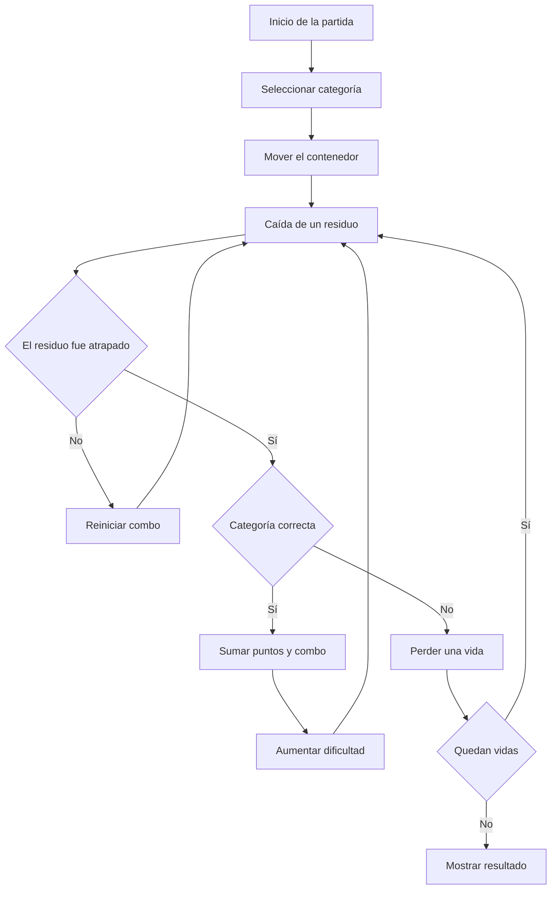

<p align="center">
  <a href="https://katfipol.github.io/game-development-portfolio/juegos/ecofest/">
    
  </a>
</p>

<h1 align="center">EcoFest</h1>

<p align="center">
  <strong>Clasifica, recicla y supera tu mejor puntuación</strong>
</p>

<p align="center">
  Un videojuego arcade educativo que transforma la clasificación de residuos en un desafío de reflejos, memoria visual y toma rápida de decisiones.
</p>

<p align="center">
  
  
  
  
  
</p>

<p align="center">
  <a href="https://katfipol.github.io/game-development-portfolio/juegos/ecofest/">
    
  </a>
  <a href="index.html">
    
  </a>
  <a href="../../README.md">
    
  </a>
</p>

---

## Descripción

EcoFest es un videojuego casual de clasificación de residuos dirigido a jugadores de seis años en adelante. El jugador controla un contenedor que puede desplazarse horizontalmente y cambiar de categoría.

Desde la parte superior de la pantalla caen diferentes residuos. Antes de atraparlos, el jugador debe reconocer el objeto, identificar su material y seleccionar la categoría correspondiente.

El objetivo es conseguir la puntuación más alta posible, conservar las tres vidas y avanzar por niveles progresivamente más rápidos.

## Propósito educativo

El videojuego busca reforzar la clasificación de residuos mediante repetición, asociación visual y respuesta inmediata.

Cada objeto presenta:

- Una representación visual diferenciada.
- El nombre del residuo.
- Su material correspondiente.
- Un color relacionado con su categoría.
- Retroalimentación cuando se clasifica incorrectamente.

La mecánica permite aprender mientras se juega, sin separar la actividad educativa del desafío arcade.

## Información del proyecto

| Elemento | Descripción |
|---|---|
| Nombre | EcoFest |
| Género | Arcade casual educativo |
| Público objetivo | Jugadores de 6 años en adelante |
| Objetivo | Clasificar correctamente la mayor cantidad de residuos |
| Modalidad | Un jugador |
| Vidas iniciales | 3 |
| Niveles | 8 niveles de dificultad |
| Condición de derrota | Perder las tres vidas |
| Condición de victoria | Superar la puntuación anterior |
| Plataforma | Navegador web |
| Tecnologías | HTML5, CSS3, JavaScript y Canvas API |

## Mecánica principal

El jugador realiza dos acciones principales:

1. Mover el contenedor hacia la izquierda o la derecha.
2. Cambiar la categoría activa del contenedor.

Cuando un residuo entra en el contenedor:

- Si la categoría coincide, se suman puntos y aumenta el combo.
- Si la categoría es incorrecta, el combo se reinicia y se pierde una vida.
- Si el residuo llega al suelo sin ser atrapado, desaparece y reinicia el combo, pero no quita una vida.
- La partida termina cuando las tres vidas llegan a cero.

Esta corrección permite que el sistema de vidas dependa de una decisión equivocada del jugador y no de objetos que simplemente no pudo alcanzar.

## Categorías de reciclaje

| Categoría | Color identificador | Ejemplos incluidos |
|---|---|---|
| Plástico | Amarillo | Botella, envase y bolsa |
| Papel | Azul | Hoja, cartón y periódico |
| Vidrio | Verde | Frasco, botella y vaso |
| Orgánico | Marrón | Cáscara, manzana y hoja |

Los residuos se dibujan individualmente para que su apariencia coincida con el objeto indicado y no sean figuras genéricas.

## Controles

| Acción | Controles |
|---|---|
| Mover a la izquierda | `A` o flecha izquierda |
| Mover a la derecha | `D` o flecha derecha |
| Categoría anterior | Flecha arriba |
| Categoría siguiente | Flecha abajo |
| Elegir plástico | Tecla `1` |
| Elegir papel | Tecla `2` |
| Elegir vidrio | Tecla `3` |
| Elegir orgánico | Tecla `4` |
| Pausar o reanudar | Barra espaciadora |
| Reiniciar | Tecla `R` o botón de reinicio |

El juego también incluye controles táctiles para desplazarse, cambiar de categoría y pausar desde dispositivos móviles.

## Flujo de juego



## Sistema de puntuación

Cada clasificación correcta otorga puntos. Mantener una racha permite conseguir una bonificación:

```text
Puntos obtenidos = 1 + parte entera del combo / 5
```

Esto significa que el jugador recibe una recompensa adicional cada cinco clasificaciones correctas consecutivas.

El mejor puntaje se guarda mediante `localStorage`, por lo que permanece registrado en el navegador después de cerrar o reiniciar la página.

## Dificultad progresiva

El nivel aumenta cada doce puntos hasta alcanzar un máximo de ocho niveles.

A medida que el jugador progresa:

- Los residuos aparecen con mayor frecuencia.
- La velocidad de caída aumenta.
- Hay menos tiempo para reconocer el material.
- Se vuelve más importante anticipar el cambio de categoría.
- Mantener combos largos requiere mayor precisión.

La progresión mantiene la partida activa sin cambiar las reglas principales.

## Interfaz y retroalimentación

La interfaz presenta permanentemente:

- Puntuación actual.
- Nivel alcanzado.
- Vidas restantes.
- Categoría seleccionada.
- Nombre y ejemplos de la categoría.
- Combo conseguido.
- Mejor puntuación registrada.

Cuando se comete un error, aparece un mensaje indicando la categoría correcta del residuo. De esta forma, el error también funciona como una oportunidad de aprendizaje.

## Sonido

EcoFest utiliza Web Audio API para generar el sonido directamente desde JavaScript.

Incluye:

- Música ambiental.
- Sonido de clasificación correcta.
- Sonido de clasificación incorrecta.
- Sonido de finalización.
- Control para activar o silenciar el audio.

No necesita archivos musicales externos para funcionar.

## Proceso de desarrollo

La práctica aplicó cuatro fases del proceso formal de creación de videojuegos.

### 1. Preproducción

Durante esta fase se definieron:

- La temática del reciclaje.
- El público objetivo.
- El género casual.
- La mecánica de residuos descendentes.
- Las cuatro categorías.
- El sistema de vidas.
- La puntuación sin límite fijo.

### 2. Producción

Se desarrollaron:

- El movimiento del contenedor.
- La generación aleatoria de residuos.
- La selección de categorías.
- Las colisiones.
- El sistema de puntos, vidas y combo.
- Los objetos dibujados mediante Canvas.
- La interfaz, los sonidos y los controles táctiles.

### 3. Testeo

Se comprobaron:

- El inicio y reinicio de la partida.
- La claridad de las categorías.
- La pérdida correcta de vidas.
- El funcionamiento de las colisiones.
- La representación visual de los residuos.
- La progresión de dificultad.
- Los controles de teclado y dispositivos táctiles.

### 4. Lanzamiento

La versión final fue organizada en el portafolio y publicada mediante GitHub Pages para ejecutarse directamente desde un navegador.

## Evolución del prototipo

| Versión | Problema identificado | Solución aplicada |
|---|---|---|
| V1 | Los residuos tenían poca variedad visual | Se incorporaron diferentes objetos para cada categoría |
| V2 | Algunos residuos no se parecían al objeto indicado | Se rediseñaron con formas, colores, etiquetas y detalles propios |
| V3 | Un error de JavaScript impedía dibujar los residuos | Se corrigió la referencia no definida en `drawTrashIcon` |
| V4 | Perder vidas por objetos no atrapados resultaba injusto | La vida ahora se pierde únicamente al atrapar una categoría incorrecta |
| V5 | La clasificación no era suficientemente clara | Se añadieron nombres, colores, ejemplos y mensajes correctivos |
| V6 | La partida se volvía repetitiva | Se incorporaron niveles, aumento de velocidad y sistema de combos |
| V7 | Faltaban opciones para diferentes dispositivos | Se añadieron controles táctiles y teclado alternativo |
| V8 | No existía seguimiento del progreso | Se incorporó un récord local mediante `localStorage` |

## Organización técnica

El videojuego está contenido en un único archivo `index.html`, dividido internamente en secciones funcionales:

| Componente | Responsabilidad |
|---|---|
| `CATEGORIES` | Define nombres, colores, ejemplos y residuos |
| Estado del juego | Gestiona puntuación, vidas, combo y nivel |
| Sistema de entrada | Procesa teclado y controles táctiles |
| Audio | Genera música y efectos mediante Web Audio API |
| Generación de residuos | Crea objetos, posiciones y variantes |
| Actualización | Controla movimiento, colisiones y dificultad |
| Renderizado | Dibuja escenario, contenedor, residuos y efectos |
| Almacenamiento | Conserva el mejor puntaje con `localStorage` |

## Cumplimiento de la práctica

| Requisito | Implementación |
|---|---|
| Videojuego funcional | Se ejecuta directamente en el navegador |
| Temática de reciclaje | Toda la mecánica se basa en clasificar residuos |
| Movimiento horizontal | El contenedor se desplaza en ambas direcciones |
| Objetos descendentes | Los residuos aparecen desde la parte superior |
| Categorías diferenciadas | Plástico, papel, vidrio y orgánico |
| Tres vidas | Se pierden al cometer clasificaciones incorrectas |
| Dificultad progresiva | La velocidad y frecuencia aumentan por nivel |
| Aprendizaje por repetición | Los objetos y categorías aparecen continuamente |
| Condición de derrota | La partida termina al perder las tres vidas |
| Validación | Se probaron las funciones principales y las correcciones |

## Uso de inteligencia artificial

ChatGPT fue utilizado como herramienta principal de apoyo para generar y mejorar el prototipo.

La inteligencia artificial colaboró en:

- La estructura inicial de HTML, CSS y JavaScript.
- La generación de la mecánica arcade.
- La corrección de errores de ejecución.
- La ampliación de categorías y residuos.
- El diseño visual de los objetos.
- El ajuste del sistema de vidas.
- La incorporación de dificultad, audio y controles táctiles.

Las decisiones sobre la temática, las reglas, las mejoras y la validación final fueron revisadas durante el desarrollo del proyecto.

<details>
<summary><strong>Prompt reconstruido del desarrollo</strong></summary>

<br>

Actúa como desarrollador de videojuegos web. Crea un videojuego educativo y funcional llamado EcoFest, dirigido a jugadores de seis años en adelante y centrado en enseñar la clasificación correcta de residuos.

El jugador debe controlar un contenedor que pueda moverse horizontalmente mientras diferentes residuos caen desde la parte superior. El contenedor debe cambiar entre cuatro categorías: plástico, papel, vidrio y orgánico.

Cada categoría debe incluir varios objetos claramente reconocibles. Los residuos no deben representarse mediante figuras genéricas: una botella debe parecer una botella, un periódico debe parecer un periódico y una manzana debe distinguirse visualmente.

Si el jugador atrapa un residuo con la categoría correcta, debe recibir puntos y aumentar su combo. Si lo atrapa con una categoría equivocada, debe perder una vida. Los residuos que lleguen al suelo sin ser atrapados deben desaparecer y reiniciar el combo, pero no quitar vidas.

La partida debe comenzar con tres vidas. Debe aumentar progresivamente la velocidad y frecuencia de aparición de los residuos. Incluye niveles, mejor puntuación, pausa, reinicio, música, efectos de sonido, mensajes de corrección y controles para teclado y dispositivos táctiles.

Utiliza HTML5, CSS3, JavaScript puro, Canvas API, Web Audio API y `localStorage`. El juego debe ejecutarse directamente en un navegador y mantenerse en un solo archivo `index.html`.

</details>

## Pruebas realizadas

Durante la validación se comprobó que:

- El juego inicia sin errores.
- El contenedor responde al teclado.
- Los controles táctiles funcionan.
- Las cuatro categorías pueden seleccionarse.
- Los residuos son reconocibles.
- Las clasificaciones correctas suman puntos.
- Las clasificaciones incorrectas quitan una vida.
- Los objetos perdidos no quitan vidas.
- El combo aumenta correctamente.
- La dificultad cambia según el puntaje.
- La partida termina después de perder las tres vidas.
- La mejor puntuación permanece guardada.

## Aprendizajes

El desarrollo de EcoFest permitió comprender cómo una mecánica sencilla puede comunicar una idea educativa mediante repetición y retroalimentación inmediata.

También permitió aplicar generación de objetos, colisiones, dificultad progresiva, controles táctiles, persistencia local, sonido procedural y organización de estados dentro de un videojuego web.

La principal mejora de diseño fue diferenciar una acción incorrecta de una oportunidad perdida: solamente una clasificación equivocada quita una vida. Esto hace que las reglas sean más coherentes y justas para el jugador.

---

<p align="center">
  <a href="https://katfipol.github.io/game-development-portfolio/juegos/ecofest/">
    Jugar EcoFest
  </a>
  ·
  <a href="../../README.md">
    Regresar al portafolio
  </a>
</p>
