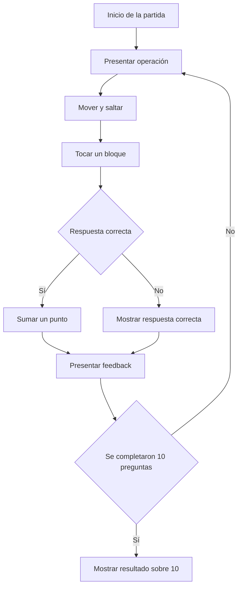

  

<h1 align="center">EduMundo</h1>

  <strong>Aventura matemática de plataformas</strong>

  Un videojuego educativo donde el movimiento, los saltos y las operaciones matemáticas forman parte del mismo desafío.

  
  
  
  

  
  
  

---

## Descripción

EduMundo es un videojuego educativo dirigido principalmente a estudiantes de primero de secundaria. Su propuesta combina preguntas aritméticas con una mecánica de movimiento lateral y salto inspirada en los videojuegos clásicos de plataformas.

En cada ronda aparece una operación matemática acompañada por cuatro bloques de respuesta. El jugador debe controlar al personaje, identificar la alternativa correcta y saltar hasta tocar el bloque correspondiente.

La partida contiene exactamente diez preguntas. Cada respuesta correcta suma un punto y, al finalizar, el juego presenta una evaluación sobre diez.

## Objetivo educativo

El proyecto busca reforzar la resolución mental de operaciones aritméticas mediante una experiencia interactiva. En lugar de responder mediante botones tradicionales, el jugador debe relacionar el resultado correcto con una acción dentro del escenario.

Las operaciones incluidas son:

- Sumas.
- Restas.
- Multiplicaciones.
- Divisiones exactas.
- Operaciones combinadas en los niveles de mayor dificultad.

## Información del proyecto

| Elemento | Descripción |
|---|---|
| Nombre | EduMundo |
| Género | Aventura matemática de plataformas |
| Público objetivo | Estudiantes de primero de secundaria |
| Duración | 10 preguntas por partida |
| Alternativas | 4 respuestas por pregunta |
| Puntuación | 1 punto por respuesta correcta |
| Resultado final | Evaluación sobre 10 |
| Plataforma | Navegador web |
| Modalidad | Un jugador |
| Tecnologías | HTML5, CSS3 y JavaScript |

## Mecánica principal

El personaje puede desplazarse horizontalmente y saltar. Para responder una pregunta debe tocar uno de los cuatro bloques flotantes.

Cuando se produce el contacto:

- Si el bloque es correcto, se suma un punto.
- Si el bloque es incorrecto, no se modifica el puntaje.
- El juego muestra una respuesta visual inmediata.
- Después del mensaje se habilita la siguiente pregunta.
- Al completar las diez preguntas aparece el resultado final.

## Controles

| Acción | Teclas |
|---|---|
| Mover a la izquierda | `A` o flecha izquierda |
| Mover a la derecha | `D` o flecha derecha |
| Saltar | `W`, flecha arriba o barra espaciadora |
| Pausar o reanudar | Botón `Pausar` o tecla `Esc` |
| Activar o desactivar música | Botón `Música` |
| Reiniciar la partida | Botón `Reiniciar` |

## Flujo de juego

## Progresión de dificultad

La dificultad cambia durante la partida para evitar que las diez preguntas se sientan iguales.

| Etapa | Características |
|---|---|
| Inicial | Operaciones sencillas y bloques estáticos |
| Intermedia | Operaciones más variadas y movimiento horizontal moderado |
| Avanzada | Operaciones más complejas, bloques más pequeños y movimiento horizontal y vertical |
| Final | Mayor precisión de salto y lectura rápida de las alternativas |

El movimiento de los bloques está limitado para mantener las respuestas legibles y alcanzables.

## Ambientación visual

EduMundo utiliza una presentación inspirada en los videojuegos clásicos, pero conserva una identidad visual propia. Durante la partida se alternan diferentes biomas:

- Pradera.
- Desierto.
- Nieve.
- Atardecer.

El personaje, los bloques, el escenario y los elementos del fondo son dibujados mediante Canvas. Esto permite generar el apartado visual directamente desde JavaScript sin depender de imágenes externas.

## Sonido

El juego utiliza Web Audio API para generar sus efectos y melodías. Incluye:

- Música de fondo original.
- Sonido de respuesta correcta.
- Sonido de respuesta incorrecta.
- Audio final diferente según el resultado.
- Control para activar o desactivar la música.

El audio comienza después de que el jugador pulsa el botón de inicio, respetando las restricciones de reproducción automática de los navegadores.

## Cumplimiento de los requisitos

| Requisito | Implementación |
|---|---|
| Diez preguntas | La partida finaliza después de responder exactamente 10 operaciones |
| Cuatro alternativas | Cada pregunta genera cuatro bloques identificados |
| Operaciones aritméticas | Se incluyen sumas, restas, multiplicaciones y divisiones |
| Puntuación | Cada acierto suma un punto |
| Feedback | Se informa si la respuesta es correcta o incorrecta |
| Resultado final | Se presenta una calificación sobre 10 |
| Funcionamiento web | El juego se ejecuta directamente desde `index.html` |
| Reinicio | El jugador puede comenzar una nueva partida |
| Dificultad progresiva | Las operaciones y el movimiento cambian durante el recorrido |
| Accesibilidad de controles | Se admiten letras, flechas y barra espaciadora |

## Evolución del prototipo

| Versión | Mejora realizada | Resultado |
|---|---|---|
| V1 | Ajuste de las posiciones de los bloques | Las respuestas quedaron al alcance del personaje |
| V2 | Incorporación de pausa, reinicio y control de música | El jugador obtuvo mayor control sobre la partida |
| V3 | Creación de una pantalla inicial e instrucciones visibles | El objetivo y los controles quedaron más claros |
| V4 | Eliminación de elementos que obstruían el movimiento | El escenario quedó más limpio y funcional |
| V5 | Incorporación de preguntas y movimientos progresivos | La dificultad aumenta de manera gradual |
| V6 | Alternancia de biomas y mejora del personaje | Cada etapa posee mayor identidad visual |
| V7 | Incorporación de sonidos finales diferentes | El resultado de victoria o repaso tiene una respuesta sonora propia |

## Organización técnica

El videojuego se encuentra en un único archivo `index.html` para facilitar su ejecución y publicación. Internamente se organiza en componentes con responsabilidades diferenciadas:

| Componente | Responsabilidad |
|---|---|
| `AudioEngine` | Música y efectos de sonido |
| `MathEngine` | Generación de operaciones y alternativas |
| `PhysicsEngine` | Comprobación de colisiones |
| `Player` | Movimiento, salto y representación del personaje |
| `Block` | Respuestas, dificultad y movimiento |
| `Game` | Estados, preguntas, puntuación y ciclo principal |

## Uso de inteligencia artificial

La inteligencia artificial se utilizó como herramienta de apoyo durante la creación y mejora del prototipo.

Según el documento original de la práctica, la primera versión fue generada con **Gemini 1.5 Pro**. Las iteraciones posteriores utilizaron asistencia de **ChatGPT** para revisar errores, ajustar mecánicas, mejorar el apartado visual y refinar la experiencia del jugador.

Las decisiones finales, la selección de mejoras y la comprobación del funcionamiento se realizaron mediante revisión y pruebas del proyecto.

<strong>Prompt principal de desarrollo</strong>

 

Actúa como desarrollador de videojuegos web. Crea un videojuego educativo de plataformas 2D llamado EduMundo, dirigido a estudiantes de primero de secundaria.

El jugador debe controlar un personaje mediante teclado, desplazarse horizontalmente y saltar para tocar bloques que contienen respuestas a operaciones matemáticas.

La partida debe incluir exactamente diez preguntas con sumas, restas, multiplicaciones y divisiones. Cada pregunta debe mostrar cuatro alternativas, otorgar un punto por respuesta correcta e informar claramente si la elección fue correcta o incorrecta.

La dificultad debe aumentar progresivamente. Las primeras respuestas deben permanecer estáticas y, en las preguntas posteriores, los bloques pueden moverse ligeramente de forma horizontal y vertical sin impedir su lectura ni volverlos inalcanzables.

Incluye una pantalla inicial, instrucciones, contador de preguntas, puntuación, pausa, reinicio, música, efectos de respuesta y una pantalla final con el resultado sobre diez.

Utiliza HTML5, CSS3 y JavaScript puro. El juego debe funcionar directamente en un navegador, evitar `eval()` y mantener separadas la generación matemática, las físicas, el audio, la interfaz y el control general de la partida.

## Pruebas realizadas

Durante la validación se comprobó que:

- El juego inicia correctamente.
- Las instrucciones son visibles.
- El personaje responde a los controles.
- Todas las preguntas presentan cuatro alternativas.
- Las respuestas generan feedback inmediato.
- El puntaje se actualiza correctamente.
- Se pueden completar las diez preguntas.
- El resultado final aparece sobre diez.
- Los bloques móviles permanecen legibles y alcanzables.
- Los botones de pausa, música y reinicio funcionan.

## Aprendizajes

El desarrollo de EduMundo permitió aplicar generación de contenido matemático, detección de colisiones, movimiento en Canvas, control de estados, retroalimentación audiovisual y dificultad progresiva.

También permitió comprender que una mecánica educativa debe equilibrar el desafío con la claridad. El movimiento puede aumentar la dificultad, pero no debe impedir que el jugador lea las respuestas o complete el objetivo.

---

  <a href="https://katfipol.github.io/game-development-portfolio/juegos/edumundo/">
    Jugar EduMundo
  </a>
  ·
  <a href="../../README.md">
    Regresar al portafolio
  </a>

