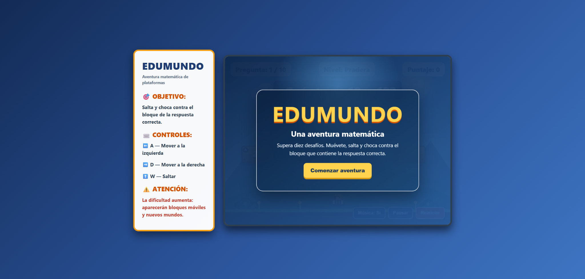
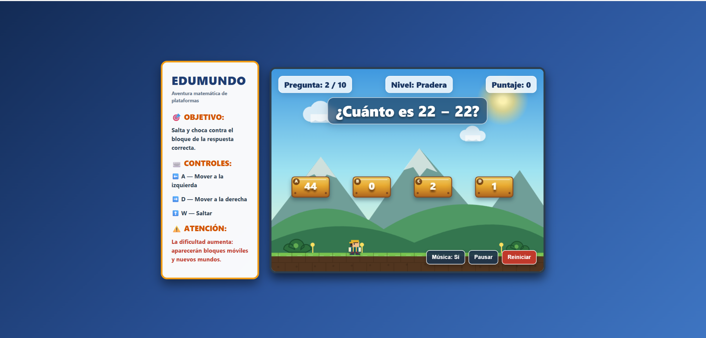
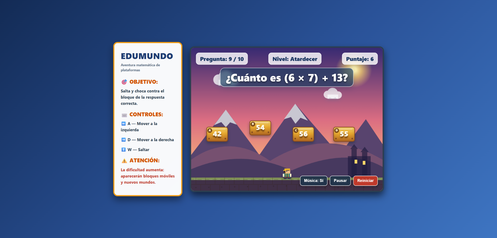
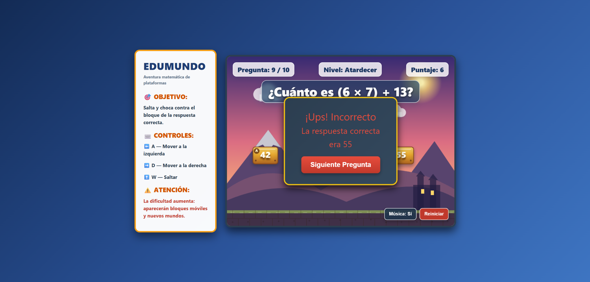
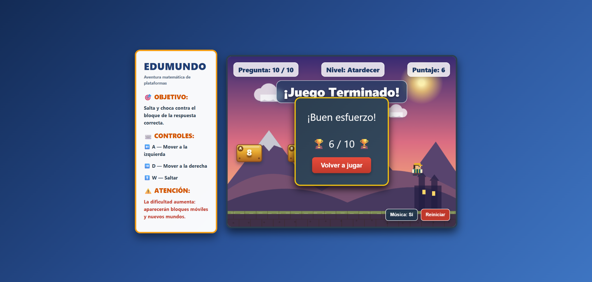
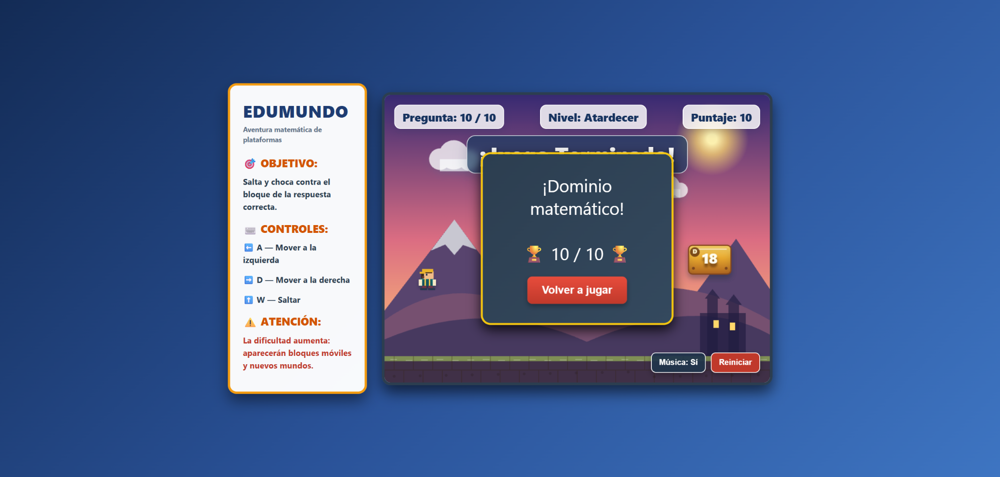
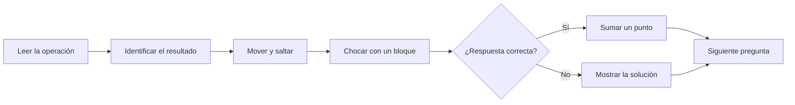
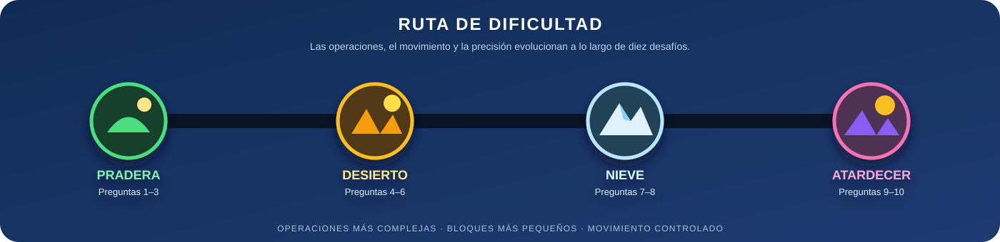

  

<h1 align="center">EduMundo</h1>

  <strong>Una aventura matemática de plataformas</strong> 
  Piensa la respuesta, recorre el escenario y alcanza el bloque correcto.

  
  
  
  

  
  
  

  <a href="#vista-general">Vista general</a>
  &nbsp;|&nbsp;
  <a href="#galeria">Galería</a>
  &nbsp;|&nbsp;
  <a href="#mecanicas">Mecánicas</a>
  &nbsp;|&nbsp;
  <a href="#progresion">Progresión</a>
  &nbsp;|&nbsp;
  <a href="#practica">Práctica</a>
  &nbsp;|&nbsp;
  <a href="#ia">Uso de IA</a>

---

## Vista general

**EduMundo** es un videojuego educativo de plataformas 2D dirigido a estudiantes de primero de secundaria. En lugar de responder mediante un formulario, el jugador debe mover al personaje, saltar y chocar con uno de los cuatro bloques que representan las posibles respuestas.

> [!TIP]
> La operación matemática y la habilidad de movimiento forman un mismo desafío: primero se resuelve la pregunta y después se ejecuta la decisión dentro del escenario.

<table>
<tr>
<td width="25%" align="center"><strong>10</strong> preguntas secuenciales</td>
<td width="25%" align="center"><strong>4</strong> alternativas por reto</td>
<td width="25%" align="center"><strong>4</strong> tipos de operación</td>
<td width="25%" align="center"><strong>10 puntos</strong> puntuación máxima</td>
</tr>
</table>

### Propósito

La práctica repetitiva de operaciones puede resultar poco motivadora. EduMundo convierte sumas, restas, multiplicaciones y divisiones en objetivos físicos dentro de un escenario, incorporando coordinación, toma de decisiones, retroalimentación inmediata y progresión visual.

### Ficha del proyecto

| Elemento | Información |
|---|---|
| Asignatura | Game Development |
| Tema | Introducción al desarrollo de videojuegos |
| Género | Aventura de plataformas 2D y puzzle educativo |
| Público objetivo | Estudiantes de primero de secundaria |
| Objetivo | Completar diez preguntas alcanzando el bloque correcto |
| Mecánica principal | Movimiento, salto, colisión y selección física de respuestas |
| Plataforma | Navegador web |
| Modalidad | Un jugador |
| Puntuación | Un punto por cada respuesta correcta |

---

## Galería del proyecto

Las capturas documentan el recorrido completo: presentación, gameplay, aumento de dificultad, retroalimentación y resultados finales.

### Gameplay y mecánica principal

<table>
<tr>
<td width="50%" valign="top">
  
  
<strong>Gameplay inicial</strong> Pregunta, cuatro bloques, personaje y controles visibles.

</td>
<td width="50%" valign="top">
  
  
<strong>Dificultad avanzada</strong> Operación combinada, bloques móviles y cambio de bioma.

</td>
</tr>
</table>

### Retroalimentación y resultado

<table>
<tr>
<td width="50%" valign="top">
  
  
<strong>Respuesta incorrecta</strong> El juego informa el error y muestra la solución correcta.

</td>
<td width="50%" valign="top">
  
  
<strong>Resultado según desempeño</strong> La evaluación final cambia de acuerdo con la puntuación obtenida.

</td>
</tr>
</table>

### Victoria perfecta

  

<strong>Dominio matemático — 10/10</strong> La puntuación máxima activa el mejor reconocimiento disponible.

> [!NOTE]
> EduMundo no detiene la partida por un error. El jugador completa los diez desafíos y recibe una evaluación final acorde con su desempeño, manteniendo el enfoque educativo.

---

## Mecánicas y reglas

### Ciclo jugable

### Reglas principales

1. La partida contiene exactamente diez preguntas.
2. Cada pregunta presenta cuatro bloques de respuesta.
3. Solo uno de los bloques contiene la solución correcta.
4. Cada acierto suma un punto.
5. Una respuesta incorrecta no resta puntos ni termina la partida.
6. Después de cada intento se muestra una retroalimentación clara.
7. El resultado final se expresa sobre diez puntos.

### Controles

| Entrada | Acción |
|---|---|
| `A` o `←` | Mover hacia la izquierda |
| `D` o `→` | Mover hacia la derecha |
| `W`, `↑` o `Espacio` | Saltar |
| Botón **Pausar** | Detener o reanudar la acción |
| Botón **Reiniciar** | Comenzar una partida nueva |
| Botón **Música** | Activar o desactivar el audio |

---

## Progresión y dificultad

  

| Preguntas | Bioma | Evolución del desafío |
|---:|---|---|
| 1–3 | Pradera | Operaciones iniciales y bloques de mayor estabilidad |
| 4–6 | Desierto | Mayor variedad numérica y movimiento progresivo |
| 7–8 | Nieve | Multiplicaciones o divisiones y mayor precisión |
| 9–10 | Atardecer | Operaciones combinadas, bloques más pequeños y movimiento vertical |

Las preguntas nueve y diez incorporan expresiones combinadas. El movimiento de los bloques se limita para que los números continúen siendo legibles y las respuestas permanezcan al alcance del personaje.

### Evaluación final

| Puntuación | Mensaje |
|---:|---|
| 9–10 | Dominio matemático |
| 7–8 | Excelente trabajo |
| 5–6 | Buen esfuerzo |
| 0–4 | Sigue practicando |

Los sonidos finales también se adaptan al resultado: una secuencia positiva acompaña las puntuaciones de siete o más y una señal diferente identifica los resultados que requieren más práctica.

---

## Diseño visual y sonoro

- Panel lateral permanente con objetivo, controles y advertencia de dificultad.
- Personaje inspirado en las aventuras clásicas, construido con formas propias.
- Bloques de respuesta con volumen, sombra, letra identificadora y número legible.
- Cuatro biomas con paletas y elementos ambientales diferentes.
- Interfaz separada del área jugable para no cubrir al personaje.
- Música y efectos sintetizados en tiempo real mediante Web Audio API.
- Retroalimentación visual diferenciada para aciertos, errores y resultados.

> [!IMPORTANT]
> La inspiración en videojuegos clásicos se utiliza como referencia de género. Los gráficos, escenarios, sonidos y código del prototipo fueron desarrollados para este proyecto y no incorporan recursos protegidos de otros juegos.

---

## Tecnologías utilizadas

  
  
  
  
  

| Tecnología | Aplicación |
|---|---|
| HTML5 | Pantallas, paneles, indicadores y controles |
| CSS3 | Distribución, colores, sombras, ventanas y adaptación visual |
| JavaScript | Preguntas, puntuación, controles, físicas y progresión |
| Canvas 2D | Escenarios, personaje, bloques, partículas y animación |
| Web Audio API | Música y señales de acierto, error y resultado |

El proyecto se ejecuta desde un único archivo `index.html` y no necesita instalación, servidor ni bibliotecas externas.

### Organización interna

La implementación separa responsabilidades mediante componentes especializados:

- **MathEngine:** genera operaciones y alternativas.
- **AudioEngine:** sintetiza música y efectos.
- **Player:** administra movimiento, salto y representación del personaje.
- **Block:** controla cada alternativa y su movimiento.
- **GameEngine:** coordina preguntas, colisiones, interfaz, puntuación y escenas.

---

## Cumplimiento de la práctica

| Requisito | Evidencia | Estado |
|---|---|---|
| Aventura de plataformas | Movimiento, salto y selección mediante colisiones | Cumplido |
| Diez operaciones aritméticas | Contador secuencial de 1/10 a 10/10 | Cumplido |
| Suma, resta, multiplicación y división | Plan de operaciones del generador matemático | Cumplido |
| Cuatro alternativas | Cuatro bloques identificados de A a D | Cumplido |
| Un punto por acierto | Marcador actualizado después de cada respuesta correcta | Cumplido |
| Retroalimentación | Mensajes diferenciados para respuestas correctas e incorrectas | Cumplido |
| Resultado final | Puntuación y evaluación estática sobre diez | Cumplido |
| Ejecución web | Archivo HTML jugable directamente en el navegador | Cumplido |
| Uso documentado de IA | Prompt y herramienta registrados en el informe | Cumplido |
| Prueba con otro equipo | Todos los criterios funcionales fueron marcados como “Sí” | Cumplido |

### De la validación a la mejora

El equipo evaluador indicó que el juego funcionaba correctamente, aunque todavía era básico, y recomendó aumentar la dificultad de las operaciones. Esa observación dio origen a las mejoras posteriores:

| Versión | Problema identificado | Mejora aplicada |
|---|---|---|
| V1 | Bloques demasiado elevados | Se acercaron al alcance del salto |
| V2 | No existían pausa ni reinicio | Se añadieron controles de partida |
| V3 | El objetivo no era evidente | Se incorporó un manual visual |
| V4 | Las instrucciones cubrían el juego | El panel se trasladó fuera del escenario |
| V5 | Dificultad constante | Se agregaron preguntas progresivas y bloques móviles |
| V6 | Niveles avanzados todavía sencillos | Se añadió movimiento vertical y reducción controlada de bloques |
| Versión final | Presentación repetitiva | Se incorporaron cuatro biomas, nuevo personaje, mejor sonido y mayor profundidad visual |

---

## Uso de inteligencia artificial

El desarrollo utilizó IA en dos momentos claramente diferenciados:

| Etapa | Herramienta | Aplicación |
|---|---|---|
| Prototipo inicial | Gemini 1.5 Pro | Generación de la primera estructura jugable a partir del prompt académico |
| Iteración y documentación | ChatGPT | Corrección de errores, dificultad, preguntas, biomas, personaje, gráficos, sonido y README |

### Justificación

La IA permitió convertir rápidamente los requisitos de la práctica en una versión ejecutable que pudiera probarse. Su mayor utilidad no estuvo en producir una respuesta definitiva, sino en facilitar ciclos cortos de **propuesta, ejecución, detección de problemas y corrección**.

El equipo conservó el control sobre:

- La interpretación de los requisitos.
- El nombre y la identidad del juego.
- La selección de mecánicas y niveles de dificultad.
- Las pruebas de movimiento, colisiones y legibilidad.
- La identificación de errores y la solicitud de cambios.
- La aprobación de la versión final.

<strong>Ver el prompt base documentado</strong>

> Actúa como un desarrollador de videojuegos senior. Desarrolla un videojuego web funcional en HTML, CSS y JavaScript puro. Debe ser una aventura de plataformas 2D para estudiantes de primero de secundaria, con diez preguntas secuenciales de suma, resta, multiplicación y división. Cada pregunta debe mostrar cuatro bloques de respuesta; el personaje se mueve y salta para chocar con el bloque correcto. Cada acierto suma un punto, se debe mostrar retroalimentación clara y al finalizar debe aparecer la puntuación sobre diez. El código debe separar la interfaz, las físicas y el generador matemático, funcionar directamente en el navegador y evitar funciones inseguras como `eval()`.

El informe conserva el prompt completo y registra a **Gemini 1.5 Pro** como la herramienta utilizada en la generación inicial.

### Verificación humana

Después de cada cambio se comprobaron el inicio, los controles, el alcance de los bloques, las cuatro alternativas, la actualización del puntaje, la retroalimentación, las diez preguntas, la pausa, el reinicio y el resultado final. Las mejoras se conservaron únicamente cuando mantenían la esencia educativa y resolvían un problema observable.

---

## Aprendizajes

- Traducir requisitos funcionales, visuales y técnicos en una experiencia jugable.
- Integrar razonamiento matemático con movimiento y colisiones.
- Generar preguntas sin utilizar `eval()`.
- Equilibrar dificultad, movimiento y legibilidad.
- Probar código generado con apoyo de IA antes de aceptarlo.
- Documentar versiones y relacionar cada mejora con un problema real.
- Crear gráficos y sonido sin depender de recursos externos.

## Posibles mejoras futuras

- Incorporar selección de dificultad antes de iniciar.
- Añadir más categorías de operaciones y problemas contextualizados.
- Guardar mejores puntuaciones de forma local.
- Incorporar controles táctiles para dispositivos móviles.
- Añadir opciones de contraste, tamaño de texto y reducción de movimiento.

## Ejecución local

1. Descarga o clona el repositorio.
2. Abre `juegos/edumundo/`.
3. Ejecuta `index.html` en un navegador moderno.

No requiere instalación ni conexión después de descargar el archivo.

---

  <a href="https://github.com/katfipol/game-development-portfolio"><strong>Portafolio principal</strong></a>
  &nbsp;|&nbsp;
  <a href="https://katfipol.github.io/game-development-portfolio/juegos/edumundo/"><strong>Jugar EduMundo</strong></a>
  &nbsp;|&nbsp;
  <a href="https://github.com/katfipol/game-development-portfolio/blob/main/juegos/ecofest/README.md"><strong>Siguiente proyecto: EcoFest</strong></a>

