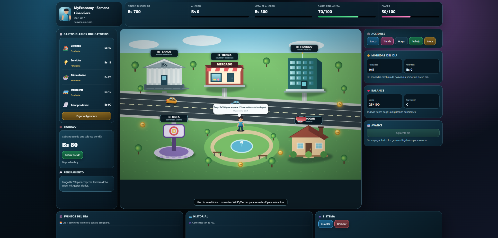
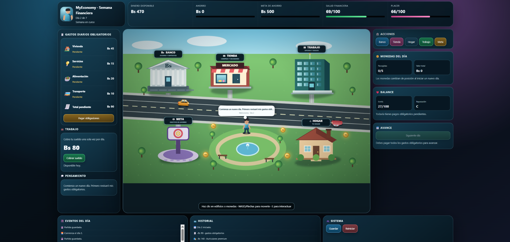
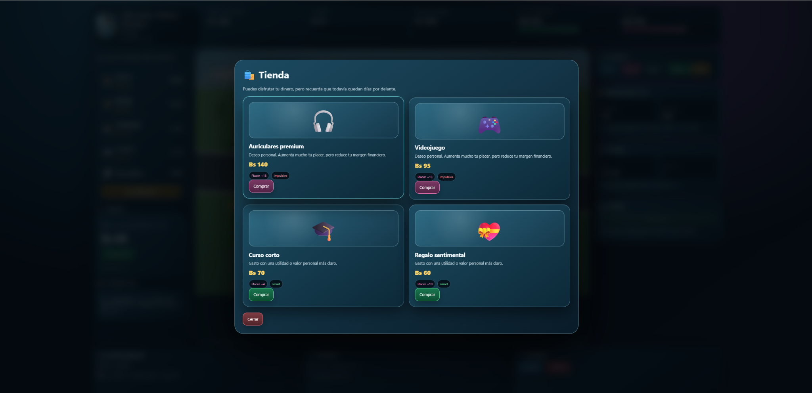
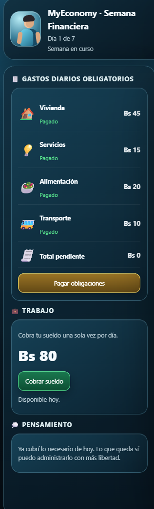
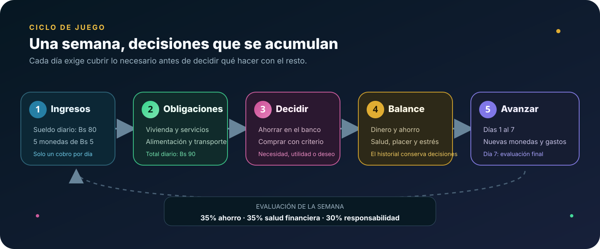

<p align="center">
  <a href="https://katfipol.github.io/game-development-portfolio/juegos/myeconomy/">
    
  </a>
</p>

<h1 align="center">MyEconomy: Semana Financiera</h1>

<p align="center"><em>Siete días para cubrir necesidades, tomar decisiones y construir un equilibrio financiero.</em></p>

<p align="center">
  
  
  
  
  
</p>

<p align="center">
  <a href="https://katfipol.github.io/game-development-portfolio/juegos/myeconomy/"><strong>JUGAR AHORA</strong></a>
  &nbsp;·&nbsp;
  <a href="index.html"><strong>VER CÓDIGO</strong></a>
  &nbsp;·&nbsp;
  <a href="../../README.md#videojuegos"><strong>GALERÍA DEL PORTAFOLIO</strong></a>
</p>

<p align="center">
  <a href="#experiencia">Experiencia</a> · <a href="#galería">Galería</a> ·
  <a href="#economía-del-juego">Economía</a> · <a href="#sistemas-y-controles">Sistemas</a> ·
  <a href="#relación-con-el-gdd">GDD</a> · <a href="#uso-de-inteligencia-artificial">IA</a>
</p>

---

## Experiencia

**MyEconomy: Semana Financiera** es un videojuego educativo de simulación y estrategia casual. El jugador administra la economía de un joven durante siete días: recibe ingresos limitados, paga gastos obligatorios, recoge monedas, utiliza el banco y decide cuánto ahorrar o gastar.

La propuesta no considera que todo gasto personal sea negativo. Su reto consiste en encontrar un equilibrio entre **responsabilidad, ahorro, salud financiera y disfrute**, observando cómo las decisiones pequeñas se acumulan durante la semana.

| Ficha | Información |
|---|---|
| Asignatura | Game Development |
| Tema académico | Game Design Document (GDD) |
| Género | Simulación y estrategia casual con exploración |
| Público objetivo | Jóvenes de 18 a 25 años |
| Duración | Siete días dentro del juego |
| Perspectiva | Ciudad 2D con profundidad visual |
| Plataforma | Navegador web |
| Modalidad | Un jugador |
| Integrantes | Melani Quintela Aguilar y José Martín Leaño Mercado |

### Problema y propósito

La práctica presenta el caso de la cooperativa **Ahorro Joven**, cuyas charlas sobre administración del dinero no generan suficiente participación ni aprendizaje duradero. MyEconomy transforma esos conceptos en decisiones jugables para practicar tres ideas:

- Diferenciar necesidades, gastos útiles y deseos impulsivos.
- Separar una parte del dinero antes de realizar compras personales.
- Reconocer que cada decisión afecta los días restantes y la meta semanal.

---

## Galería

### La ciudad funciona como tablero financiero

<p align="center"></p>

Banco, mercado, trabajo, hogar y meta poseen formas propias y funciones diferenciadas. Las monedas cambian de posición al iniciar cada día y los vehículos permanecen dentro de la avenida.

### Ahorrar o utilizar el dinero

| Banco | Tienda |
|---|---|
|  |  |
| Permite proteger una parte del dinero mediante depósitos y recuperarla cuando sea necesario. | Presenta compras impulsivas y opciones con utilidad o valor personal más claro. |

### Las elecciones dejan consecuencias visibles

<p align="center"></p>

La compra de auriculares aumenta el placer, pero reduce el dinero disponible, la salud financiera y el margen para los siguientes días. El pensamiento del personaje explica la consecuencia sin impedir que el jugador continúe decidiendo.

### Primero lo necesario

<p align="center"></p>

El avance se habilita únicamente después de pagar vivienda, servicios, alimentación y transporte. Así, la regla principal siempre permanece visible en la interfaz.

---

## Economía del juego

### Ciclo semanal

<p align="center"></p>

### Valores principales

| Concepto | Valor |
|---|---:|
| Dinero inicial | Bs 700 |
| Sueldo diario | Bs 80 |
| Cobros permitidos | Uno por día |
| Meta semanal de ahorro | Bs 500 |
| Monedas disponibles | Cinco por día |
| Valor de cada moneda | Bs 5 |
| Duración | Siete días |

### Gastos obligatorios diarios

| Gasto | Importe |
|---|---:|
| Vivienda | Bs 45 |
| Servicios | Bs 15 |
| Alimentación | Bs 20 |
| Transporte | Bs 10 |
| **Total diario** | **Bs 90** |

No es posible avanzar al siguiente día mientras exista algún gasto obligatorio pendiente.

### Decisiones disponibles en la tienda

| Producto | Precio | Clasificación | Efecto principal |
|---|---:|---|---|
| Auriculares premium | Bs 140 | Impulsiva | Placer +18; salud financiera −6; estrés +5 |
| Videojuego | Bs 95 | Impulsiva | Placer +13; salud financiera −4; estrés +3 |
| Curso corto | Bs 70 | Inteligente | Placer +4; salud financiera +6; estrés −1 |
| Regalo sentimental | Bs 60 | Inteligente | Placer +10; salud financiera +2 |

La clasificación representa el efecto dentro de esta simulación. No intenta establecer una regla universal sobre las decisiones financieras de una persona.

### Evaluación final

Al completar las obligaciones del séptimo día, el juego calcula una puntuación sobre 100:

| Componente | Peso |
|---|---:|
| Cumplimiento de la meta de ahorro | 35% |
| Salud financiera | 35% |
| Responsabilidad de las decisiones | 30% |

| Puntuación | Evaluación |
|---:|---|
| 85–100 | Semana excelente |
| 70–84 | Semana responsable |
| 55–69 | Semana equilibrada |
| 40–54 | Semana complicada |
| 0–39 | Semana de riesgo |

<details>
<summary><strong>Ver fórmula técnica de la evaluación</strong></summary>

```text
ahorro = limitar((ahorro_actual / meta) × 100, 0, 100)
responsabilidad = limitar(100 − impulsivas × 10 + inteligentes × 7, 0, 100)

puntuación = redondear(
  ahorro × 0.35 +
  salud_financiera × 0.35 +
  responsabilidad × 0.30
)
```

La pantalla final también presenta dinero, ahorro, salud financiera, gastos obligatorios, gastos personales y número de decisiones impulsivas.

</details>

---

## Sistemas y controles

| Sistema | Función |
|---|---|
| Ciudad interactiva | Integra banco, tienda, trabajo, hogar y meta en un mismo escenario. |
| Economía de siete días | Reinicia salario, obligaciones y monedas al comenzar una jornada. |
| Banco | Permite depositar y retirar cantidades válidas. |
| Tienda | Aplica efectos diferentes según cada compra. |
| Indicadores | Muestra dinero, ahorro, salud financiera, placer, estrés y reputación. |
| Historial | Registra ingresos, depósitos, pagos y compras. |
| Colisiones | Evita atravesar edificios y la fuente central. |
| Persistencia | Guarda y recupera el estado mediante LocalStorage. |

### Controles

| Entrada | Acción |
|---|---|
| `W` `A` `S` `D` | Mover al personaje |
| Flechas | Movimiento alternativo |
| `E` | Interactuar con un edificio cercano |
| Clic | Abrir edificios o recoger monedas |
| Botones de interfaz | Pagar, ahorrar, comprar, guardar y avanzar |

### Lugares interactivos

| Lugar | Función dentro de la semana |
|---|---|
| Banco | Depositar o retirar ahorro |
| Tienda | Comparar compras personales |
| Trabajo | Cobrar Bs 80 una vez por día |
| Hogar | Revisar el estado de la jornada |
| Meta | Consultar el progreso hacia Bs 500 |

---

## Diseño visual

La interfaz combina azul petróleo, verde, violeta, rosa y dorado para separar funciones sin perder unidad visual. La información financiera aparece en paneles de alto contraste y la ciudad utiliza edificios reconocibles:

- El banco presenta fachada institucional, columnas y símbolo monetario.
- La tienda incorpora escaparate, toldo y señalización comercial.
- El trabajo utiliza una estructura de oficinas.
- El hogar cuenta con techo, chimenea, ventanas y jardín.
- La meta se representa como un punto independiente de progreso.

La avenida contiene carriles definidos y los autos circulan únicamente por esa zona. El personaje tiene proporciones humanas estilizadas, animación de movimiento y sombra de contacto.

## Tecnologías

| Tecnología | Aplicación |
|---|---|
| HTML5 | Estructura, paneles, modales y controles |
| CSS3 | Diseño adaptable, tarjetas, colores y jerarquía visual |
| JavaScript | Economía, reglas, días, compras y evaluación |
| Canvas 2D | Ciudad, edificios, personaje, monedas, autos y colisiones |
| LocalStorage | Guardado y recuperación de la semana |

El videojuego se distribuye en un solo archivo `index.html` y no necesita servidor ni dependencias externas.

---

## Relación con el GDD

| Componente del documento | Implementación observable | Estado |
|---|---|---|
| Concepto y premisa | Administración de ingresos, gastos, ahorro y compras cotidianas | Cumplido |
| Género | Simulación financiera con exploración y decisiones | Cumplido |
| Objetivo | Terminar siete días con estabilidad y ahorro | Cumplido |
| Mecánica principal | Recolectar y decidir entre pagar, ahorrar o gastar | Cumplido |
| Reglas | Ingresos limitados, obligaciones, banco y consecuencias | Cumplido |
| Progresión | Jornadas sucesivas con nuevas monedas y presión acumulada | Cumplido |
| Personaje | Avatar controlable dentro de la ciudad | Cumplido |
| Arte | Ciudad 2D moderna, colorida y legible | Cumplido |
| Público objetivo | Situaciones financieras dirigidas a jóvenes | Cumplido |
| Victoria o resultado negativo | Cinco evaluaciones posibles al terminar la semana | Cumplido |

### Diferencias controladas respecto al documento

El GDD menciona como posibilidades futuras eventos inesperados y personajes secundarios. El prototipo final se concentra en el núcleo verificable de la propuesta: **administrar siete días, pagar obligaciones, ahorrar y evaluar decisiones**. Esta reducción mantiene el objetivo educativo y evita agregar sistemas incompletos solamente para ampliar el alcance.

### Validación registrada

La tabla de la Práctica 06 marca **“sí” en los seis criterios**: funcionamiento técnico, coincidencia de la mecánica, correspondencia visual con la infografía, acceso a los resultados favorable y negativo, y enseñanza del uso responsable del dinero.

La única sugerencia escrita fue **“Todo bn”**. Por transparencia, se conserva como una aprobación general, pero no se interpreta como una observación técnica detallada. Las próximas pruebas deberían incluir comentarios específicos y escenarios comprobables.

### Evolución del prototipo

| Área | Mejora incorporada |
|---|---|
| Duración | Semana completa de siete días con evaluación final |
| Balance | Bs 700 iniciales, sueldo limitado y obligaciones diarias |
| Interacción | Edificios accesibles por proximidad, clic o botones |
| Ciudad | Construcciones diferenciadas, zona verde y avenida definida |
| Movimiento | Colisiones con edificios y fuente central |
| Vehículos | Recorrido limitado a los carriles |
| Aprendizaje | Separación entre necesidades, ahorro y compras personales |
| Persistencia | Guardado del progreso con LocalStorage |

---

## Uso de inteligencia artificial

**ChatGPT fue la herramienta de IA principal** para convertir el GDD en un prototipo, estructurar la economía, construir la ciudad y realizar correcciones funcionales y visuales. El equipo definió y revisó los montos, reglas, decisiones, condiciones de avance, arquitectura y evaluación final.

| Uso | Apoyo de la IA | Decisión y revisión humana |
|---|---|---|
| Planificación | Transformó componentes del GDD en sistemas programables. | Se eligió el ciclo semanal y sus prioridades. |
| Programación | Propuso estados, funciones, colisiones y persistencia. | Se probaron límites, cobros, pagos y cambios de día. |
| Balance | Ayudó a organizar ingresos, obligaciones y compras. | El equipo ajustó montos y efectos para conservar el reto. |
| Diseño visual | Sugirió edificios y paneles diferenciados. | Se solicitaron formas reconocibles, color y profundidad. |
| Documentación | Apoyó la organización del README y del prompt. | La información se verificó contra el GDD y el código final. |

<details>
<summary><strong>Ver prompt reconstruido utilizado como referencia</strong></summary>

> **Nota:** el prompt original no fue conservado. Este texto reconstruye las instrucciones utilizadas a partir del GDD y de las mejoras solicitadas; no es una transcripción literal.

```text
Actúa como diseñador y desarrollador de videojuegos educativos. Crea en un solo
archivo HTML un videojuego llamado "MyEconomy: Semana Financiera", basado en un
GDD sobre uso responsable del dinero para jóvenes de 18 a 25 años.

La partida debe durar siete días. El jugador comienza con Bs 700, recibe un
sueldo de Bs 80 que solo puede cobrar una vez al día y debe pagar diariamente
vivienda, servicios, alimentación y transporte antes de avanzar. Genera cinco
monedas de Bs 5 en posiciones variables al comenzar cada jornada.

Incluye una ciudad 2D con banco, tienda, trabajo, hogar y meta de ahorro. Permite
depositar y retirar dinero, comprar productos útiles o impulsivos y mostrar
dinero, ahorro, salud financiera, placer, estrés, reputación e historial. La meta
de ahorro será Bs 500 y al terminar el séptimo día se calculará una evaluación
ponderada según ahorro, salud financiera y responsabilidad.

Usa WASD o flechas para moverse, E o clic para interactuar, colisiones para que
el personaje no atraviese edificios y autos que circulen solo por la carretera.
Agrega guardado con LocalStorage, diseño adaptable, edificios reconocibles y una
interfaz colorida con sombras y profundidad. Utiliza HTML5, CSS3, JavaScript y
Canvas 2D sin dependencias externas.
```

</details>

### Uso responsable

La IA funcionó como apoyo técnico e iterativo. El equipo mantuvo la responsabilidad de comprender el código, verificar que las reglas fueran coherentes y seleccionar únicamente las mejoras alineadas con el objetivo del GDD.

---

## Aprendizajes

- Utilizar un GDD como guía antes y durante la programación.
- Convertir reglas escritas en condiciones verificables.
- Diseñar un ciclo de juego basado en ingresos, obligaciones y decisiones.
- Equilibrar varios indicadores en una evaluación final.
- Implementar persistencia con LocalStorage.
- Construir una ciudad interactiva y sus colisiones con Canvas 2D.
- Comunicar educación financiera mediante consecuencias jugables.

## Próximas mejoras

- Registrar validaciones con observaciones más específicas.
- Incorporar eventos imprevistos descritos inicialmente en el GDD.
- Añadir personajes secundarios con funciones económicas claras.
- Incluir opciones de accesibilidad y controles táctiles completos.
- Agregar una captura oficial de cada categoría de evaluación final.

## Ejecución local

1. Descarga o clona el repositorio.
2. Abre `juegos/myeconomy/index.html` en un navegador moderno.
3. Recorre la ciudad o utiliza los botones del panel de acciones.

No se requiere instalación.

---

<p align="center">
  <a href="../detras-de-la-pantalla/README.md">← Anterior: Detrás de la pantalla</a>
  &nbsp;&nbsp;·&nbsp;&nbsp;
  <a href="../../README.md#videojuegos">Galería de videojuegos</a>
  &nbsp;&nbsp;·&nbsp;&nbsp;
  <a href="../edumundo/README.md">Inicio del recorrido: EduMundo →</a>
</p>

<p align="center"><sub>Proyecto académico de Game Development · José Martín Leaño Mercado</sub></p>
