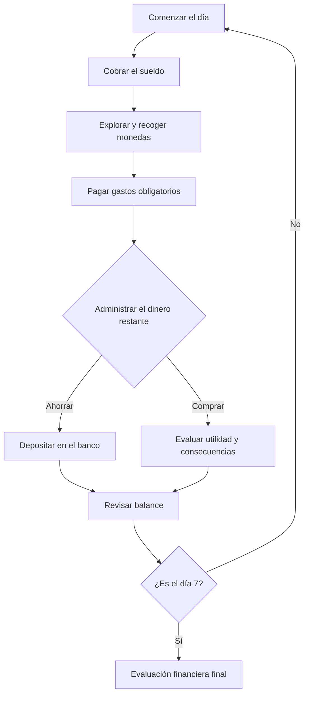

<p align="center">
  <a href="https://katfipol.github.io/game-development-portfolio/juegos/myeconomy/">
    
  </a>
</p>

<h1 align="center">MyEconomy: Semana Financiera</h1>

<p align="center">
  <em>Siete días para organizar tus ingresos, cubrir necesidades y construir un ahorro responsable.</em>
</p>

<p align="center">
  
  
  
  
  
</p>

<p align="center">
  <a href="https://katfipol.github.io/game-development-portfolio/juegos/myeconomy/"><strong>JUGAR EN EL NAVEGADOR</strong></a>
  &nbsp;&nbsp;|&nbsp;&nbsp;
  <a href="index.html"><strong>VER CÓDIGO</strong></a>
  &nbsp;&nbsp;|&nbsp;&nbsp;
  <a href="../../README.md"><strong>VOLVER AL PORTAFOLIO</strong></a>
</p>

---

## Descripción

**MyEconomy: Semana Financiera** es un videojuego educativo de simulación y estrategia casual. El jugador administra la economía de un joven durante siete días: recibe ingresos, paga gastos obligatorios, recoge monedas, utiliza el banco y decide cuánto ahorrar o gastar.

El proyecto transforma conceptos financieros en decisiones jugables. No basta con acumular dinero: el resultado final también considera la salud financiera y la responsabilidad demostrada durante la semana.

## Ficha del proyecto

| Elemento | Información |
|---|---|
| Asignatura | Game Development |
| Tema de la práctica | Game Design Document (GDD) |
| Género | Simulación y estrategia casual con elementos de aventura |
| Tema central | Uso responsable del dinero |
| Público objetivo | Jóvenes de 18 a 25 años |
| Duración | Siete días dentro del juego |
| Plataforma | Navegador web |
| Modalidad | Un jugador |
| Perspectiva | Ciudad 2D con profundidad visual |
| Integrantes | Melani Quintela Aguilar y José Martín Leaño Mercado |

## Problema y propósito

La práctica plantea el caso de la cooperativa **Ahorro Joven**, cuyas charlas sobre administración del dinero no producen suficiente participación ni aprendizaje duradero. La propuesta consiste en sustituir la explicación pasiva por una experiencia donde cada decisión tenga una consecuencia visible.

MyEconomy permite practicar tres ideas esenciales:

- Diferenciar necesidades y deseos.
- Reservar dinero antes de realizar compras personales.
- Evaluar cómo las decisiones pequeñas afectan una meta de varios días.

## Concepto definido en el GDD

El jugador controla a un joven que atraviesa situaciones económicas cotidianas. Durante el recorrido puede generar ingresos, recolectar monedas, cubrir necesidades, utilizar servicios bancarios y elegir entre compras útiles o impulsivas.

El objetivo es completar la semana con las obligaciones pagadas, una situación financiera estable y la mayor cantidad de ahorro responsable posible.

## Ciclo principal de juego



## Economía de la partida

| Concepto | Valor |
|---|---:|
| Dinero inicial | Bs 700 |
| Sueldo diario | Bs 80 |
| Cobros permitidos | Uno por día |
| Meta semanal de ahorro | Bs 500 |
| Monedas disponibles | Cinco por día |
| Valor de cada moneda | Bs 5 |
| Duración | Siete días |

### Gastos obligatorios diarios

| Gasto | Importe |
|---|---:|
| Vivienda | Bs 45 |
| Servicios | Bs 15 |
| Alimentación | Bs 20 |
| Transporte | Bs 10 |
| **Total diario** | **Bs 90** |

No es posible avanzar al siguiente día mientras exista algún gasto obligatorio pendiente.

## Lugares interactivos

| Lugar | Función |
|---|---|
| Banco | Depositar dinero en el ahorro o retirar una cantidad guardada |
| Tienda | Comparar y adquirir compras personales |
| Trabajo | Cobrar el sueldo una sola vez durante el día |
| Hogar | Consultar dinero, ahorro, obligaciones, placer, estrés y monedas |
| Meta | Revisar el progreso hacia el objetivo de Bs 500 |

Los edificios poseen siluetas diferenciadas y accesos visibles. También se puede interactuar mediante los botones laterales para facilitar la navegación.

## Compras y decisiones

| Producto | Precio | Tipo | Consecuencia principal |
|---|---:|---|---|
| Auriculares premium | Bs 140 | Impulsiva | Aumenta el placer, pero reduce la salud financiera |
| Videojuego | Bs 95 | Impulsiva | Aumenta el placer y reduce el margen disponible |
| Curso corto | Bs 70 | Inteligente | Mejora la salud financiera y la reputación |
| Regalo sentimental | Bs 60 | Inteligente | Aporta placer con un impacto financiero controlado |

El juego no presenta todos los gustos como incorrectos. La evaluación considera el equilibrio entre disfrute, ahorro y cumplimiento de responsabilidades.

## Indicadores

- **Dinero disponible:** recursos que pueden utilizarse inmediatamente.
- **Ahorro:** dinero separado mediante el banco.
- **Salud financiera:** estabilidad producida por las decisiones económicas.
- **Placer:** satisfacción obtenida durante la semana.
- **Estrés:** presión generada por el paso de los días y algunas compras.
- **Reputación:** clasificación de A a D según las decisiones tomadas.
- **Historial:** registro de ingresos, pagos, depósitos y compras.

## Evaluación final

Al cerrar correctamente el séptimo día, el juego calcula una puntuación sobre 100:

| Componente | Peso |
|---|---:|
| Cumplimiento de la meta de ahorro | 35 % |
| Salud financiera | 35 % |
| Responsabilidad de las decisiones | 30 % |

La responsabilidad disminuye con las compras impulsivas y aumenta con las decisiones inteligentes. Todos los valores se limitan a un rango válido antes de calcular el resultado.

| Puntuación | Resultado |
|---:|---|
| 85–100 | Semana excelente |
| 70–84 | Semana responsable |
| 55–69 | Semana equilibrada |
| 40–54 | Semana complicada |
| 0–39 | Semana de riesgo |

Además de la calificación, la pantalla final presenta el dinero, el ahorro, la salud financiera, los gastos obligatorios, los gastos personales y la cantidad de decisiones impulsivas.

## Reglas principales

1. La partida comienza con Bs 700.
2. El sueldo de Bs 80 solo puede cobrarse una vez por día.
3. Cada jornada genera cinco monedas nuevas en posiciones variables.
4. Todos los gastos obligatorios deben pagarse antes de avanzar.
5. El banco separa el ahorro del dinero disponible.
6. Una compra solo se completa si existe dinero suficiente.
7. Las decisiones modifican indicadores y quedan registradas.
8. La evaluación se habilita después de completar las obligaciones del día siete.

## Controles

| Entrada | Acción |
|---|---|
| `W` `A` `S` `D` | Mover al personaje |
| Flechas | Movimiento alternativo |
| `E` | Interactuar con un edificio cercano |
| Clic | Abrir edificios o recoger monedas |
| Botones de interfaz | Pagar, ahorrar, comprar, guardar y avanzar |

## Diseño de la ciudad

La interfaz combina una ciudad colorida con paneles financieros de alto contraste. Cada espacio se reconoce por su arquitectura:

- El banco utiliza fachada institucional, columnas y símbolo monetario.
- La tienda presenta escaparate, toldo y señalización comercial.
- El trabajo se representa como un edificio de oficinas.
- El hogar tiene techo, chimenea, ventanas y jardín.
- La meta se identifica como un punto independiente de progreso.

La avenida dispone de carriles definidos y los vehículos circulan únicamente por la carretera. El personaje y los edificios cuentan con colisiones para evitar que el jugador atraviese las construcciones.

## Tecnologías utilizadas

| Tecnología | Aplicación en el proyecto |
|---|---|
| HTML5 | Estructura de la interfaz, paneles, modales y controles |
| CSS3 | Diseño adaptable, colores, sombras, tarjetas y jerarquía visual |
| JavaScript | Economía, reglas, días, compras, indicadores y evaluación |
| Canvas 2D | Ciudad, edificios, personaje, monedas, vehículos y colisiones |
| LocalStorage | Guardado y recuperación del progreso de la semana |

El videojuego se encuentra integrado en un único archivo `index.html` y no requiere dependencias externas.

## Organización técnica

```text
myeconomy/
├── index.html   # Juego, estilos, ciudad y sistema económico
└── README.md    # Documentación individual del proyecto
```

El estado de la partida concentra el día, dinero, ahorro, indicadores, gastos pagados, posición del jugador, monedas, compras, historial y progreso. Las funciones de la interfaz actualizan esos datos y guardan la partida localmente.

## Relación con el GDD

| Componente del GDD | Implementación observable | Estado |
|---|---|---|
| Concepto y premisa | Administración de ingresos, gastos, ahorro y compras cotidianas | Cumplido |
| Género | Simulación financiera con exploración y decisiones | Cumplido |
| Objetivo | Completar siete días con estabilidad y ahorro | Cumplido |
| Mecánica principal | Recolectar y decidir entre pagar, ahorrar o gastar | Cumplido |
| Reglas | Ingresos limitados, obligaciones, banco y consecuencias | Cumplido |
| Progresión | Jornadas sucesivas con pagos, monedas y presión acumulada | Cumplido |
| Personaje | Avatar controlable dentro de la ciudad | Cumplido |
| Arte y estilo visual | Ciudad 2D moderna, colorida y legible | Cumplido |
| Público objetivo | Situaciones financieras dirigidas a jóvenes | Cumplido |
| Victoria o resultado negativo | Cinco categorías de evaluación al finalizar la semana | Cumplido |

## Validación de la práctica

La tabla entregada registra **“Sí” en todos los criterios de validación**:

- El prototipo funciona sin errores técnicos.
- La mecánica coincide con la descrita en el GDD.
- La presentación mantiene la propuesta de la infografía.
- Es posible alcanzar la condición favorable y el resultado financiero negativo.
- La experiencia enseña a utilizar el dinero responsablemente.

La observación original fue positiva. Antes de publicar el documento final se reformulará con una redacción académica más precisa.

## Evolución del prototipo

| Área | Mejora incorporada |
|---|---|
| Duración | Semana completa de siete días con cierre y evaluación |
| Balance | Bs 700 iniciales, sueldo diario limitado y gastos obligatorios |
| Interacción | Edificios accesibles por proximidad, clic o botones |
| Ciudad | Construcciones reconocibles, zonas verdes y avenida definida |
| Movimiento | Colisiones con edificios y fuente central |
| Vehículos | Recorrido restringido a los carriles de la avenida |
| Aprendizaje | Separación entre necesidades, ahorro y decisiones personales |
| Persistencia | Guardado del progreso mediante LocalStorage |
| Resultado | Evaluación ponderada con cinco categorías financieras |

## Uso de inteligencia artificial

La práctica permite utilizar herramientas de IA siempre que el equipo comprenda y pueda defender técnicamente los resultados. **ChatGPT** fue la herramienta principal de apoyo para convertir el GDD en un prototipo, programar la economía, construir la ciudad y realizar correcciones funcionales y visuales.

El equipo definió y revisó los montos, reglas, decisiones, condiciones de avance, arquitectura de la ciudad y sistema de evaluación. La IA se presenta como una herramienta de apoyo dentro de un proceso dirigido y validado por los estudiantes.

<details>
<summary><strong>Prompt reconstruido del proceso</strong></summary>

> Desarrolla en un único archivo HTML un videojuego educativo llamado MyEconomy. Debe ser una simulación financiera de siete días en una ciudad 2D colorida. El jugador comienza con Bs 700, cobra un sueldo de Bs 80 una sola vez por día y debe pagar diariamente vivienda, servicios, alimentación y transporte antes de avanzar. Incluye cinco monedas de Bs 5 por jornada, un banco para depositar y retirar ahorro, una meta de Bs 500, una tienda con decisiones útiles e impulsivas, indicadores de dinero, ahorro, salud financiera, placer, estrés y reputación, además de guardado con LocalStorage. Permite moverse con WASD o flechas, interactuar con E o clic y evita que el personaje atraviese edificios. Diseña construcciones reconocibles, una carretera con autos restringidos a sus carriles y una evaluación final ponderada al terminar el día siete.

Este texto es una **reconstrucción basada en el GDD y en las mejoras solicitadas**; no corresponde a una copia literal del prompt original.

</details>

## Pruebas recomendadas

- [ ] Confirmar que el sueldo solo pueda cobrarse una vez por día.
- [ ] Intentar avanzar sin pagar las obligaciones.
- [ ] Depositar y retirar cantidades válidas e inválidas.
- [ ] Comprobar compras con dinero suficiente e insuficiente.
- [ ] Recoger las cinco monedas y verificar su regeneración diaria.
- [ ] Guardar, recargar la página y recuperar el progreso.
- [ ] Completar una semana responsable y otra de riesgo.
- [ ] Verificar colisiones y recorrido de los vehículos.

## Aprendizajes

- Utilizar un GDD como guía antes y durante la programación.
- Convertir reglas escritas en condiciones verificables.
- Diseñar un ciclo de juego basado en ingresos, obligaciones y decisiones.
- Equilibrar varios indicadores en una evaluación final.
- Implementar persistencia mediante LocalStorage.
- Construir una ciudad interactiva y sus colisiones con Canvas 2D.
- Comunicar educación financiera mediante consecuencias jugables.

## Ejecución local

1. Descarga o clona el repositorio.
2. Abre la carpeta `juegos/myeconomy/`.
3. Ejecuta `index.html` en un navegador moderno.

No requiere instalación, servidor ni paquetes externos.

---

<p align="center">
  <a href="https://katfipol.github.io/game-development-portfolio/juegos/myeconomy/"><strong>Jugar ahora</strong></a>
  &nbsp;&nbsp;|&nbsp;&nbsp;
  <a href="../../README.md"><strong>Explorar los seis videojuegos</strong></a>
</p>
