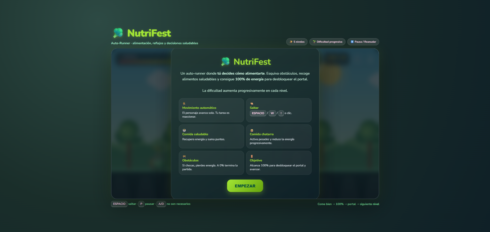
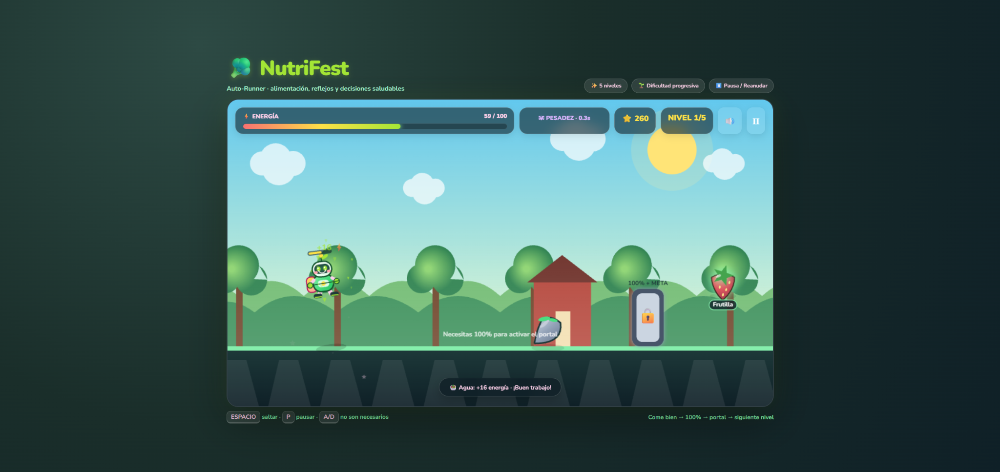
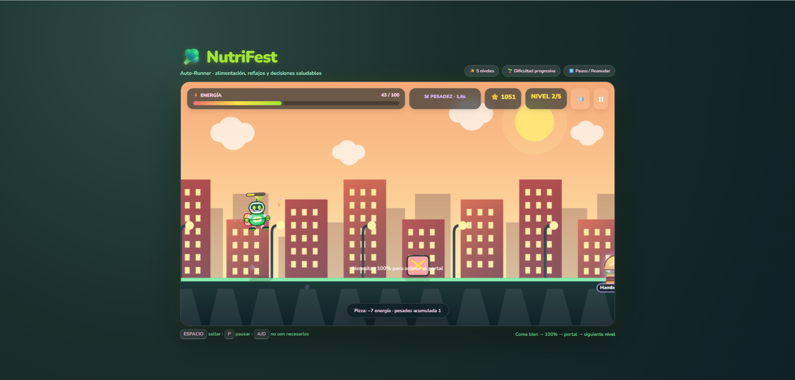
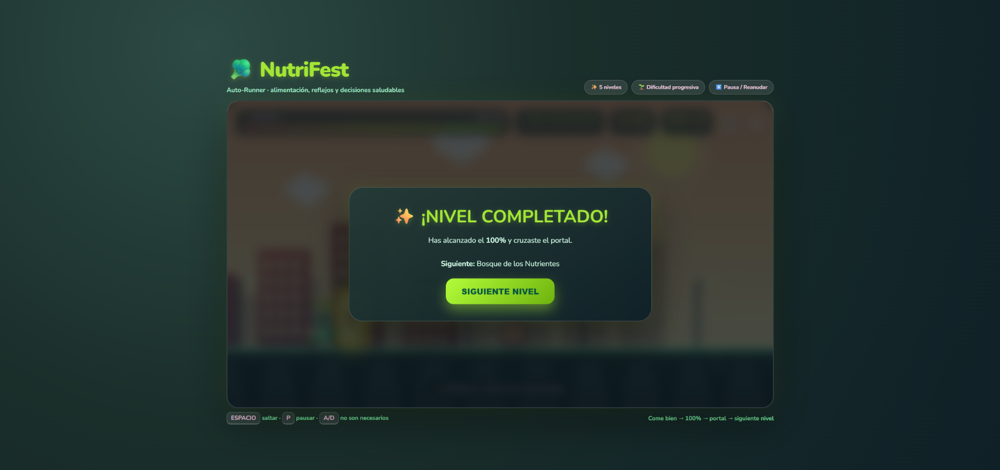
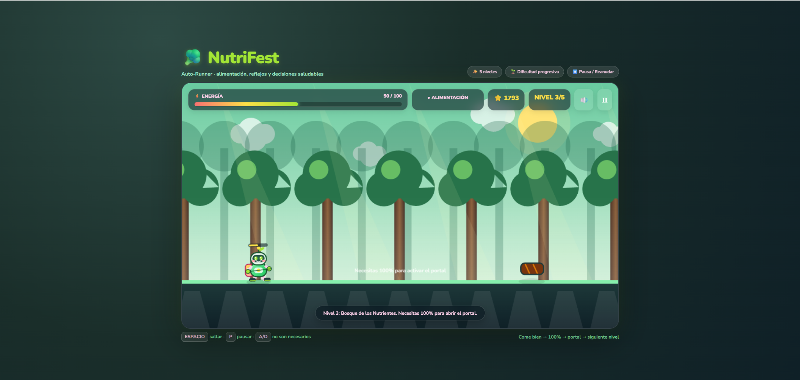
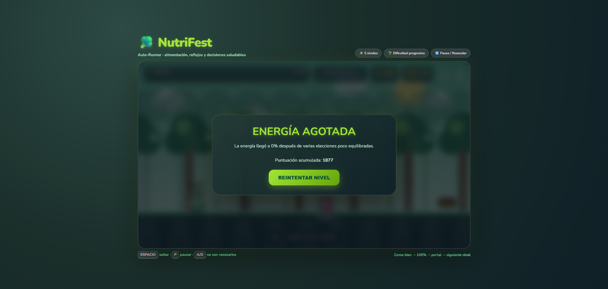
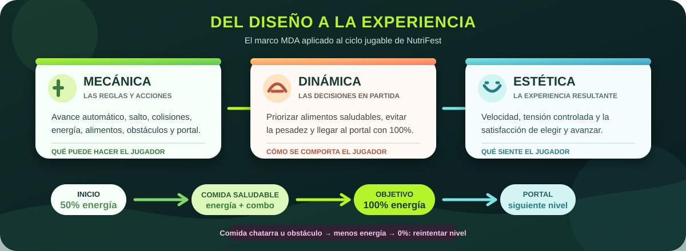
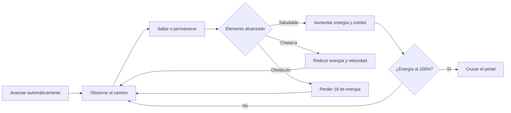

  

<h1 align="center">NutriFest</h1>

  <strong>Corre, elige y alimenta tu energía</strong> 
  Un auto-runner educativo donde cada alimento modifica el camino hacia la meta.

  
  
  
  

  
  
  

  <a href="#vista-general">Vista general</a>
  &nbsp;|&nbsp;
  <a href="#galeria">Galería</a>
  &nbsp;|&nbsp;
  <a href="#mda">Modelo MDA</a>
  &nbsp;|&nbsp;
  <a href="#mecanicas">Mecánicas</a>
  &nbsp;|&nbsp;
  <a href="#progresion">Progresión</a>
  &nbsp;|&nbsp;
  <a href="#practica">Práctica</a>
  &nbsp;|&nbsp;
  <a href="#ia">Uso de IA</a>

---

## Vista general

**NutriFest** es un videojuego educativo de tipo auto-runner. El personaje avanza automáticamente y el jugador debe saltar para recoger alimentos saludables, evitar comida chatarra y superar obstáculos. El propósito de cada nivel es alcanzar el 100 % de energía y atravesar el portal activo.

> [!TIP]
> El movimiento automático elimina controles innecesarios y concentra la experiencia en tres decisiones: cuándo saltar, qué alimento recoger y qué elemento evitar.

<table>
<tr>
<td width="20%" align="center"><strong>5</strong> niveles</td>
<td width="20%" align="center"><strong>6</strong> alimentos saludables</td>
<td width="20%" align="center"><strong>6</strong> alimentos ocasionales</td>
<td width="20%" align="center"><strong>50%</strong> energía inicial</td>
<td width="20%" align="center"><strong>100%</strong> meta por nivel</td>
</tr>
</table>

### Propósito

NutriFest representa de forma sencilla cómo diferentes decisiones alimentarias pueden influir en la energía y el rendimiento. No busca convertir la alimentación en una prohibición, sino mostrar mediante consecuencias jugables que el equilibrio y las elecciones frecuentes ayudan a avanzar con mayor facilidad.

### Ficha del proyecto

| Elemento | Información |
|---|---|
| Asignatura | Game Development |
| Tema | Mecánicas de juego y marco MDA |
| Género | Runner y arcade educativo |
| Público objetivo | Niños y estudiantes de colegio |
| Objetivo | Alcanzar 100 % de energía y cruzar el portal de cada nivel |
| Mecánica principal | Saltar, recoger alimentos y esquivar obstáculos |
| Plataforma | Navegador web |
| Modalidad | Un jugador |
| Condición de victoria | Completar los cinco niveles y sus portales |
| Condición de derrota | Reducir la energía hasta 0 % |

---

## Galería del proyecto

Las capturas documentan la presentación, las decisiones durante el recorrido, la progresión visual y las dos condiciones principales de resultado.

### Alimentación durante el gameplay

<table>
<tr>
<td width="50%" valign="top">
  
  
<strong>Elección saludable</strong> El agua recupera energía, suma puntuación y acerca al jugador al portal.

</td>
<td width="50%" valign="top">
  
  
<strong>Pesadez acumulada</strong> La pizza reduce energía, rompe el combo y ralentiza temporalmente el avance.

</td>
</tr>
</table>

### Progreso y cambio de escenario

<table>
<tr>
<td width="50%" valign="top">
  
  
<strong>Portal superado</strong> Al llegar al 100 % y cruzar la meta se habilita el siguiente nivel.

</td>
<td width="50%" valign="top">
  
  
<strong>Bosque de los Nutrientes</strong> Los ambientes cambian y la presencia de obstáculos aumenta progresivamente.

</td>
</tr>
</table>

### Condición de derrota

  

<strong>Energía agotada</strong> El nivel puede reintentarse sin perder la puntuación obtenida antes de comenzarlo.

> [!NOTE]
> La captura inicial también funciona como manual: explica el avance automático, el salto, los tipos de alimento, los obstáculos y la condición para activar el portal.

---

## Modelo MDA aplicado

  

| Componente | Aplicación en NutriFest |
|---|---|
| Mecánica | Avance automático, salto, colisiones, alimentos, energía, pesadez, obstáculos y portal |
| Dinámica | El jugador prioriza objetos beneficiosos, calcula el momento del salto y evita acumular penalizaciones |
| Estética | Sensación de velocidad, tensión controlada y satisfacción al equilibrar la energía y cruzar la meta |

La relación entre los tres componentes es directa: las reglas de energía producen decisiones bajo presión y esas decisiones generan la experiencia educativa buscada.

---

## Mecánicas y reglas

### Ciclo jugable

### Reglas principales

1. El personaje avanza sin que el jugador controle su desplazamiento horizontal.
2. Cada nivel comienza con 50 puntos de energía.
3. Los alimentos saludables recuperan energía y aumentan el combo.
4. La comida chatarra reduce energía, resta puntuación y activa pesadez temporal.
5. Las penalizaciones de comida chatarra crecen cuando se acumulan dentro del nivel.
6. Chocar con un obstáculo resta 18 puntos de energía y rompe el combo.
7. El portal aparece al alcanzar la distancia objetivo, pero solo se activa con 100 % de energía.
8. Cruzar el portal activo completa el nivel.
9. Llegar a 0 % de energía produce la derrota y permite reintentar el nivel actual.
10. Superar los cinco portales completa NutriFest.

### Controles

| Entrada | Acción |
|---|---|
| `Espacio`, `W` o `↑` | Saltar |
| Clic sobre el juego | Saltar |
| Toque sobre el juego | Saltar en pantalla táctil |
| `P` | Pausar o reanudar |
| Botón de pausa | Pausar o reanudar desde la interfaz |
| Botón de sonido | Activar o silenciar música y efectos |

Las teclas `A` y `D` no son necesarias porque el desplazamiento horizontal forma parte de la mecánica auto-runner.

---

## Alimentos y consecuencias

### Alimentos saludables

| Alimento | Energía recuperada | Función |
|---|---:|---|
| Agua | +16 | Recuperación ligera |
| Banana | +18 | Recuperación media |
| Manzana | +20 | Recuperación equilibrada |
| Frutilla | +20 | Recuperación equilibrada |
| Zanahoria | +22 | Recuperación alta |
| Brócoli | +25 | Mayor recuperación disponible |

Cada alimento saludable suma `60 + (combo × 4)` puntos. Si la barra está cerca del máximo, solo se añade la energía necesaria para llegar a 100.

### Comida chatarra y obstáculos

| Elemento | Consecuencia |
|---|---|
| Hamburguesa, papas fritas, dona, gaseosa, dulce o pizza | Daño progresivo, −20 puntos, combo reiniciado y pesadez temporal |
| Obstáculo del escenario | −18 de energía, retroceso de salto, vibración visual y breve invulnerabilidad |

La primera comida chatarra resta 7 puntos de energía. Las siguientes aumentan el daño en intervalos de 2, hasta un máximo de 17, y prolongan la duración de la pesadez.

> [!IMPORTANT]
> La clasificación “saludable” o “chatarra” es una simplificación diseñada para la mecánica educativa. El mensaje central del proyecto es el equilibrio de decisiones, no la prohibición absoluta de alimentos.

---

## Progresión y dificultad

| Nivel | Escenario | Evolución visual y jugable |
|---:|---|---|
| 1 | Pradera del Equilibrio | Introducción a alimentos, rocas, energía y portal |
| 2 | Ciudad del Azúcar | Mayor velocidad y presencia de obstáculos urbanos |
| 3 | Bosque de los Nutrientes | Entorno de árboles, profundidad y obstáculos de madera |
| 4 | Laboratorio del Veneno | Mayor probabilidad de comida chatarra y escenario tecnológico |
| 5 | Cumbre NutriFest | Velocidad máxima, ambiente nocturno y desafío final |

### Cómo aumenta el reto

- La velocidad base crece en cada nivel.
- La frecuencia de aparición se adapta a la velocidad actual.
- Los alimentos pueden aparecer a distintas alturas.
- La probabilidad de obstáculos aumenta progresivamente.
- Desde el nivel 4 puede incrementarse la presencia de comida chatarra.
- La distancia requerida para que aparezca el portal aumenta en cada nivel.
- Cada escenario incorpora un obstáculo visual diferente.

### Puntuación y continuidad

La puntuación crece por la distancia recorrida y por los alimentos saludables. La comida chatarra resta 20 puntos sin permitir valores negativos. Al reintentar un nivel, el puntaje vuelve al valor registrado al comienzo de ese nivel; al completar los cinco niveles, el récord se almacena mediante `localStorage`.

---

## Diseño visual y sonoro

- Personaje robótico de apariencia amable con animación de carrera, salto y barra de energía propia.
- Alimentos dibujados con formas, volumen, color, brillo y etiquetas legibles.
- Fondos diferenciados para pradera, ciudad, bosque, laboratorio y cumbre.
- Obstáculos específicos para cada ambiente, en lugar de utilizar una figura genérica.
- Barra energética con cambios de estado: alimentación, pesadez, energía baja y portal activo.
- Partículas con corazones, estrellas y nubes de impacto.
- Movimiento de cámara para reforzar colisiones importantes.
- Música y efectos sintetizados con Web Audio API.
- Interfaz adaptable y entrada táctil mediante clic o toque.

---

## Tecnologías utilizadas

  
  
  
  
  
  

| Tecnología | Aplicación |
|---|---|
| HTML5 | Canvas, HUD, manual, overlays y controles |
| CSS3 | Diseño adaptable, paneles, estados, colores y profundidad |
| JavaScript | Física, generación, colisiones, energía, niveles y puntuación |
| Canvas 2D | Personaje, escenarios, alimentos, obstáculos, portal y partículas |
| Web Audio API | Música y señales de salto, beneficio, penalización, portal y derrota |
| LocalStorage | Conservación del récord total en el navegador |

El juego se ejecuta desde un único archivo `index.html` y no depende de bibliotecas, imágenes ni audios externos.

---

## Relación con la práctica 03

La práctica estudia el marco MDA, los géneros de videojuegos y la coherencia entre una mecánica planteada, la dinámica que genera y la experiencia que produce. NutriFest aplica esos conceptos a la enseñanza de decisiones alimentarias.

| Requisito | Evidencia | Estado |
|---|---|---|
| Investigación de mecánica, dinámica y estética | Definiciones y ejemplos incluidos en el informe | Cumplido |
| Investigación de géneros | MOBA, battle royale y rol de acción analizados | Cumplido |
| Análisis de un caso real | Desglose MDA de *Polarity Switch* | Cumplido |
| Género elegido y justificado | Runner con controles sencillos y lectura visual rápida | Cumplido |
| Mecánica principal | Avance automático, salto y selección mediante colisiones | Cumplido |
| Boceto previo | Representación de personaje, objetos, energía y consecuencias | Cumplido |
| Producción con IA | Prototipo funcional creado e iterado desde los requisitos | Cumplido |
| Victoria y derrota | Cinco portales completados o energía reducida a cero | Cumplido |
| Testeo externo | Dos equipos marcaron todos los criterios funcionales como “Sí” | Cumplido |
| Evidencia visual | Inicio, gameplay, penalización, nivel, escenario y derrota | Cumplido |

### Resultado de la validación

Los dos equipos revisores confirmaron que:

- El juego funcionaba sin errores técnicos.
- La mecánica principal era clara desde el primer intento.
- El género runner se percibía durante la partida.
- La dinámica coincidía con lo esperado.
- Se podía alcanzar tanto la victoria como la derrota.
- La selección de alimentos comunicaba el objetivo educativo.

El campo “Sugerencia de mejora” aparece marcado afirmativamente en ambas tablas, pero los revisores no escribieron una observación concreta. Por transparencia, no se atribuye una recomendación que no esté registrada.

### Evolución del prototipo

| Iteración | Situación observada | Mejora aplicada |
|---|---|---|
| Prototipo inicial | El inicio no respondía de forma estable | Se revisó el estado inicial y la acción del botón de comienzo |
| Mecánica básica | El recorrido tenía poca variedad | Se añadieron cinco niveles, nuevos obstáculos y dificultad progresiva |
| Lectura visual | Algunos alimentos no se reconocían con facilidad | Se redibujaron con volumen, detalles, color y nombre visible |
| Personaje | La figura necesitaba mayor expresividad | Se conservó su identidad robótica y se mejoraron rostro, proporciones y animación |
| Escenario | Fondo y piedras se percibían planos | Se incorporaron capas, sombras, iluminación y obstáculos temáticos |
| Retroalimentación | Las consecuencias no eran suficientemente evidentes | Se agregaron mensajes, partículas, vibración, estados del HUD y sonidos distintos |
| Versión final | Faltaba una meta clara por nivel | Se implementó el ciclo 50 % → 100 % → portal → siguiente escenario |

---

## Uso responsable de inteligencia artificial

ChatGPT fue la herramienta principal de apoyo durante la programación y las iteraciones visuales de NutriFest.

| Etapa | Participación de la IA | Participación humana |
|---|---|---|
| Preproducción | Organización de género, mecánica y objetivo | Elección del tema, público y experiencia buscada |
| Prototipo | Generación de la estructura HTML, CSS y JavaScript | Prueba del inicio, salto y colisiones |
| Balance | Propuestas para energía, penalizaciones y dificultad | Evaluación de claridad, ritmo y justicia |
| Diseño | Alternativas para personaje, alimentos, fondos y obstáculos | Solicitud, comparación y aprobación de cada ajuste |
| Corrección | Revisión de errores que impedían iniciar o continuar | Reproducción del problema y comprobación de la solución |
| Documentación | Organización inicial de la información | Contraste con el informe, el código final y las capturas |

### Justificación

La IA permitió pasar rápidamente del concepto MDA a una versión jugable y facilitó sucesivas correcciones. Su función fue servir como apoyo técnico y creativo; el resultado final dependió de probar cada propuesta, detectar problemas reales y decidir qué cambios mantenían la esencia educativa.

<strong>Ver prompt base reconstruido</strong>

> Actúa como desarrollador de videojuegos web. Crea un juego educativo llamado NutriFest usando HTML5, CSS3 y JavaScript puro. Debe ser un auto-runner para estudiantes, con un personaje que avance automáticamente y pueda saltar con Espacio, W, flecha arriba, clic o toque. El jugador comenzará cada nivel con 50 puntos de energía, recogerá alimentos saludables para llegar al 100 % y evitará comida chatarra y obstáculos. La comida chatarra debe reducir energía, aplicar pesadez temporal y romper el combo. Al alcanzar la distancia final debe aparecer un portal que solo pueda cruzarse con 100 % de energía. Incluye cinco niveles con escenarios y dificultad diferentes, puntuación, récord local, pausa, sonido, instrucciones, victoria y derrota. Los alimentos, el personaje y los obstáculos deben ser reconocibles y dibujarse en Canvas 2D sin dependencias externas.

Este prompt fue reconstruido a partir de la tabla de preproducción, el prototipo final y las correcciones realizadas. No se presenta como una copia literal del prompt original, porque ese texto no se conservó.

### Verificación humana

Se probaron el botón de inicio, el salto por teclado y toque, la pausa, el sonido, los doce alimentos, los obstáculos, el aumento y reducción de energía, la pesadez, el combo, el portal, el cambio de nivel, el reintento, la victoria completa y el almacenamiento del récord.

---

## Aprendizajes

- Diferenciar mecánica, dinámica y estética mediante un caso implementado.
- Justificar por qué un género es adecuado para un público y un objetivo educativo.
- Construir un auto-runner sin controles horizontales innecesarios.
- Equilibrar energía, recompensas, penalizaciones, velocidad y aparición de objetos.
- Crear alimentos y escenarios legibles mediante Canvas 2D.
- Diseñar cinco niveles con identidad visual y dificultad creciente.
- Probar y corregir código generado con apoyo de IA antes de publicarlo.
- Documentar con transparencia las decisiones y limitaciones del proceso.

## Posibles mejoras futuras

- Incorporar información nutricional breve y revisada por una fuente especializada.
- Añadir opciones de accesibilidad visual y reducción de movimiento.
- Crear una selección de dificultad antes de comenzar.
- Ampliar las combinaciones de alimentos y obstáculos.
- Incorporar desafíos opcionales de equilibrio en lugar de categorías binarias.
- Realizar una nueva validación con observaciones escritas y criterios de experiencia.

## Ejecución local

1. Descarga o clona el repositorio.
2. Abre la carpeta `juegos/nutrifest/`.
3. Ejecuta `index.html` en un navegador moderno.

No requiere instalación ni conexión después de descargar el archivo.

---

  <a href="https://github.com/katfipol/game-development-portfolio"><strong>Portafolio principal</strong></a>
  &nbsp;|&nbsp;
  <a href="https://katfipol.github.io/game-development-portfolio/juegos/nutrifest/"><strong>Jugar NutriFest</strong></a>
  &nbsp;|&nbsp;
  <a href="https://github.com/katfipol/game-development-portfolio/blob/main/juegos/waterfest/README.md"><strong>Siguiente proyecto: WaterFest</strong></a>

