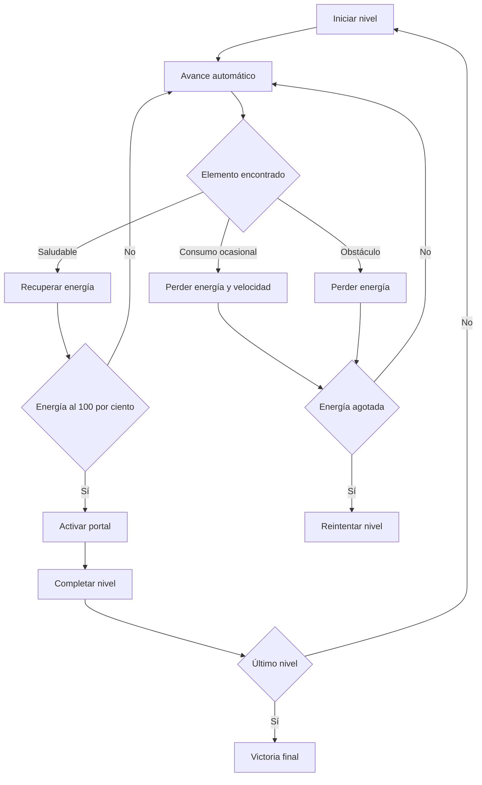

<p align="center">
  <a href="https://katfipol.github.io/game-development-portfolio/juegos/nutrifest/">
    
  </a>
</p>

<h1 align="center">NutriFest</h1>

<p align="center">
  <strong>Aventura saludable en movimiento</strong>
</p>

<p align="center">
  Un auto-runner educativo donde las elecciones alimentarias, los reflejos y la administración de energía determinan el avance del jugador.
</p>

<p align="center">
  
  
  
  
  
  
</p>

<p align="center">
  <a href="https://katfipol.github.io/game-development-portfolio/juegos/nutrifest/">
    
  </a>
  <a href="index.html">
    
  </a>
  <a href="../../README.md">
    
  </a>
</p>

---

## Descripción

NutriFest es un videojuego educativo del género auto-runner. El personaje avanza automáticamente por diferentes escenarios mientras el jugador salta para recolectar alimentos, evitar obstáculos y administrar una barra de energía.

La meta de cada nivel es alcanzar el 100 % de energía y atravesar el portal. Para completar el juego se deben superar cinco escenarios con dificultad progresiva.

La mecánica relaciona los alimentos saludables con la recuperación de energía y los alimentos de consumo ocasional con una pérdida temporal de rendimiento dentro del juego.

## Propósito educativo

NutriFest busca representar de manera sencilla cómo las decisiones alimentarias pueden influir en la energía y el rendimiento durante una actividad.

El juego no pretende sustituir información nutricional profesional. Utiliza una representación simplificada con fines educativos:

- Los alimentos saludables recuperan energía.
- Los alimentos de consumo ocasional reducen energía.
- El consumo repetido aumenta la penalización.
- Los obstáculos también reducen la energía.
- Mantener un equilibrio permite alcanzar la meta.

## Información del proyecto

| Elemento | Descripción |
|---|---|
| Nombre | NutriFest |
| Género | Auto-runner educativo |
| Público objetivo | Estudiantes de colegio |
| Objetivo | Alcanzar 100 % de energía y atravesar el portal |
| Modalidad | Un jugador |
| Energía inicial | 50 sobre 100 |
| Niveles | 5 |
| Condición de victoria | Completar los cinco niveles |
| Condición de derrota | Llegar a 0 % de energía |
| Plataforma | Navegador web |
| Tecnologías | HTML5, CSS3, JavaScript y Canvas API |

## Mecánica principal

El escenario y sus elementos se desplazan automáticamente. El jugador no necesita controlar el movimiento horizontal del personaje; su acción principal consiste en decidir cuándo saltar.

Durante el recorrido aparecen tres clases de elementos:

### Alimentos saludables

Aumentan la energía, suman puntos y mantienen el combo.

### Alimentos de consumo ocasional

Reducen la energía, descuentan puntos, reinician el combo y producen un efecto temporal de pesadez que disminuye la velocidad.

### Obstáculos

Quitan energía, interrumpen el combo y generan un breve periodo de invulnerabilidad para evitar daños repetidos.

## Alimentos incluidos

| Alimentos saludables | Alimentos de consumo ocasional |
|---|---|
| Manzana | Hamburguesa |
| Brócoli | Papas fritas |
| Agua | Dona |
| Banana | Gaseosa |
| Zanahoria | Dulce |
| Frutilla | Pizza |

Cada alimento tiene una representación gráfica propia, nombre visible, volumen, sombras, colores y detalles para facilitar su identificación.

## Sistema de energía

La energía comienza en 50 y puede llegar hasta un máximo de 100.

| Elemento | Efecto |
|---|---|
| Agua | Recupera 16 puntos |
| Banana | Recupera 18 puntos |
| Manzana | Recupera 20 puntos |
| Frutilla | Recupera 20 puntos |
| Zanahoria | Recupera 22 puntos |
| Brócoli | Recupera 25 puntos |
| Alimento de consumo ocasional | Reduce energía y provoca pesadez |
| Obstáculo | Reduce 18 puntos de energía |

La penalización de los alimentos de consumo ocasional aumenta cuando se recogen repetidamente. Esto representa la importancia del equilibrio dentro de las reglas del juego.

## Controles

| Acción | Controles |
|---|---|
| Saltar | Barra espaciadora |
| Saltar | Flecha arriba |
| Saltar | Tecla `W` |
| Pausar o reanudar | Tecla `P` o botón de pausa |
| Activar o silenciar audio | Botón de sonido |

Las teclas `A` y `D` no son necesarias porque el desplazamiento horizontal es automático.

## Flujo de juego



## Progresión de niveles

| Nivel | Nombre | Ambientación |
|---|---|---|
| 1 | Pradera del Equilibrio | Colinas, árboles, flores y elementos naturales |
| 2 | Ciudad del Azúcar | Edificios, ventanas, calles y faroles |
| 3 | Bosque de los Nutrientes | Árboles altos, profundidad y rayos de luz |
| 4 | Laboratorio del Veneno | Módulos, tuberías y depósitos luminosos |
| 5 | Cumbre NutriFest | Montañas, nieve, estrellas y ambiente nocturno |

En cada nivel:

- Aumenta la velocidad.
- Crece la probabilidad de encontrar obstáculos.
- Se incrementa la presencia de alimentos de consumo ocasional.
- La distancia necesaria para alcanzar el portal es mayor.
- El fondo y los obstáculos cambian de apariencia.

## Portal y condición de victoria

El portal aparece después de recorrer la distancia establecida para el nivel.

Para activarlo se necesita:

```text
Energía = 100 %
```

Si el jugador llega a la meta sin suficiente energía, el portal permanece bloqueado y vuelve a aparecer hasta que se cumpla la condición.

Después de atravesarlo:

- Se muestra el resultado del nivel.
- Se conserva la puntuación acumulada.
- Se carga el escenario siguiente.
- Al superar el quinto portal se muestra la victoria final.

## Sistema MDA

La práctica se desarrolló utilizando el marco MDA: mecánicas, dinámicas y estética.

### Mecánicas

- Salto.
- Avance automático.
- Recolección de alimentos.
- Energía de 0 a 100.
- Obstáculos.
- Combo y puntuación.
- Penalización de velocidad.
- Portales y niveles.

### Dinámicas

Las mecánicas generan decisiones durante la partida:

- Elegir qué alimentos recoger.
- Calcular el momento correcto para saltar.
- Evitar obstáculos sin perder oportunidades.
- Recuperar energía antes de alcanzar la meta.
- Mantener combos para mejorar la puntuación.
- Adaptarse al aumento de velocidad.

### Estética

La experiencia busca producir:

- Sensación de movimiento.
- Tensión moderada ante los obstáculos.
- Satisfacción al recuperar energía.
- Claridad al reconocer los alimentos.
- Progresión visual entre escenarios.
- Recompensa al activar y atravesar el portal.

## Puntuación y récord

Los alimentos saludables otorgan puntos y una bonificación relacionada con el combo. La distancia recorrida también incrementa gradualmente la puntuación.

Los alimentos de consumo ocasional descuentan puntos y reinician la racha.

Al completar los cinco niveles, el mejor resultado se guarda mediante `localStorage` para conservar el récord en el navegador.

## Interfaz y retroalimentación

El HUD muestra:

- Energía actual.
- Estado del personaje.
- Puntuación.
- Nivel.
- Activación del portal.
- Botones de sonido y pausa.

La retroalimentación incluye:

- Textos flotantes.
- Partículas.
- Cambio de color en la energía.
- Movimiento de cámara al recibir daño.
- Mensajes sobre los alimentos.
- Indicador de pesadez.
- Alertas de energía baja.
- Sonidos diferentes para cada acción.

## Sonido

El juego utiliza Web Audio API para generar:

- Música ambiental.
- Sonido de salto.
- Sonido de alimento saludable.
- Sonido de penalización.
- Sonido de activación del portal.
- Sonido de derrota.

El audio puede desactivarse desde la interfaz.

## Evolución del prototipo

| Versión | Problema identificado | Solución aplicada |
|---|---|---|
| V1 | El inicio de la partida no funcionaba correctamente | Se corrigió la inicialización del juego y sus eventos |
| V2 | La dificultad permanecía constante | Se incorporaron cinco niveles con mayor velocidad y obstáculos |
| V3 | Faltaba respuesta visual al recoger elementos | Se añadieron partículas, textos flotantes y movimiento de cámara |
| V4 | La energía no tenía un objetivo claro | Se estableció el 100 % como requisito para activar el portal |
| V5 | Los alimentos eran difíciles de reconocer | Se rediseñó cada alimento con una forma, color y etiqueta propia |
| V6 | El personaje tenía poca personalidad | Se mantuvo su concepto original y se mejoraron sus detalles y animación |
| V7 | Los fondos resultaban simples | Se crearon cinco escenarios con elementos y profundidad diferenciados |
| V8 | Los obstáculos no se integraban visualmente | Se diseñaron obstáculos específicos para cada nivel |
| V9 | No existía seguimiento del mejor resultado | Se agregó almacenamiento local para conservar el récord |

## Organización técnica

El videojuego se distribuye en un único archivo `index.html`, organizado internamente en sistemas:

| Sistema | Responsabilidad |
|---|---|
| Configuración | Define gravedad, salto, velocidad, energía y daño |
| Niveles | Controla temas, nombres, dificultad y distancias |
| Entidades | Genera alimentos y obstáculos |
| Jugador | Gestiona salto, gravedad, animación e invulnerabilidad |
| Colisiones | Aplica energía, puntuación y penalizaciones |
| Portal | Comprueba la condición de avance |
| Renderizado | Dibuja fondos, personaje, alimentos y obstáculos |
| Audio | Genera música y efectos |
| Almacenamiento | Conserva el récord mediante `localStorage` |

## Cumplimiento de la práctica

| Requisito | Implementación |
|---|---|
| Género runner | El personaje avanza automáticamente |
| Mecánica clara | La acción principal es saltar |
| Alimentación saludable | Los alimentos modifican la energía |
| Dinámica de decisión | El jugador selecciona qué recoger o evitar |
| Condición de victoria | Completar los cinco niveles |
| Condición de derrota | Llegar a 0 % de energía |
| Estética definida | Se combinan movimiento, tensión y satisfacción |
| Prototipo funcional | Se ejecuta directamente en el navegador |
| Validación | Se comprobaron las mecánicas principales |
| Relación con MDA | El diseño diferencia mecánicas, dinámicas y experiencia |

## Uso de inteligencia artificial

ChatGPT se utilizó como herramienta de apoyo durante la creación y mejora del prototipo.

La inteligencia artificial colaboró en:

- La generación de la estructura inicial.
- La programación de la mecánica auto-runner.
- La creación del sistema de energía.
- La corrección de errores.
- La incorporación de niveles y portales.
- La mejora de alimentos, personaje, fondos y obstáculos.
- La generación de sonido mediante Web Audio API.

Las decisiones de diseño, la selección de cambios y las pruebas finales fueron realizadas durante el proceso de desarrollo.

<details>
<summary><strong>Prompt principal de desarrollo</strong></summary>

<br>

Actúa como desarrollador de videojuegos web. Crea un videojuego educativo llamado NutriFest, dirigido a estudiantes de colegio y centrado en enseñar decisiones relacionadas con una alimentación equilibrada.

El videojuego debe pertenecer al género auto-runner. El personaje avanzará automáticamente y el jugador solamente deberá controlar el salto mediante la barra espaciadora, la tecla W o la flecha arriba.

Incluye alimentos saludables que recuperen energía y alimentos de consumo ocasional que reduzcan energía, disminuyan temporalmente la velocidad y reinicien el combo. Añade obstáculos que también reduzcan energía.

La energía debe comenzar en 50 y alcanzar un máximo de 100. Cuando llegue al 100 %, debe activarse un portal que permita avanzar al siguiente nivel. Si la energía llega a cero, el jugador debe repetir el nivel.

Crea cinco niveles con ambientaciones, obstáculos, velocidad y dificultad diferentes. Incluye puntuación, combo, récord local, pausa, música, efectos de sonido, partículas y mensajes visuales.

Los alimentos deben ser reconocibles y contar con formas, colores, volumen, sombras y etiquetas. El personaje debe conservar una apariencia tierna y expresiva.

Utiliza HTML5, CSS3, JavaScript puro, Canvas API, Web Audio API y `localStorage`. El resultado debe funcionar directamente en un navegador mediante un único archivo `index.html`.

</details>

## Pruebas realizadas

Se comprobó que:

- La partida inicia correctamente.
- El salto responde a los tres controles.
- Los alimentos saludables recuperan energía.
- Los alimentos de consumo ocasional aplican penalizaciones.
- Los obstáculos quitan energía.
- La pesadez reduce temporalmente la velocidad.
- El portal solamente se activa al alcanzar 100 %.
- Los cinco niveles pueden completarse.
- La derrota permite reintentar el nivel.
- La pausa y el audio funcionan.
- La puntuación se conserva entre niveles.
- El récord se guarda en el navegador.

## Aprendizajes

NutriFest permitió aplicar el marco MDA dentro de un proyecto funcional. La práctica demostró que una mecánica sencilla, como saltar, puede generar decisiones, estrategias y sensaciones diferentes cuando se combina con energía, velocidad, obstáculos y recompensas.

También permitió trabajar con dificultad progresiva, sistemas de estados, colisiones, generación de entidades, animación procedural, audio, persistencia local y comunicación visual.

La principal lección fue mantener un equilibrio entre velocidad y claridad: el juego debe presentar un reto, pero los alimentos y obstáculos deben seguir siendo reconocibles para que la decisión del jugador sea intencional.

---

<p align="center">
  <a href="https://katfipol.github.io/game-development-portfolio/juegos/nutrifest/">
    Jugar NutriFest
  </a>
  ·
  <a href="../../README.md">
    Regresar al portafolio
  </a>
</p>
