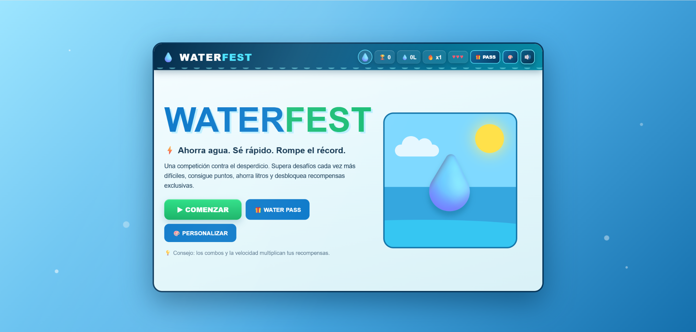
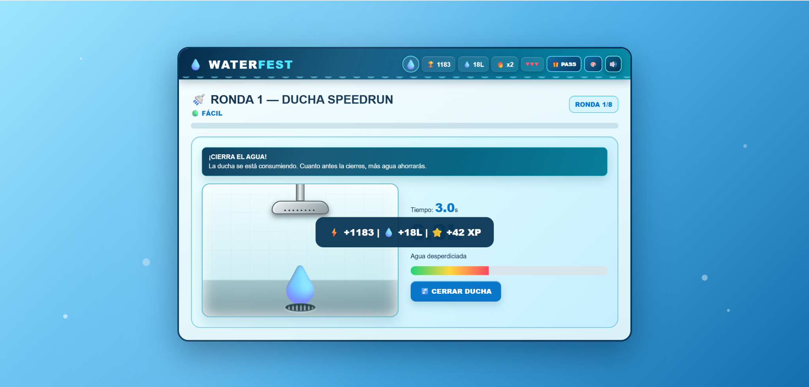
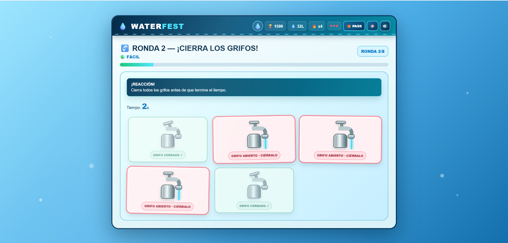
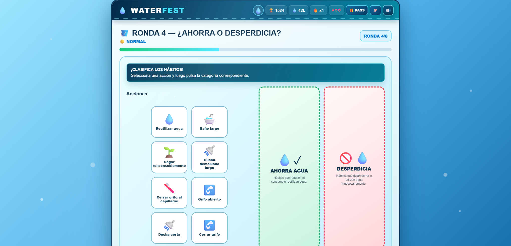
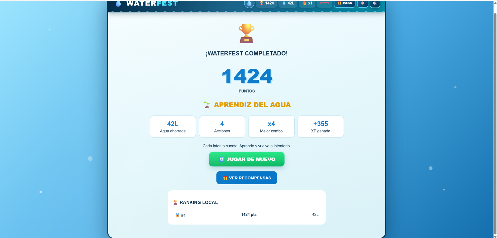
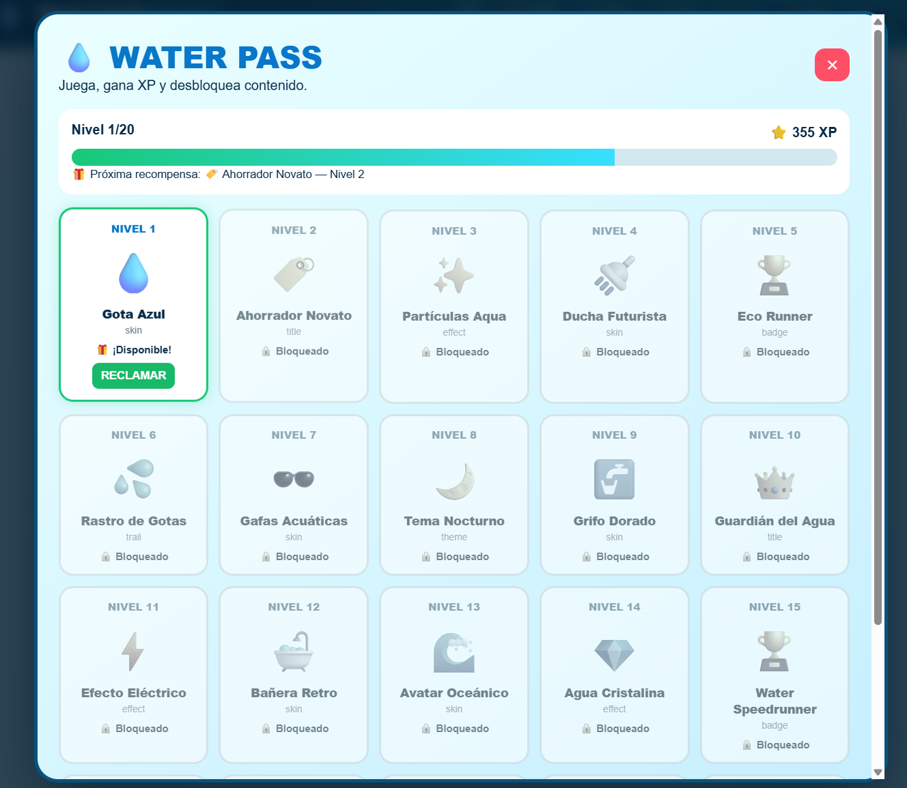
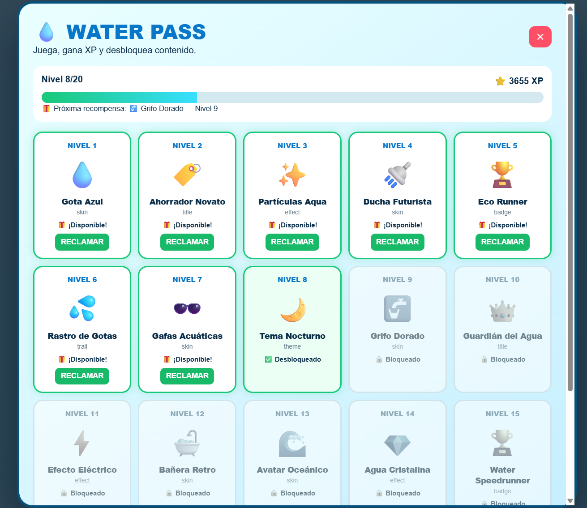
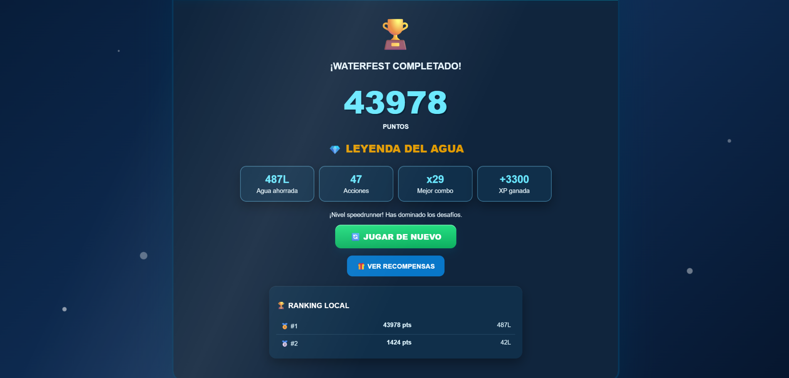
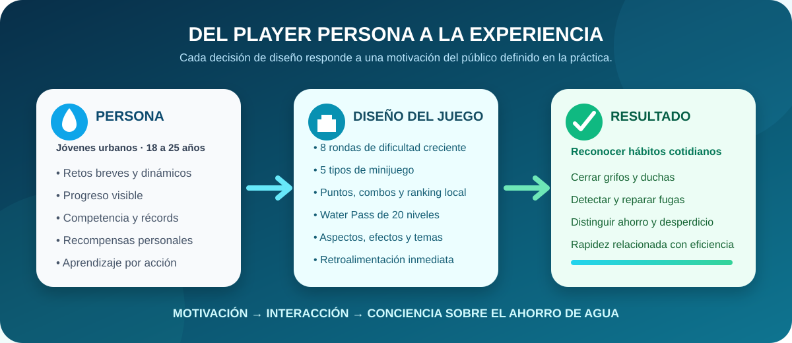
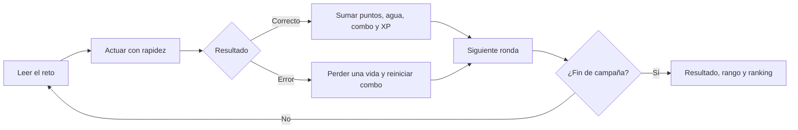

  

<h1 align="center">WaterFest</h1>

  <strong>Ahorra agua. Sé rápido. Rompe el récord.</strong> 
  Ocho rondas arcade convierten hábitos cotidianos en desafíos de velocidad, clasificación y precisión.

  
  
  
  

  
  
  

  <a href="#vista-general">Vista general</a> &nbsp;|&nbsp;
  <a href="#galeria">Galería</a> &nbsp;|&nbsp;
  <a href="#player-persona">Player Persona</a> &nbsp;|&nbsp;
  <a href="#mecanicas">Mecánicas</a> &nbsp;|&nbsp;
  <a href="#progresion">Progresión</a> &nbsp;|&nbsp;
  <a href="#practica">Práctica</a> &nbsp;|&nbsp;
  <a href="#ia">Uso de IA</a>

---

## Vista general

**WaterFest** es una colección de minijuegos educativos sobre el uso responsable del agua. La campaña alterna cinco tipos de reto a lo largo de ocho rondas: cerrar una ducha, apagar grifos, reparar fugas, clasificar hábitos y atrapar gotas. Cada acción correcta suma puntos, litros ahorrados y experiencia; los errores consumen una de las tres vidas.

> [!TIP]
> La partida es breve, pero la progresión continúa: la experiencia ganada alimenta un Water Pass local con recompensas cosméticas y anima a mejorar el récord.

<table>
<tr>
<td width="20%" align="center"><strong>8</strong> rondas</td>
<td width="20%" align="center"><strong>5</strong> tipos de reto</td>
<td width="20%" align="center"><strong>3</strong> vidas iniciales</td>
<td width="20%" align="center"><strong>20</strong> niveles del Pass</td>
<td width="20%" align="center"><strong>500 XP</strong> por nivel</td>
</tr>
</table>

### Problema y propósito

La práctica parte de una observación concreta: las campañas generales de ahorro de agua no siempre conectan con jóvenes de 18 a 25 años porque suelen ignorar sus motivaciones, hábitos y formas de interacción digital. WaterFest responde con retos cortos, resultados visibles, competencia local y personalización.

El objetivo educativo no es memorizar una lista. El jugador **ejecuta** acciones de ahorro, identifica desperdicios y recibe una consecuencia inmediata en puntos, agua, combo y progreso.

### Ficha del proyecto

| Elemento | Información |
|---|---|
| Asignatura | Game Development |
| Tema de la práctica | Player Persona |
| Género | Arcade educativo y colección de minijuegos |
| Público definido | Jóvenes urbanos de 18 a 25 años |
| Objetivo | Completar ocho rondas, ahorrar agua y superar el récord |
| Plataforma | Navegador web |
| Modalidad | Un jugador |
| Victoria | Finalizar la campaña con vidas disponibles |
| Derrota | Perder las tres vidas antes de terminar las rondas |

---

## Galería del proyecto

Las evidencias visuales muestran la presentación, las mecánicas principales, el resultado de una partida y el sistema de progreso persistente.

### Velocidad y reacción

<table><tr>
<td width="50%" valign="top">
<strong>Ducha Speedrun</strong> Cerrar cuanto antes reduce el desperdicio y mejora puntos, litros y experiencia.
</td>
<td width="50%" valign="top">
<strong>Cierra los grifos</strong> El estado abierto o cerrado se comunica mediante agua, color y texto.
</td>
</tr></table>

### Decisiones y resultado

<table><tr>
<td width="50%" valign="top">
<strong>Clasifica los hábitos</strong> El jugador distingue acciones que ahorran de aquellas que desperdician agua.
</td>
<td width="50%" valign="top">
<strong>Resumen de desempeño</strong> Puntaje, litros, acciones, combo, XP y ranking hacen visible el resultado.
</td>
</tr></table>

### Water Pass y recompensas

<table><tr>
<td width="50%" valign="top">
<strong>Comienzo del recorrido</strong> Las recompensas futuras aparecen bloqueadas y explican la meta siguiente.
</td>
<td width="50%" valign="top">
<strong>Progreso persistente</strong> La experiencia desbloquea aspectos, efectos, títulos, insignias y temas.
</td>
</tr></table>

### Tema nocturno y dominio

<strong>Leyenda del Agua</strong> La interfaz conserva contraste y legibilidad al utilizar un tema desbloqueable.

---

## Diseño guiado por el Player Persona

| Aspecto de la persona | Decisión aplicada en WaterFest |
|---|---|
| Prefiere experiencias breves | Rondas cortas con instrucciones directas |
| Busca reto y competencia | Puntuación, combo máximo, títulos y ranking local |
| Valora el progreso visible | Barra de campaña, XP y Water Pass de 20 niveles |
| Disfruta personalizar | Aspectos, rastros, efectos, insignias, títulos y temas |
| Aprende mejor mediante acciones | Cerrar, reparar, clasificar y reaccionar en vez de leer una lección extensa |
| Puede ignorar mensajes generales | Retroalimentación inmediata vinculada a litros ahorrados |

Esta correspondencia mantiene el foco de la práctica: el Player Persona no funciona como adorno descriptivo, sino como criterio para decidir la duración, la dificultad, la recompensa y la presentación del prototipo.

---

## Mecánicas y reglas

### Ciclo jugable

### Los cinco tipos de desafío

| Minijuego | Acción del jugador | Regla principal |
|---|---|---|
| Ducha Speedrun | Pulsar **Cerrar ducha** | Cuanto menor sea el tiempo, mayor será el ahorro y la puntuación |
| Cierra los grifos | Pulsar todos los grifos abiertos | Cada grifo cerrado recompensa; dejar alguno abierto penaliza |
| Repara las fugas | Detectar y pulsar las fugas de una tubería | Repararlas todas antes del tiempo otorga bonificación |
| Ahorra o desperdicia | Seleccionar una acción y luego su categoría | Una clasificación incorrecta resta puntos y una vida |
| Reflejos | Pulsar gotas que cambian de posición | En rondas avanzadas son más pequeñas y aparecen con menor demora |

Las ocho rondas recorren estos tipos en orden y vuelven a comenzar la secuencia con mayor dificultad.

### Controles

| Entrada | Acción |
|---|---|
| Clic o toque | Interactuar con duchas, grifos, fugas, hábitos y gotas |
| Botón **Comenzar** | Iniciar una campaña nueva |
| Botón de sonido | Activar o silenciar música y efectos |
| **Water Pass** | Consultar y reclamar recompensas disponibles |
| **Personalizar** | Equipar elementos ya reclamados |

> [!IMPORTANT]
> Las instrucciones cambian con cada ronda. Antes de actuar, conviene identificar el objetivo, el tiempo disponible y el estado visual de los elementos.

---

## Puntuación, dificultad y progresión

| Rondas | Nivel | Cambio percibido |
|---:|---|---|
| 1–2 | Fácil | Introducción a la velocidad y al estado de los objetos |
| 3–4 | Normal | Más elementos y decisiones de clasificación |
| 5–6 | Difícil | Menos tiempo, más objetivos y mayor precisión |
| 7–8 | Extremo | Ritmo máximo y objetivos de reflejos más pequeños |

### Sistema de desempeño

- Una acción correcta suma puntos multiplicados por el combo actual.
- Cada acierto aumenta el combo y conserva el máximo alcanzado.
- La experiencia combina la acción, los litros ahorrados y la continuidad del combo.
- Cada ronda completada añade experiencia adicional.
- Un error reinicia el combo y consume una vida; la cantidad de vidas nunca puede bajar de cero.
- El resultado se clasifica como **Aprendiz del Agua**, **Ahorrador Pro**, **Guardián del Agua** o **Leyenda del Agua** según el puntaje.
- El ranking conserva en el navegador los cinco mejores resultados.

### Water Pass

El Water Pass tiene 20 niveles y requiere 500 XP por nivel. Sus recompensas no alteran la ventaja jugable: personalizan la presentación y refuerzan la motivación de repetir.

| Niveles | Ejemplos de recompensas |
|---:|---|
| 1–5 | Gota Azul, Ahorrador Novato, Partículas Aqua, Ducha Futurista y Eco Runner |
| 6–10 | Rastro de Gotas, Gafas Acuáticas, Tema Nocturno, Grifo Dorado y Guardián del Agua |
| 11–15 | Efecto Eléctrico, Bañera Retro, Avatar Oceánico, Agua Cristalina y Water Speedrunner |
| 16–20 | Rastro Arcoíris, Robot Acuático, Tema Océano, Corona de Agua y Leyenda del Agua |

El progreso, las recompensas reclamadas, el equipamiento y el ranking se guardan con `localStorage` en el mismo navegador.

---

## Diseño visual y sonoro

- Paleta acuática con azul, cian y verde para relacionar ahorro, limpieza y progreso.
- Grifos, ducha y fugas construidos con volumen, reflejos, tuberías, chorros y estados legibles.
- Categorías de ahorro y desperdicio separadas por color, borde, símbolo y explicación.
- Tema nocturno con paneles oscuros y texto de alto contraste.
- Interfaz adaptable para escritorio y dispositivos táctiles.
- Música y señales sonoras generadas con Web Audio API, incluyendo respuestas distintas para acierto, error y victoria.
- Partículas, mensajes emergentes y cambios de color como retroalimentación inmediata.

## Tecnologías utilizadas

  
  
  
  
  

| Tecnología | Aplicación |
|---|---|
| HTML5 | Pantallas, HUD, modales, botones y estructura de minijuegos |
| CSS3 | Diseño adaptable, dispositivos ilustrados, temas, animaciones y profundidad |
| JavaScript | Estados, temporizadores, puntuación, combos, XP, dificultad y recompensas |
| Web Audio API | Música ambiental y señales de interacción, acierto, error y victoria |
| LocalStorage | Water Pass, equipamiento y ranking local |

El proyecto se ejecuta desde un único archivo `index.html` y no necesita instalación ni dependencias externas.

---

## Relación con la práctica 04

| Requisito | Evidencia en el proyecto | Estado |
|---|---|---|
| Comprender el Player Persona | Se identifican metas, motivaciones, hábitos y frustraciones del público | Cumplido |
| Construir una persona específica | Se define a jóvenes urbanos de 18 a 25 años, no a un público genérico | Cumplido |
| Relacionar prototipo y persona | Retos breves, competencia, progreso, personalización y respuesta inmediata | Cumplido |
| Promover el ahorro de agua | Las cinco mecánicas representan hábitos y consecuencias de consumo | Cumplido |
| Definir victoria y derrota | Completar ocho rondas o perder las tres vidas | Cumplido |
| Probar el prototipo | Dos equipos evaluaron funcionamiento, claridad, relación y motivación | Cumplido |
| Presentar evidencia visual | Inicio, gameplay, clasificación, resultado, progreso y tema especial | Cumplido |

### Resultado de la validación

Los dos equipos revisores marcaron afirmativamente los criterios principales: ausencia de errores técnicos durante la prueba, comprensión de la mecánica, relación con el Player Persona, atención a una meta o frustración, condiciones alcanzables y motivación para ahorrar agua.

En la primera tabla se marcó que existía una sugerencia de mejora, pero el espacio de observación quedó vacío; en la segunda se indicó que no existía sugerencia. Por transparencia, no se inventa una recomendación que el documento no registra.

### Evolución del prototipo

| Iteración | Situación observada | Mejora aplicada |
|---|---|---|
| Control de vidas | El HUD intentaba repetir corazones con valores negativos y generaba `RangeError` | Se limitó el valor entre 0 y 3 antes de renderizarlo |
| Claridad de la clasificación | Algunas acciones y categorías podían confundirse | Se añadieron nombres, ayudas, color y respuesta con la categoría correcta |
| Dispositivos | Ducha, grifos y fugas se percibían demasiado simbólicos | Se rediseñaron con cuerpo, tubería, brillo, chorro, grieta y estados visibles |
| Modo nocturno | Ranking y recompensas perdían contraste | Se incorporaron estilos específicos para paneles, bordes y texto oscuro |
| Motivación | Una campaña aislada ofrecía poca continuidad | Se añadió Water Pass, XP, personalización y progreso persistente |
| Retroalimentación | El resultado de cada acción necesitaba mayor fuerza | Se integraron mensajes, audio, litros, combo, XP y títulos de desempeño |

---

## Uso responsable de inteligencia artificial

ChatGPT fue la herramienta principal de apoyo para generar, revisar y mejorar el prototipo. La IA no sustituyó la toma de decisiones: el juego se probó, los errores se reprodujeron y cada cambio visual o funcional se evaluó antes de conservarlo.

| Etapa | Apoyo de la IA | Decisión y revisión humana |
|---|---|---|
| Preproducción | Organización del concepto y posibles retos | Elección del tema, público, objetivo y enfoque del Player Persona |
| Programación | Estructura HTML, CSS y JavaScript; lógica de rondas y progreso | Pruebas de controles, dificultad, victoria y derrota |
| Corrección | Diagnóstico del `RangeError` y revisión de estados | Reporte del error real y comprobación de que no volviera a ocurrir |
| Diseño visual | Propuestas para ducha, grifos, fugas, temas y paneles | Solicitud de mayor claridad, realismo, contraste y aprobación final |
| Documentación | Organización del contenido y las evidencias | Contraste con la práctica, el código corregido y las capturas finales |

### Justificación

La IA permitió transformar con rapidez los requisitos del Player Persona en una experiencia jugable y facilitó iteraciones sobre problemas concretos. Su aporte fue técnico y creativo; la autoría del proceso se refleja en la selección del problema, las observaciones durante las pruebas, las correcciones solicitadas y la validación del resultado.

### Prompt reconstruido

El prompt original no se conservó. El siguiente texto reconstruye de forma transparente la intención utilizada durante el desarrollo:

> Crea en un único archivo HTML un videojuego educativo llamado WaterFest para jóvenes urbanos de 18 a 25 años. Debe promover el ahorro de agua mediante minijuegos breves sobre duchas, grifos, fugas, clasificación de hábitos y reflejos. Incluye ocho rondas con dificultad progresiva, puntos, tres vidas, combos, litros ahorrados, experiencia, ranking local, un sistema de 20 recompensas, personalización, sonido y diseño adaptable. Las condiciones de victoria y derrota deben ser claras y el juego debe funcionar directamente en el navegador.

> [!NOTE]
> Se presenta como reconstrucción y no como transcripción literal para mantener honestidad sobre el proceso.

---

## Aprendizajes

- Convertir rasgos de un Player Persona en decisiones jugables verificables.
- Coordinar varios minijuegos bajo una misma campaña, HUD y sistema de resultados.
- Diseñar progresión extrínseca sin alterar la equidad del gameplay.
- Guardar XP, recompensas, equipamiento y récords en el navegador.
- Proteger la interfaz ante estados inválidos como vidas negativas.
- Mantener contraste y jerarquía visual en temas claros y oscuros.
- Documentar con claridad qué hizo la IA y qué fue revisado por la persona desarrolladora.

## Posibles mejoras futuras

- Añadir una explicación breve del impacto estimado de cada hábito.
- Incorporar opciones de accesibilidad para movimiento reducido y contraste reforzado.
- Permitir perfiles locales separados para comparar progreso sin mezclar datos.
- Equilibrar puntos y XP mediante pruebas con más jugadores del público objetivo.
- Añadir nuevas situaciones domésticas y urbanas relacionadas con el agua.
- Incluir una opción para borrar únicamente el progreso guardado.

---

## Ejecución local

1. Descarga la carpeta `juegos/waterfest`.
2. Abre `index.html` en un navegador moderno.
3. Pulsa **Comenzar** y permite el audio cuando el navegador solicite una interacción.

No requiere instalación, servidor ni conexión a internet después de descargar el archivo.

  <a href="https://katfipol.github.io/game-development-portfolio/juegos/waterfest/"><strong>Jugar WaterFest</strong></a>
  &nbsp;·&nbsp;
  <a href="https://github.com/katfipol/game-development-portfolio/blob/main/juegos/waterfest/index.html">Ver código</a>
  &nbsp;·&nbsp;
  <a href="../../README.md">Volver al portafolio</a>

