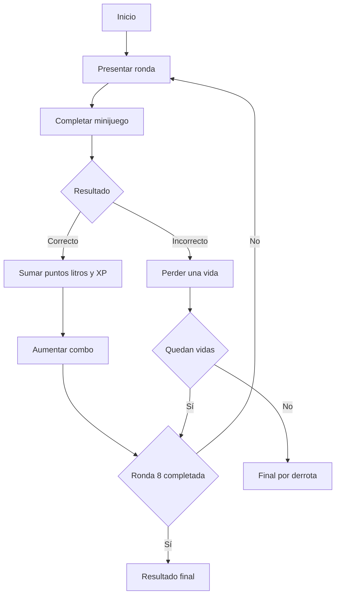

<p align="center">
  <a href="https://katfipol.github.io/game-development-portfolio/juegos/waterfest/">
    
  </a>
</p>

<h1 align="center">WaterFest</h1>

<p align="center">
  <strong>Ahorra agua, supera desafíos y rompe tu propio récord</strong>
</p>

<p align="center">
  Una colección de minijuegos educativos que convierte los hábitos de ahorro de agua en desafíos breves, progresivos y competitivos.
</p>

<p align="center">
  
  
  
  
  
  
</p>

<p align="center">
  <a href="https://katfipol.github.io/game-development-portfolio/juegos/waterfest/">
    
  </a>
  <a href="index.html">
    
  </a>
  <a href="../../README.md">
    
  </a>
</p>

---

## Descripción

WaterFest es un videojuego educativo compuesto por minijuegos relacionados con el ahorro y el uso responsable del agua.

Durante una partida se presentan ocho rondas con desafíos de velocidad, observación, clasificación y reflejos. El jugador obtiene puntos, registra litros ahorrados, mantiene combos y gana experiencia para desbloquear contenido.

El proyecto fue diseñado tomando como referencia un Player Persona específico, evitando crear una experiencia genérica para cualquier público.

## Problema abordado

La práctica parte de una situación relacionada con campañas de ahorro de agua dirigidas a jóvenes de La Paz.

El problema identificado fue que los mensajes tradicionales no lograban conectar con jóvenes de 18 a 25 años. Por esta razón, la propuesta transforma las recomendaciones en:

- Desafíos cortos.
- Objetivos medibles.
- Competencia mediante récords.
- Recompensas digitales.
- Progresión constante.
- Retroalimentación inmediata.

## Player Persona

El Player Persona representa a un joven urbano de La Paz con hábitos digitales y poco interés por campañas tradicionales.

| Aspecto | Descripción |
|---|---|
| Edad | Entre 18 y 25 años |
| Contexto | Joven de la ciudad de La Paz |
| Hábitos relacionados | Duchas largas y descuido ocasional al utilizar grifos |
| Motivaciones | Competencia, progreso, recompensas y superación de récords |
| Frustraciones | Mensajes genéricos y actividades poco dinámicas |
| Preferencias | Desafíos breves, visuales y fáciles de comprender |
| Objetivo personal | Reducir el desperdicio de agua mediante acciones concretas |
| Formato adecuado | Videojuego web de partidas rápidas |

## Relación entre el jugador y el diseño

| Necesidad del Player Persona | Decisión de diseño |
|---|---|
| Prefiere actividades rápidas | Minijuegos de corta duración |
| Le motiva competir | Puntuación, ranking local y récords |
| Busca progreso visible | Sistema de experiencia y Water Pass |
| Ignora mensajes genéricos | Acciones concretas dentro de cada reto |
| Necesita resultados inmediatos | Puntos, litros ahorrados y feedback visual |
| Disfruta personalizar | Skins, efectos, rastros, temas y títulos |
| Busca dificultad creciente | Ocho rondas con cuatro niveles de dificultad |

## Información del proyecto

| Elemento | Descripción |
|---|---|
| Nombre | WaterFest |
| Género | Colección de minijuegos educativos |
| Público objetivo | Jóvenes de 18 a 25 años |
| Objetivo | Completar desafíos y ahorrar la mayor cantidad de agua |
| Rondas | 8 |
| Vidas iniciales | 3 |
| Dificultad | Fácil, normal, difícil y extrema |
| Progresión | Water Pass de 20 niveles |
| Condición de victoria | Completar las ocho rondas |
| Condición de derrota | Perder las tres vidas |
| Plataforma | Navegador web |
| Tecnologías | HTML5, CSS3 y JavaScript |

## Minijuegos

### Ducha contrarreloj

La ducha permanece abierta y registra el tiempo y los litros desperdiciados. El jugador debe cerrarla lo antes posible.

Cuanto más rápido actúa:

- Más agua ahorra.
- Mayor puntuación obtiene.
- Más experiencia recibe.

### Cierre de grifos

Aparecen varios grifos abiertos. El jugador debe hacer clic en todos antes de que termine el tiempo.

Los grifos presentan estados visuales diferentes para indicar claramente si están abiertos o cerrados.

### Reparación de fugas

El jugador debe localizar fugas distribuidas sobre una tubería y repararlas antes de que finalice el temporizador.

Cada fuga utiliza una representación visual con:

- Grieta.
- Orificio.
- Chorro de agua.
- Gotas animadas.
- Profundidad y sombras.

### Clasificación de hábitos

Se presentan diferentes acciones relacionadas con el consumo de agua. El jugador selecciona una acción y luego la clasifica como:

```text
AHORRA AGUA
```

o:

```text
DESPERDICIA AGUA
```

Al responder se muestra una explicación clara y la categoría correcta en caso de error.

### Reto de reflejos

El jugador debe hacer clic en gotas que aparecen en diferentes posiciones.

En las rondas avanzadas:

- Las gotas son más pequeñas.
- Aparecen con mayor rapidez.
- El tiempo disponible disminuye.
- Mantener el combo requiere más precisión.

## Distribución de las rondas

| Ronda | Minijuego | Dificultad |
|---|---|---|
| 1 | Ducha contrarreloj | Fácil |
| 2 | Cierre de grifos | Fácil |
| 3 | Reparación de fugas | Normal |
| 4 | Clasificación de hábitos | Normal |
| 5 | Reto de reflejos | Difícil |
| 6 | Ducha contrarreloj avanzada | Difícil |
| 7 | Cierre de grifos avanzado | Extrema |
| 8 | Reparación de fugas avanzada | Extrema |

## Hábitos incluidos

| Ahorra agua | Desperdicia agua |
|---|---|
| Tomar una ducha corta | Tomar un baño demasiado largo |
| Cerrar el grifo | Mantener el grifo abierto |
| Reutilizar agua | Utilizar agua innecesariamente |
| Cerrar el grifo al enjabonarse | Mantener la ducha abierta al enjabonarse |
| Cerrar el grifo al cepillarse | Dejar correr el agua al cepillarse |
| Regar responsablemente | Regar utilizando más agua de la necesaria |

## Flujo de la partida



## Sistema de puntuación

Las acciones correctas aumentan:

- La puntuación.
- Los litros ahorrados.
- El número de acciones completadas.
- El combo.
- La experiencia obtenida.

El combo funciona como multiplicador:

```text
Multiplicador = 1 + (combo - 1) × 0.15
```

Las acciones incorrectas:

- Restan una vida.
- Reinician el combo.
- Pueden descontar puntos.
- Producen feedback visual y sonoro.

## Clasificación final

El resultado de la partida depende de la puntuación:

| Puntuación | Clasificación |
|---|---|
| Menos de 2800 | Aprendiz del Agua |
| Desde 2800 | Ahorrador Pro |
| Desde 4500 | Guardián del Agua |
| Desde 6500 | Leyenda del Agua |

La pantalla final también presenta:

- Puntos totales.
- Litros ahorrados.
- Acciones completadas.
- Mejor combo.
- Experiencia obtenida.

## Ranking local

WaterFest guarda las cinco mejores partidas mediante `localStorage`.

Cada registro conserva:

- Posición.
- Puntuación.
- Litros ahorrados.
- Fecha de la partida.

El ranking funciona de manera local y no envía información a servidores externos.

## Water Pass

El Water Pass es un sistema de progresión de veinte niveles. Cada nivel requiere 500 puntos de experiencia.

Las recompensas incluyen:

- Apariencias.
- Títulos.
- Efectos.
- Rastros.
- Temas.
- Insignias.

Los elementos desbloqueados pueden reclamarse y equiparse desde la sección de personalización.

No existen compras, pagos ni elementos aleatorios. El contenido se desbloquea únicamente mediante la experiencia obtenida al jugar.

## Personalización

El jugador puede cambiar diferentes elementos visuales:

| Categoría | Ejemplos |
|---|---|
| Apariencia | Gota azul, ducha futurista, gafas, corona y robot |
| Efecto | Partículas de agua, electricidad y agua cristalina |
| Rastro | Gotas o arcoíris |
| Tema | Nocturno u océano |
| Título | Ahorrador Novato o Guardián del Agua |
| Insignia | Eco Runner o Water Speedrunner |

Los temas oscuros incluyen estilos específicos para mantener legibles las tarjetas, recompensas y textos.

## Interfaz visual

La interfaz utiliza una identidad inspirada en el agua:

- Tonos azules y turquesa.
- Tarjetas con profundidad.
- Reflejos y degradados.
- Animaciones de gotas.
- Efectos de burbujas.
- Indicadores claros de éxito y error.

La ducha, los grifos y las fugas fueron rediseñados para representar mejor sus formas y estados.

## Sonido

WaterFest utiliza Web Audio API para generar una ambientación diferente a los demás juegos del portafolio.

Incluye sonidos para:

- Inicio.
- Acción correcta.
- Acción incorrecta.
- Grifos y ducha.
- Obtención de experiencia.
- Desbloqueo de nivel.
- Victoria.
- Derrota.

El jugador puede activar o silenciar el sonido desde el encabezado.

## Evolución del prototipo

| Versión | Problema identificado | Solución aplicada |
|---|---|---|
| V1 | El HUD intentaba repetir corazones con valores negativos | Las vidas se limitan siempre entre 0 y 3 |
| V2 | La clasificación de hábitos no era suficientemente clara | Se añadieron categorías, colores y explicaciones |
| V3 | Los grifos se veían como elementos genéricos | Se construyeron grifos con base, cuello, manija, boca y agua |
| V4 | La ducha no representaba claramente su funcionamiento | Se añadieron cabezal, tubería, flujo, desagüe y estado apagado |
| V5 | Las fugas parecían gotas aisladas | Se incorporaron grieta, orificio y chorro conectado a la tubería |
| V6 | El modo nocturno tenía poco contraste | Se corrigieron fondos, textos, tarjetas y recompensas |
| V7 | El Water Pass presentaba textos difíciles de leer | Se mejoró la jerarquía y el contraste de cada recompensa |
| V8 | Faltaba motivación para repetir la partida | Se añadieron ranking, experiencia, recompensas y personalización |
| V9 | Los minijuegos tenían una dificultad similar | Se incorporaron cuatro niveles de dificultad progresiva |

## Organización técnica

WaterFest se encuentra en un único archivo `index.html`, organizado mediante sistemas diferenciados:

| Sistema | Responsabilidad |
|---|---|
| Estado de partida | Puntuación, agua, vidas, combo y rondas |
| Minijuegos | Ducha, grifos, fugas, clasificación y reflejos |
| Dificultad | Ajusta tiempo, cantidad y velocidad |
| Audio | Música y efectos mediante Web Audio API |
| Water Pass | Experiencia, niveles y recompensas |
| Personalización | Apariencias, efectos, rastros y temas |
| Persistencia | Ranking, experiencia y equipamiento |
| Interfaz | Pantallas, HUD, mensajes y modales |

## Cumplimiento de la práctica

| Requisito | Implementación |
|---|---|
| Player Persona específico | Joven urbano de 18 a 25 años |
| Mecánicas breves | Ocho rondas con desafíos rápidos |
| Ahorro de agua | Todas las actividades enseñan acciones concretas |
| Motivación competitiva | Puntuación, combos y ranking |
| Recompensas digitales | Water Pass y personalización |
| Condición de victoria | Completar las ocho rondas |
| Condición de derrota | Perder las tres vidas |
| Dificultad progresiva | Cuatro niveles de dificultad |
| Prototipo funcional | Ejecución directa en navegador |
| Relación persona-diseño | Cada sistema responde a una motivación identificada |

## Uso de inteligencia artificial

ChatGPT se utilizó como herramienta de apoyo para desarrollar y mejorar el prototipo.

La inteligencia artificial colaboró en:

- La estructura de los minijuegos.
- El sistema de puntuación y experiencia.
- La corrección de errores de ejecución.
- La creación del Water Pass.
- La persistencia mediante `localStorage`.
- La mejora visual de duchas, grifos y fugas.
- La adaptación del modo nocturno.
- La creación del audio procedural.

El Player Persona, las decisiones de diseño, la selección de mejoras y la validación final fueron revisados durante el desarrollo.

<details>
<summary><strong>Prompt principal de desarrollo</strong></summary>

<br>

Actúa como desarrollador de videojuegos web. Crea un videojuego educativo llamado WaterFest, dirigido a jóvenes de 18 a 25 años de la ciudad de La Paz.

El Player Persona disfruta de los desafíos breves, la competencia, la personalización y las recompensas digitales, pero suele ignorar las campañas tradicionales sobre el ahorro de agua.

Crea una campaña de ocho rondas con minijuegos relacionados con cerrar la ducha rápidamente, apagar grifos, reparar fugas, clasificar hábitos de consumo y atrapar gotas.

Incluye tres vidas, puntuación, litros ahorrados, combos, dificultad progresiva y una evaluación final. Añade un ranking local y un sistema de experiencia llamado Water Pass con veinte niveles y recompensas visuales.

Las duchas, grifos, tuberías y fugas deben ser claramente reconocibles. La clasificación debe diferenciar de forma precisa los hábitos que ahorran agua de los que la desperdician.

Incluye personalización, temas claros y oscuros, música ambiental y efectos de sonido. La interfaz debe ser moderna, dinámica y mantener suficiente contraste en todos sus temas.

Utiliza HTML5, CSS3, JavaScript puro, Web Audio API y `localStorage`. El juego debe ejecutarse directamente desde un único archivo `index.html`.

</details>

## Pruebas realizadas

Se comprobó que:

- El juego inicia correctamente.
- Las ocho rondas pueden completarse.
- Los minijuegos muestran instrucciones.
- Las acciones correctas suman puntos.
- Las acciones incorrectas quitan vidas.
- El HUD nunca recibe valores negativos.
- La clasificación muestra la respuesta correcta.
- Los grifos cambian claramente de estado.
- Las fugas pueden identificarse y repararse.
- La ducha registra tiempo y litros.
- El ranking guarda las mejores partidas.
- La experiencia y recompensas permanecen guardadas.
- Los temas oscuros mantienen sus textos legibles.
- El sonido puede activarse o desactivarse.

## Aprendizajes

WaterFest permitió comprender cómo el Player Persona puede influir directamente en las decisiones de diseño.

La preferencia por experiencias rápidas dio origen a los minijuegos; la motivación competitiva produjo el ranking y los combos; el interés por recompensas digitales llevó al Water Pass; y la necesidad de recibir resultados inmediatos se reflejó en los puntos y litros ahorrados.

También se trabajó con temporizadores, generación dinámica de elementos, persistencia local, sistemas de experiencia, personalización, interfaces responsivas y corrección de errores relacionados con estados negativos.

---

<p align="center">
  <a href="https://katfipol.github.io/game-development-portfolio/juegos/waterfest/">
    Jugar WaterFest
  </a>
  ·
  <a href="../../README.md">
    Regresar al portafolio
  </a>
</p>
